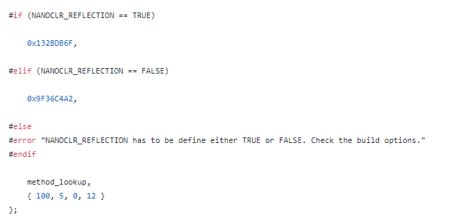
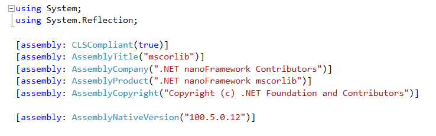
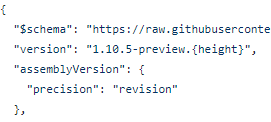
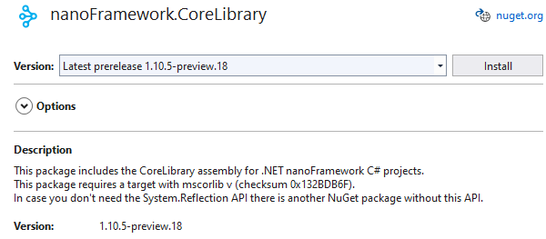
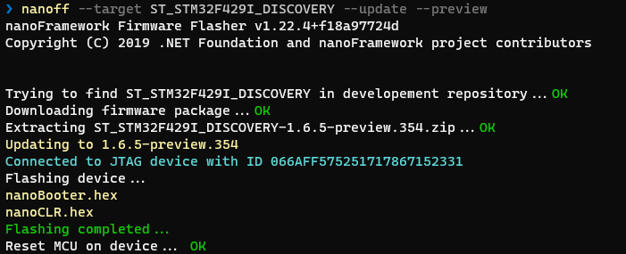
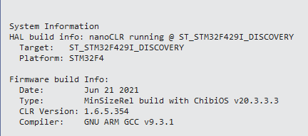
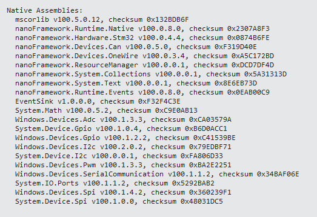

# 包和组件版本以及校验和

.NET **nanoFramework** 的大部分内容由调用本机 C++ 组件中的代码的 C# 类组成。某些组件仅为通用的 C++ 组件，而其他组件则特定于硬件平台。

有一个互操作框架来帮助处理 C# 和 C++ 之间的接口。该框架包括为给定接口合同生成校验和的机制，以及版本检查机制，确保在合同（和校验和）发生变化时进行版本更新。

## 校验和的生成方式

与所有 dotnet 一样，nfproj 文件实际上是一个 MSBuild XML 配置文件。nanoFramework 的一部分是 `meta-data-processor`（MDP），它在 nfproj 的 MSBuild 中作为后置构建任务调用。

在后置构建期间，MDP 为任何声明为 `InternalCall` 的接口创建存根 C++ 文件。存根文件位于 bin\debug\stubs\\[assembly-name]。计算得到的校验和位于 corlib_native.cpp 文件中。MDP 还将校验和作为环境变量输出，并且稍后将其用于嵌入实际运行的 nanoFramework 的可移植可执行文件（PE）文件中。下面是从具有校验和 0x132BDB6F 和所需本机组件版本 100.5.0.12 的 mscorlib 存根中获取的屏幕截图：
>

## 如何定义所需的本机版本

所需的本机版本由开发人员在 AssemblyInfo.cs 文件中手动设置。MDP 将复制该信息并将其放置在存根文件 corlib_native.cpp 中。下面是 CoreLibrary 的 AssemblyInfo.cs 文件的屏幕截图：
>

## 手动更新本机组件校验和和版本的过程

每个本机组件都有一个 corlib_native.cpp（和.h）文件。开发人员将由 MDP 存根生成过程生成的任何接口更改手动复制到实际用于本机组件的 CPP 文件中。他们非常小心地复制新的校验和，并在接口/合同更改导致校验和更改时接受新的版本号。

## NuGet 包版本的生成方式

nanoFramework 中的组件使用 nerdBank GitVersion NuGet 组件来管理 NuGet 版本。GIT 存储库根目录中有一个 version.json 文件，以下是 CoreLibrary 的屏幕截图：
>

{height} 占位符由 nerdBank 组件填充。它是上次将 version.json 文件更改为新

版本号后的提交数量。请注意，该数字将始终递增，但不像构建号那样从 1 开始，并且不一定递增 1。但是，版本号将始终是数字，并且大于上一个版本。更改文件中的版本信息将导致计数器重新从 1 开始，这取决于在更新版本信息后的第一个构建中有多少次提交。

当接口发生重大更改且需要新的校验和时，开发人员会手动更新 NuGet 包版本前缀。在上面的示例中，开发人员将前缀从 1.10.4 更改为 1.10.5。不会更改合同（和校验和）的代码更改只会在提交和构建过程中获得新的 "height"。

校验和和所需的本机版本包含在 NuGet 包的描述中。以下是 CoreLibrary 的描述示例：
>
>注意：在此示例中，构建过程中的错误导致所需的本机组件版本号未能正确地复制到描述中。

## 固件版本和本机组件版本

固件会自动为一组标准设备目标构建。固件版本独立于组件版本，但最新固件始终使用最新的本机组件版本，并与组件的最新 NuGet 包版本配合使用。下面是从 Cloudsmith.io 存储库中使用 `nanoff` 安装最新预览版固件的屏幕截图：

>

下面是使用 Visual Studio 中的 **设备资源管理器** 的 **设备功能** 查看已安装的固件版本以及包含在该固件版本中的本机组件版本（和校验和）的两个屏幕截图：

>
>