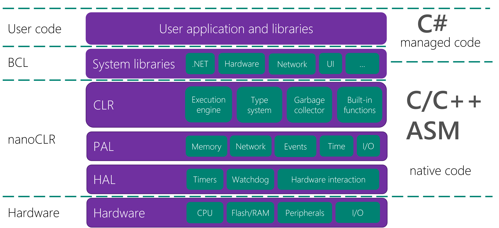

# .NET **nanoFramework** 结构

[简化和权衡](simplifications-and-trade-offs.md)是一个重要的阅读材料。由于微控制器单元的资源有限，我们不得不做出权衡，以便在一些限制下仍然能够获得最好的.NET和C#体验。

本地开发：

- [为本地项目生成存根、NANOCLR宏、参数和返回类型](nanoclr-stub-args.md)
- [类库](class-libraries.md)
- [日期和时间](date-and-time.md)
- [本地中断处理程序](native-interrupt-handlers.md)
- [Wire协议](wire-protocol.md)
- [PE文件格式](pe-file.md)和更多细节[在这里](pe-file/index.md)
- [包和程序集版本和校验和](guide-version-checksums.md)
- [数字格式的String.Format示例](string-format-examples.md)

总的来说，我们可以这样表示nanoFramework架构：

nanoFramework建立在硬件抽象层（HAL）之上。HAL允许以一致和标准的方式访问硬件。这允许有一组函数以相同的方式暴露给平台抽象层（PAL）和特定的驱动程序。

CLR建立在PAL上，并提供多个库。始终使用的是mscorlib（System和少数其他命名空间）。nanoFramework的模块化允许添加任意数量的命名空间、类。它们都将链接到CLR。

其他架构元素：

- [nanoFramework架构的单元测试](unit-test.md)
- [浮点数计算](floating-point-calculations.md)
- [应用程序部署](deployment.md)
- [线程执行](thread-execution.md)
- [HAL](HAL.md)