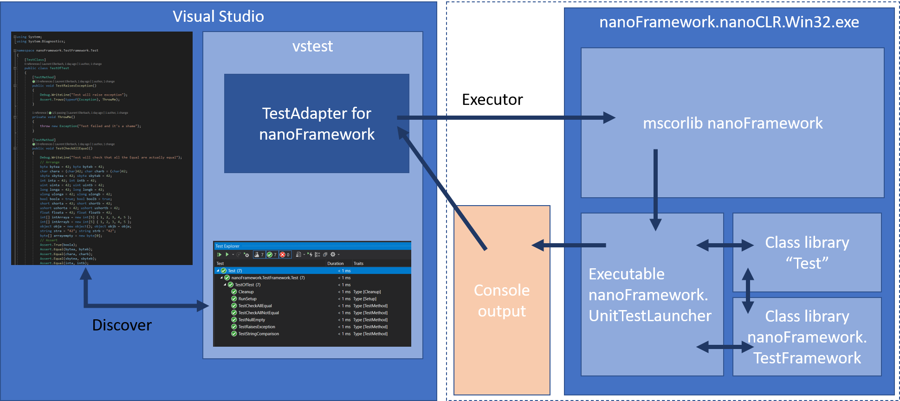

# nanoFramework架构的单元测试

本文介绍了nanoFramework单元测试平台的构建方式以及各个组件之间的协作方式。整体架构可以描述如下：



nanoFramework测试平台依赖于Visual Studio测试平台（vstest）并使用适配器（Adapter）的概念。您可以在[此处](https://github.com/Microsoft/vstest-docs/blob/master/RFCs/0004-Adapter-Extensibility.md)找到更详细的信息。

简而言之，vstest提供了与Visual Studio集成以及在命令行中运行的扩展性，因此可以在流水线上运行。我们专门为此目的构建了一个名为`nanoFramework.TestAdapter`的组件。它实现了详细信息中描述的两个接口，以及一个用于使用特定参数（如超时时间、测试是否在真实硬件上运行还是在Win32 nanoCLR上运行）的第三个接口。无论是在Win32 nanoCLR上还是在真实硬件上进行测试，架构都是完全相同的。唯一的区别在于输出控制台，在真实硬件的情况下，输出来自串行调试端口。

其中一个接口称为`ITestDiscoverer`，它由Visual Studio用于收集可能的测试。vstest会为触发的每个构建调用适配器，并传递与特定构建条件匹配的生成的dll或exe。我们的nanoFramework TestAdapter然后解析目录，查找nfproj文件，解析cs文件并查找针对nanoFramework定义的特定测试属性。基于此构建一个列表并传回。

通过名为`.runsettings`的文件进行了这种hack，您至少需要的元素如下（注意：IsRealHardware为false表示在Win32 nanoCLR上运行，为true表示在真实硬件上运行）：

```xml
<?xml version="1.0" encoding="utf-8"?>
<RunSettings>
   <!-- Configurations that affect the Test Framework -->
   <RunConfiguration>
       <MaxCpuCount>1</MaxCpuCount>
       <ResultsDirectory>.\TestResults</ResultsDirectory><!-- Path relative to solution directory -->
       <TestSessionTimeout>120000</TestSessionTimeout><!-- Milliseconds -->
       <TargetFrameworkVersion>Framework40</TargetFrameworkVersion>
   </RunConfiguration>
   <nanoFrameworkAdapter>
    <Logging>None</Logging>
    <IsRealHardware>True</IsRealHardware>
   </nanoFrameworkAdapter>
</RunSettings>
```

然后，Visual Studio将显示这些设置。在这种情况下，除非选择了该选项，否则它们仍然不会立即运行。

当您开始构建它们时，会触发另一个接口`ITestExecutor`。如果在Visual Studio的上下文中运行，则会传递测试的列表（单个或完整列表），这是启动`nanoFramework.nanoCLR.Win32.exe`作为进程的地方，并传

递`nanoFramework.UnitTestLauncher.pe`、`mscorlib.pe`、`nanoFramework.TestFramework.pe`以及您自己的测试库到可执行文件中。然后，nanoFramework Unit Test启动器将使用反射加载测试程序集，并首先执行`Setup`，然后执行`TestMethod`，最后执行`Cleanup`。

此过程的输出被重定向到TestAdapter，然后进行解析。重要注意事项：`UnitTestLauncher` **必须**以调试模式构建和部署！否则，它将无法在控制台上输出任何内容。要在真实硬件上运行测试，只需像上面的runsettings文件中添加一行条目即可。

测试运行完成后，会返回测试的状态。简单的字符串输出包含测试的状态、方法名称和运行时间或异常。例如：`Test passed: MethodName, 1234` 或 `Test failed: MethodName, Detailed exception`。

这些信息被传回给vstest，然后在Visual Studio中显示。

如果使用vstest.console.exe，执行器将只是一组dll和exe，发现阶段会在内部调用，然后使用相同的原理返回一组测试及其状态。

## 以透明方式分发所有内容

NuGet是我们最好的朋友！我们已经将所需的所有内容打包在其中！Win32 nanoCLR可执行文件、mscorelib以及Unit Test启动器和测试框架。如果将其添加到您的项目中，您只需要在项目目录中添加一个`.runsettings`文件，其中包含上一节中描述的元素。

我们还在Visual Studio中构建了一个Unit Test nanoFramewok项目，这是最简单的方式！它会自动添加NuGet和.runsettings到项目中。

## 下一步该查找什么

有关当前状态和使用信息，请参阅[单元测试](./index.md)主菜单项。