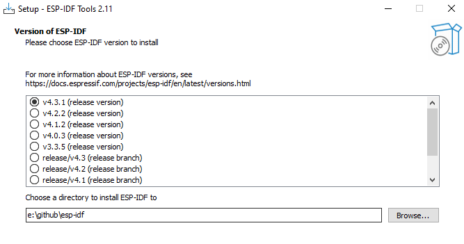
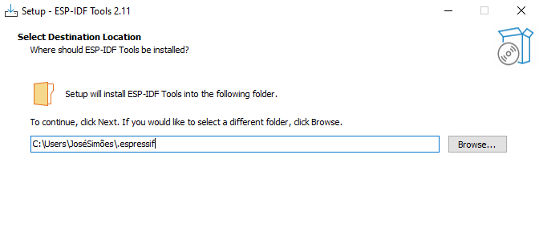
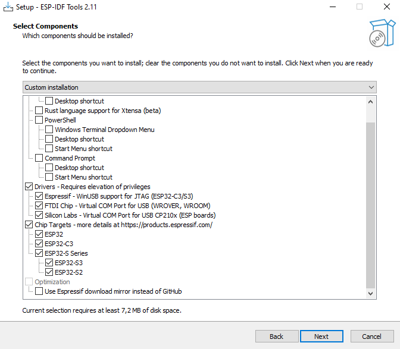
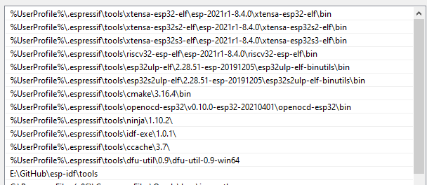

# 如何在Windows上使用Visual Code构建、烧写和调试ESP32 nanoCLR

⚠️ 关于构建 .NET **nanoFramework** 固件的说明 ⚠️

只有当您计划调试CLR、解释器、执行引擎、驱动程序、添加新目标或在本机级别添加新功能时，才需要构建它。
如果您的目标是在C#中编码，您只需使用[nanoff](https://github.com/nanoframework/nanoFirmwareFlasher)将适当的固件映像刷写到您的MCU上。
针对多个目标，提供了准备好的固件映像可供刷写，请参阅[Home](https://github.com/nanoframework/Home#firmware-for-reference-boards)存储库。

## 关于本文档

本文档描述了如何为ESP32目标构建所需的.NET **nanoFramework**固件映像。
构建系统基于CMake工具，以便在所有主要平台上简化开发过程。

## 使用开发容器

如果您希望使用一种简单高效的方式，我们建议您使用[Dev Container](using-dev-container.md)来构建您的映像。这也需要一些额外的要求，例如在VS Code中安装Docker Desktop和Remote Container扩展，但它已经配置好并准备好运行！

如果您更喜欢在Windows机器上安装所有所需的工具，请继续本教程。

## 先决条件

您将需要：

- [Visual Studio Code](https://code.visualstudio.com/)。下面将介绍其他扩展和设置步骤。
- Visual Studio Code 扩展
  . [C/C++](https://marketplace.visualstudio.com/items?itemName=ms-vscode.cpptools) - C/C++ IntelliSense、调试和代码浏览（由Microsoft提供）
  . [CMake Tools](https://marketplace.visualstudio.com/items?itemName=ms-vscode.cmake-tools) - Visual Studio Code 中的扩展 CMake 支持（由Microsoft提供）
- [CMake](https://cmake.org/download/)（最低要求版本为3.21）
- [Python 3.6.8](https://www.python.org/downloads/release/python-368) 用于将nanoCLR上传到ESP32。
  - 确保Windows默认打开`.py`文件的应用程序是Python。
- 用于生成构建文件的CMake构建系统。我们推荐使用[Ninja](https://github.com/ninja-build/ninja/releases)。
- [ESP-IDF 工具](https://docs.espressif.com/projects/esp-idf/en/stable/esp32/get-started/windows-setup.html)。
- 用于 USB 到 UART 桥接器的驱动程序。这取决于ESP32硬件。安装完驱动程序后，请使用Windows设备管理器确定COM端口，因为这在完成设置时是必需的。以下是常见的驱动程序（所有这些驱动程序都可以与 ESP-IDF

 工具安装程序一起使用）：
  - [CP210x USB to UART Bridge VCP Drivers](https://www.silabs.com/developers/usb-to-uart-bridge-vcp-drivers?tab=downloads)。
  - [FTDI Virtual COM Port Drivers](https://www.ftdichip.com/Drivers/VCP.htm)。
  - [WHC CH34x](https://www.wch.cn/download/CH341SER_ZIP.html)。

## 概述

- **步骤1**：创建如下所示的目录结构：

      `C:\nanoFramework`

- **步骤2**：下载并安装[Visual Studio Code](http://code.visualstudio.com)。

- **步骤3**：将[`nf-interpreter`](https://github.com/nanoframework/nf-interpreter)存储库克隆到`C:\nanoFramework\nf-interpreter`。有关更多信息，请参阅下一节。

- **步骤4**：使用Espressif提供的安装程序安装ESP-IDF工具。

- **步骤5**：检查并调整几个JSON文件以符合您的环境（如下所述的文档中有详细说明）。

- **步骤6**：重新启动Visual Studio Code（由于更改了JSON文件）。

## .NET **nanoFramework** GitHub存储库

如果您打算更改nanoCLR并创建拉取请求，那么您需要将[nanoFramework/nf-interpreter](https://github.com/nanoFramework/nf-interpreter)分叉到自己的GitHub存储库，并使用Git客户端（如[Fork](https://fork.dev)或[GitHub桌面应用程序](https://desktop.github.com)）在Windows系统上克隆分叉的GitHub存储库。

_main_分支是默认的工作分支。当修复错误或尝试新功能时，您应该在其自己的分支上进行操作。有关建议的贡献工作流程的具体说明，请参阅[贡献指南](../contributing/contributing-workflow.md#suggested-workflow)。

如果您不打算对nanoBooter和nanoCLR进行更改，您可以直接从GitHub克隆[nanoFramework/nf-interpreter](https://github.com/nanoFramework/nf-interpreter)。

请确保将此文件夹放在驱动器上足够高的位置，以避免触发文件名过长的问题。CMake不支持超过250个字符的文件名。

## 设置构建环境

在克隆存储库之后，您需要设置构建环境。您可以使用PowerShell脚本或按步骤进行手动设置。

### 手动安装构建环境

（如果您已经安装了ESP-IDF工具，可以跳过此步骤。）

- **步骤1**：使用Espressif提供的安装程序[在此处](https://docs.espressif.com/projects/esp-idf/en/stable/esp32/get-started/windows-setup.html#esp-idf-tools-installer)安装ESP-IDF工具。

安装程序包含所有先决条件。

- **步骤2**：在启动安装程序后，您需要按照向导的说明进行操作。以下是一些值得注意的方面。

- **步骤3**：IDF存储库的位置。您可以将其设置为您选择的位置。安装程序完成后，您将在此位置找到ESP-IDF的git克隆。



- **步骤4**：IDF工具链和其他工具的位置。默认情况下，它位于用户文件夹中。可以自由更改为其他位置。



- **步骤5**：在选项屏幕上，知道您不必安装那里的所有工具。按照建议的选项进行设置，以便能够构建.NET nanoFramework。还请注意，您可能只想为您计划构建的芯片系列安装工具链。



- **步骤6**：安装步骤可能会提示您在安装驱动程序并启动辅助安装程序时获得权限。请注意，这可能需要一些时间才能完成...

- **步骤7**：安装程序完成后，使用提升的权限在IDF存储库位置打开命令提示符，并执行脚本`install`。这将“希望地”安装所有要求和先决条件。

- **步骤8**：现在执行脚本`export`。这将“希望地”更新机器的路径环境变量。您可以通过打开另一个命令提示符并打印路径变量的内容来检查操作的成功。

:warning: 在编写本文时，IDF随附的CMake版本已过时。您必须在此步骤之后编辑路径环境变量，删除指向CMake的条目，以便使用当前的CMake。路径可能类似于`(...).espressif\tools\cmake\3.20.3`。 :warning:

- **步骤9**：不能保证通过调用上述脚本百分之百地成功安装所有内容并更新路径。这可能是由于权限问题、路径变量更新和其他原因。这是安装成功后机器上路径的映像，以便您进行比较。



- **步骤10**：还值得检查以下环境变量是否已设置：

- `IDF_PATH`：必须指向克隆ESP-IDF存储库的位置（请参阅步骤3）。
- `IDF_PYTHON_ENV_PATH`：必须指向Python的安装位置。
- `IDF_TOOLS_PATH`：必

须指向ESP-IDF工具的安装位置（请参阅步骤3）。

:warning: **正确设置路径对于能够进行构建绝对是必需的。** :warning:

## 设置Visual Studio Code

- **步骤1**：安装以下扩展：

    - [C/C++](https://marketplace.visualstudio.com/items?itemName=ms-vscode.cpptools)
    - [CMake Tools](https://marketplace.visualstudio.com/items?itemName=ms-vscode.cmake-tools)

- **步骤2**：运行`install-scripts`文件夹中的PowerShell脚本`Initialize-VSCode.ps1`。这将调整所需的设置，构建用于调试的启动配置，并设置任务以便于开发者工作。

    ```ps
    .\Initialize-VSCode.ps1
    ```

    - 您可以在命令行中添加`-Force`来强制更新环境变量。
    - PowerShell依赖于上述描述的环境变量，以正确设置各种VS Code工作文件。如果您没有使用自动安装并且变量不可用，您将不得不手动编辑`tasks.json`、`launch.json`和`settings.json`以替换相关路径。**请确保始终在路径中使用正斜杠（/）！**
    - 有关可用目标的文档，请参阅[Tweaking CMakeUserPresets.TEMPLATE.json](cmake-presets.md)文档页面。

- **步骤3**：将模板文件（位于`nf-interpreter\config`文件夹中）`user-tools-repos.TEMPLATE.json`复制到（新的）名为`user-tools-repos.json`的文件中。将json部分`user-tools-repos-local`重命名为`user-tools-repos`，并调整`user-tools-repos`配置预设中工具和存储库的路径。如果您不打算为特定平台构建，可以直接从中删除相关选项。如果您不想使用各种存储库的本地克隆，可以将其设置为`null`。**请确保始终在路径中使用正斜杠（/）！**

- **步骤4**：保存所有打开的文件，然后**重新启动**VS Code。您已经**重新启动**了VS Code吗？您确实需要这样做，否则这不起作用。

## 构建nanoCLR

- **步骤1**：从存储库文件夹中启动Visual Studio，或者从**文件**菜单中加载它，选择**打开文件夹**，然后浏览到存储库文件夹。VS Code可能会提示您询问“是否要配置此项目？”忽略该提示，因为您需要先选择构建变体。
下次打开VS Code时，它应该自动加载工作区。

- **步骤2**：重新打开VS Code。它应该自动加载工作区。在左下角的状态栏中，单击`No Configure Preset

 Selected`，然后从打开的下拉列表中选择您要构建的目标，例如`ESP32_PSRAM_REV0`。VS Code将自动选择相应的构建预设。有关此信息的更多详细信息，请参阅文档中关于可用目标的文档[此处](../reference-targets/esp32.md)。


- **步骤3**：在状态栏中点击`Build`或按下F7。

- **步骤4**：等待构建完成，并查看输出消息中的`Build finished with exit code 0`。

- **步骤5**：在`build`文件夹中，您将找到几个文件：
    - `nanoCLR.bin`
    - `nanoCLR.elf`
    - `partitions_4mb.elf`
    - ...

>> 注意：如果在构建过程中出现错误，可能会导致`build`文件夹中出现部分构建，并且`CMake/Ninja`构建过程声明构建成功，尽管`.bin`目标未被创建，并且`CMake clean`也无法帮助解决问题。
在这种情况下，删除`build`文件夹中的内容应该允许构建在解决引起原始失败的问题后完成。

### 常见构建问题

如果出现以下情况，可能会出现一些错误：

- CMake未正确安装，未在路径中，或由于某些原因找不到。
- Ninja未被识别：检查settings.json或PATH环境变量，并重新启动Visual Studio Code。
- 未找到COMPILATION对象文件：检查您的路径是否超过140个字符。将解决方案文件夹放在驱动器上足够高的位置。
- 如果您对`CMakePresets.json`或`CMakeUserPresets.json`进行了更改，则重新打开VS Code。

对于大多数构建问题，一个很好的解决方法是手动清理构建文件夹，删除其内容并重新启动VS Code。

## 将nanoCLR烧写到ESP32

- **步骤1**：烧写到ESP32的第三个文件是`bootloader.bin`，它将位于成功构建后的`build/bootloader/bootloader.bin`位置。

- **步骤2**：连接您的开发板。

- **步骤3**：一些ESP32开发板需要进入“下载模式”。大多数开发板甚至不需要此操作。请查看您所使用的开发板的文档。最常见的选项之一是：按住GPIO0引脚接地，或在上电时按住相应按钮。

- **步骤4**：下载固件到设备上。
    - 在Visual Studio Code中，转到菜单"终端" -> "运行任务"，然后从列表中选择"Flash nanoCLR to ESP32"。
  
    - 作为

替代方法，在命令面板中输入以下命令：

       ```cmd
       Tasks: Run task
       ```

       如果您第一次为板子烧写固件

       ```cmd
       Erase ESP32
       ```

       然后

       ```cmd
       Flash nanoCLR to ESP32
       ```

       它将要求您输入连接的COM端口。

    - 另一种选择是使用[nanoff](../getting-started-guides/getting-started-managed.md#uploading-the-firmware-to-the-board-using-nanofirmwareflasher)工具：

       ```console
       nanoff --target ESP32_PSRAM_REV0 --serialport <YourCOMPort> --image nanoCLR.bin --address 0x00010000
       ```
  
    - 还有一种选择是使用Espressif自己的[esptool.py](https://github.com/espressif/esptool)工具：

        ```console
        esptool.py --chip auto --port <YourCOMPort> --baud 1500000 --before "default_reset" --after "hard_reset" write_flash -z --flash_mode "dio" --flash_freq "40m" --flash_size detect 0x1000 <YourPathTo>/nf-interpreter/build/bootloader/bootloader.bin 0x10000 <YourPathTo>/nf-interpreter/build/nanoCLR.bin 0x8000 <YourPathTo>/nf-interpreter/build/<PartitionFilePassingToYourBoard>.bin
        ```

## 使用“Hello World”C#应用程序入门

观看此视频教程[here](https://youtu.be/iZdN2GmefXI)，然后按照其中在Visual Studio 2017 Community Edition中应完成的步骤进行操作。跳过描述将nanoCLR上传到STM32 Nucleo板的步骤。

## 调试nanoCLR

如果您想要调试ESP32芯片上的nanoCLR代码，您将需要一个JTAG调试适配器。ESP32 WROVER KIT已经包含了一个。对于其他板子，您可以使用Olimex ARM-USB-OCD-H JTAG调试适配器或Segger JLink。这些适配器都有预设配置。

您现在可以通过在Visual Studio Code中按F5来调试ESP32上的nanoCLR代码。

### 关于在ESP32上进行JTAG调试的说明

ESP32 DEVKITC上的JTAG连接如下：

- TDI -> GPIO12
- TCK -> GPIO13
- TMS -> GPIO14
- TDO -> GPIO15
- TRST -> EN / RST（复位）
- GND -> GND

请参阅Gojimmypi关于JTAG连接的描述[here](https://gojimmypi.blogspot.com/2017/03/jtag-debugging-for-esp32.html)。

如果通过COM端口（默认）烧录nanoCLR固件，然后请注意您需要断开JTAG以避免其阻止引导加载程序运行，从而无法重新编程ESP32。例如，如果您看到以下模式重复出现，请拔下USB-OCD-H，然后编程将继续。

      ```txt
         esptool.py v2.1
         Connecting

........_____....._____...
      ```

您可能需要在要调试的函数中添加`IRAM_ATTR`属性，以便它可以加载到RAM中。当启动调试器时，通常会停在主任务处。无法在尚未加载的代码上设置断点，因此要么逐步进入加载它的位置，要么临时设置具有IRAM_ATTR属性的方法。

有关JTAG调试的更多信息，请参阅[Espressif文档](http://esp-idf.readthedocs.io/en/latest/api-guides/jtag-debugging/)。

### 在没有特殊硬件的情况下调试nanoCLR

如果您无法访问调试所需的任何特殊硬件，仍然可以使用一些老派的技巧：只需在有趣的地方放置一些临时代码，以获取所需的信息。使用下面的步骤，您将在Visual Studio的标准调试输出窗口中获得这些信息。
当Visual Studio正在调试时，调试输出窗口才能正常工作。因此，此技巧仅适用于您希望调试可通过托管代码执行的nanoCLR代码的情况。

- **步骤1**：编写一些可执行引发执行您感兴趣的nanoCLR调用的托管代码。
- **步骤2**：选择nanoCLR代码中您想要了解的位置。
   例如：一个变量的值是多少？if-else语句的哪一部分被执行？
- **步骤3**：在此处放置以下临时代码：

      ```cpp
      {
            char temporaryStringBuffer[64];
            int realStringSize=snprintf(temporaryStringBuffer, sizeof(temporaryStringBuffer), "interestingValue: %d\r\n", interestingValue);
            CLR_EE_DBG_EVENT_BROADCAST( CLR_DBG_Commands_c_Monitor_Message, realStringSize, temporaryStringBuffer, WP_Flags_c_NonCritical | WP_Flags_c_NoCaching );
      }
      ```

   或者简单地：

      ```cpp
         CLR_EE_DBG_EVENT_BROADCAST( CLR_DBG_Commands_c_Monitor_Message, 12, "Hello World!", WP_Flags_c_NonCritical | WP_Flags_c_NoCaching );
      ```

- **步骤4**：无聊的部分：重新构建和重新烧写固件和程序。
- **步骤5**：在Visual Studio中开始调试，并关注其调试输出窗口。
   当相关的临时代码执行时，您将在那里收到您的消息！
- **步骤6**：重复步骤2-5，直到找到您感兴趣的内容。
- **步骤7**：在意外提交之前，请务必删除所有这些临时代码块！