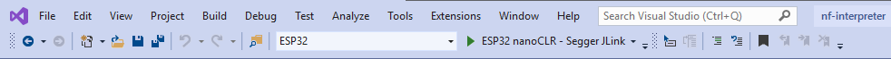
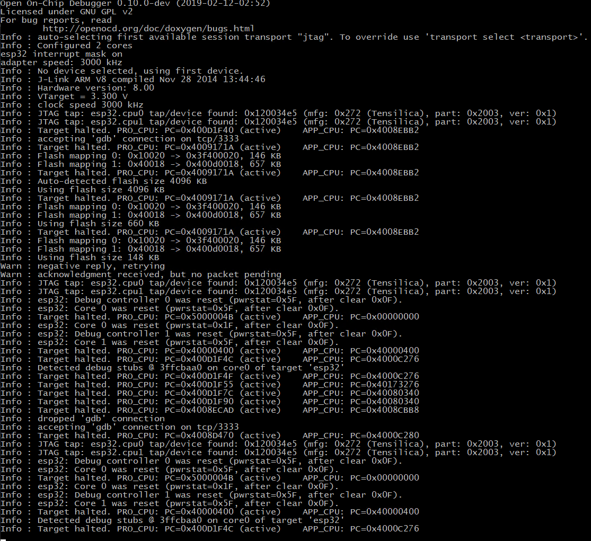
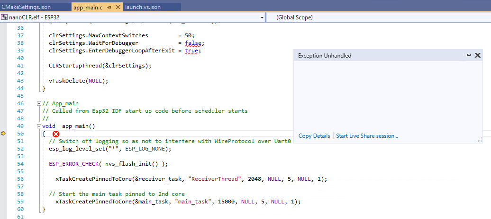

# 在 Visual Studio 中构建 .NET nanoFramework

⚠️ 关于构建 .NET nanoFramework 固件的说明 ⚠️

只有在计划调试本机代码、添加新目标或在本机级别添加新功能时才需要构建它。
如果您的目标是使用 C# 进行编码，只需使用适当的固件映像刷写您的 MCU。
有多个目标可用的固件映像可供刷写，请查看[Home](https://github.com/nanoframework/Home#firmware-for-reference-boards)存储库。

## 使用 Visual Studio 2019 Community 版本开发 nanoFramework 固件

（有关 VS2017，请参阅下文）

下面描述的开发过程最初是针对 STM32/ChibiOS 目标进行的，稍后添加了 Espressif ESP32。在本更新中，我们将以 ESP32 作为示例，有关 STM32 的特定信息请参阅 VS2017 部分。

> 在 ChibiOS 构建中使用的非常长的文件名可能会超出 Windows 250 个字符的路径限制。有时，CMake 会对此发出警告，或者您可能会遇到似乎随机失败的构建。此前解决此问题的方法是将源代码放置在顶级目录中。作为替代方案，我们一直在使用 Windows 的 `SUBST` 命令通过映射的路径访问源代码。提供了一些自动化此过程的工具。

### 首先使用 VS Code 设置工作构建环境（推荐）

虽然可以使用 VS 2019 设置成功的构建和调试环境，但强烈建议首先设置 VS Code 环境。这是最常用和经过测试的路径，如果您在途中遇到任何问题，很可能能够得到其他用户的帮助。一旦设置完毕，您可以切换到您首选的 IDE！

请参考以下其中一篇指南：

- [使用 VS Code 和 ESP32 入门](build-esp32.md)

- [使用 VS Code 和 STM32 入门](build-stm32.md)

### 安装 Visual Studio 2019 Community 和相关工作负载

您现在应该已经准备好构建、部署和调试 nanoFramework 解释器所需的组件，您可能已经安装了 Visual Studio 并尝试运行了一些托管代码示例。现在我们需要将这些组件与 Visual Studio 集成，以便在其中使用它来运行构建/部署/调试过程。

安装以下组件：

| 软件 | 工作负载/组件 |
|:---|---|
| Visual Studio 2019 Community 版本 | Linux C++ 开发 |
|option|适用于 Windows 和 Linux 的 C++ CMake 工具 |
|option|嵌入式和物联网开发工具 |

### 配置文件


VS Code 和 VS2019/2017 将大多数配置文件存储在名为 `"hidden"` 的目录中（在 Unix/Linux 中，以点开头的目录名被视为隐藏）。对于 VS Code，该目录名为 `".vscode"`，对于 VS2019，该目录名为 `".vs"`，这有助于避免它们互相冲突。
VS2019 IDE 通常会在 `Solution Explorer` 中隐藏此目录的内容，但是如果您在 `Solution Explorer` 窗格顶部的任务栏上悬停在图标上，您将找到 `"显示所有文件"` 选项。选择该选项后，这些文件将在 `"本地设置 (.vs)"` 下方显示。

`.vs` 中的两个配置文件是 `tasks.vs.json` 和 `launch.vs.json`。当您克隆 `nf-interpreter` 存储库时，将有两个文件名为 `tasks.vs.SAMPLE.json` 和 `launch.vs.SAMPLE.json`，您可以将其复制为适当的名称，然后根据需要进行修改。请注意，这些是 `SAMPLE` 文件而不是 `TEMPLATE` 文件，因为它们不用作自动配置的基础，而是作为已知可工作示例的存在。

>与 VS2017 不同，VS2019 目前会重写您的 JSON 配置文件，并在此过程中删除您添加的任何注释。这可能严格遵循 JSON 规范，但对于人类可读的配置文件来说是一个非常糟糕的事情！希望微软能够意识到这一点并改变这种行为，或者采用更加合理的格式，比如 [JSON5](https://json5.org/)

#### tasks.vs.json

此文件将为 `Solution Explorer` 窗格中的项目提供一些右键单击上下文菜单项，例如 `CMakeLists.txt`。示例文件针对 ESP32 进行了设置，并使用 `esptool.py` 来擦除或编程设备上的 Flash。您可能需要在文件顶部附近修改 `"port"` 设置，将其从 `COM3` 修改为您 ESP32 连接的端口。

#### launch.vs.json

此文件用于启动调试器，使用本地的 `GDB` 和 `OpenOCD` 作为 GDB 服务器，提供与设备的连接。示例中的 ESP32 部分使用 `SEGGER JLINK` 设备连接到 ESP32 的 JTAG 引脚，而 STM32 示例使用 STM769IDiscovery 板上的 `STM32 STLINK` 接口。

请注意，我们尚未能够完全使用 VS2019 资源使调试系统正常工作，我们调用一个名为 `"startocd.bat"` 的 Windows 批处理文件来处理 `OpenOCD` 的配置细节。查看该文件并根据您的配置进行修改（它**可以**包含注释，因为 VS 不会对其进行修改！）。当您有可工作的

配置时，请告知我们，我们可以将其作为文件中的另一个选项添加。

>GDB 要求在传递给可执行文件和符号的路径中使用 `/` 分隔符，而不是 Windows 的反斜杠 `\`，目前无论是 VS Code 还是 VS2017/2019 都无法在扩展变量时为我们执行此操作，因此需要添加硬编码的文件路径。对于 VS Code，我们有一个很好的小扩展程序 `nf` 来为我们处理这个问题，但是目前对于 VS 没有类似的解决方案。

#### CMakeSettings.json

这是用于设置 `nf-interpreter` 构建选项的主要配置文件，位于根目录中。当前存储库中的实际文件与 `SAMPLE` 版本不同，这是我们需要审查的事项，因为我们不希望更新覆盖您的本地修改！
> 您可能更喜欢从一个本地分支进行工作，以保护您的更改，而不是使用 `develop` 分支。我目前使用一个名为 `SaveLocalSettings` 的分支进行构建，使用一个小脚本自动将上游的 `develop` 更改合并到其中。

请注意，VS2019 会覆盖此文件！但好处是它为您提供了一个漂亮的图形界面，用于更改构建中包含的选项并生成系统，这在 VS2017 中不存在。要访问此界面，请在 `Solution Explorer` 中右键单击 `CMakeSettings.json`，然后选择选项 `"CMake Settings for nanoFramework"`。

### 助手批处理脚本

#### RunCmd.bat

这是一个辅助脚本，用于在单独的控制台窗口中运行命令，并在命令完成后等待一段时间然后关闭窗口。在需要手动干预（例如按下按钮）的情况下，这在编程 ESP32 板时是必需的。`Esptool.py` 会发送一系列 `___...___...___...`，在此期间，您可能需要按住引导按钮并按下复位按钮，但是 VS2019 会缓冲输出窗口，因此在太迟之前您看不到这些输出。
第一个参数 `n` 是等待的秒数。

- n = 0 - 在命令完成后等待用户输入
- n > 0 - 在命令完成后等待 n 秒
- n < 0 - 仅在命令完成且出现错误时等待

#### SetNFRoot.bat

此脚本用于帮助解决构建 `nf-interpreter` 时文件路径超过 Windows 250 个字符限制的问题。它通过使用 Windows 的 `SUBST` 命令将未使用的驱动器号映射到源代码根目录来实现。如果已存在映射，则会重新使用该

映射。将环境变量 `nfRoot` 设置为此位置，可以在 Visual Studio 中访问该位置。

例如，如果我的源代码根目录位于 `D:\usr_chronos\Sandbox\NanoFramework\nf-interpreter\`，则执行以下命令：

```batch
D:\usr_chronos\Sandbox\NanoFramework\nf-interpreter>SetNFRoot.bat
Found free drive letter: B:
Created new subst for D:\usr_chronos\Sandbox\NanoFramework\nf-interpreter\ on B:
You can remove it with subst B: /D
Using short path B:\ for D:\usr_chronos\Sandbox\NanoFramework\nf-interpreter\
B:\
```

现在我们可以将源代码根目录表示为 `B:\`，并从那里进行构建，路径大大缩短。

脚本输出（参见上面的示例）发送到 `stderr` 而不是 `stdout`，除了最后的 `B:\`，这意味着它可以用作命令变量在 VS 中进行扩展，也可以用作环境变量扩展，例如 `${env.nfRoot}` 或 `${cmd.SetNFRoot.bat}`。

#### startocd.bat

此脚本由 `GDB` 调用以作为单独的进程启动 `OpenOCD`，您可以在脚本底部添加其他条目，遵循现有的模式。`launch.vs.json` 中的一行将该标签传递给它，默认情况下是针对 ESP32 使用 `SEGGER JLINK`。
>该脚本当前启动 `C:\\nanoFramework_Tools\\Tools\\openocd\\bin\\openocd.exe` 用于 `STM32_STLINK` 标签，如果您按照 STM32 的说明进行操作，那么您将安装了它，但实际上我在使用 STM32 时取得了更好的结果，使用的是 ESP32 版本的 OpenOCD。
如果您已安装该版本，请将 `:STM32_STLINK` 标签后面的行注释掉。

### 构建位置

我们可以在不同的位置进行构建，以适应我们正在处理的目标类型和配置。当前布局是使用 `Build` 子目录来包含所有不同的构建类型文件夹，因此 ESP32 的构建在 `Build\ESP32` 中，测试构建在 `Build\ESP32_test` 中，等等。
STM32 构建很可能需要较短的构建路径，因此我们可以在 `CMakeSettings.json` 文件的 STM769IDiscovery 部分使用 `"${env.nfRoot}Build/${name}"`。然后，构建将在 `"B:\\Build\\STM769IDiscovery"` 中进行。

### 调试

程序构建并加载到 Flash 中后，您可以启动调试器。您需要从下拉菜单中选择启动配置，如下所示：



>请注意，启动配置（在此处为 `ESP32 nanoCLR - Segger

 JLink`）可能不会立即显示在下拉菜单中供选择，在某些情况下，可能需要几分钟时间才能可用。我们假设 VS2019 在后台执行某些操作，如果有人了解原因或者知道加快此过程的方法，请告诉我们！

然后，您可以从顶部的 DEBUG 菜单开始调试。

OpenOCD 应该会在自己的控制台窗口中打开，连接到目标设备，并显示类似于以下内容：



在 VS2019 IDE 输出窗口中，您应该看到：

```text
=thread-group-added,id="i1"
GNU gdb (crosstool-NG crosstool-ng-1.22.0-80-g6c4433a5) 7.10
Copyright (C) 2015 Free Software Foundation, Inc.
License GPLv3+: GNU GPL version 3 or later <http://gnu.org/licenses/gpl.html>
This is free software: you are free to change and redistribute it.
There is NO WARRANTY, to the extent permitted by law.  Type "show copying"
and "show warranty" for details.
This GDB was configured as "--host=i686-host_pc-mingw32 --target=xtensa-esp32-elf".
Type "show configuration" for configuration details.
For bug reporting instructions, please see:
<http://www.gnu.org/software/gdb/bugs/>.
Find the GDB manual and other documentation resources online at:
<http://www.gnu.org/software/gdb/documentation/>.
For help, type "help".
Type "apropos word" to search for commands related to "word".
Warning: Debuggee TargetArchitecture not detected, assuming x86_64.
=cmd-param-changed,param="pagination",value="off"
@"Detected debug stubs @ 3ffcbaa0 on core0 of target 'esp32'\n"
@"Target halted. PRO_CPU: PC=0x400D1F4C (active)    APP_CPU: PC=0x4000C276 \n"
[New Thread 1073557668]
[New Thread 1073555768]
[New Thread 1073561472]
[New Thread 1073560324]
[New Thread 1073548060]
[New Thread 1073544580]
[New Thread 1073546588]
[New Thread 1073549192]
[Switching to Thread 1073553736]

Temporary breakpoint 1, app_main () at ../../targets/FreeRTOS_ESP32/ESP32_WROOM_32/nanoCLR/app_main.c:50
50 {
=breakpoint-deleted,id="1"
```

处理器现在停在由我们的 `launch.vs.json` 启动顺序插入的临时断点处，它在源代码窗口中显示为入口点处的异常。



现在，您可以逐步执行代码，观察变量，设置断点等等。

### 总结

此文档仍在不断更新中，与此类项目一样，VS 对其的支持也在不断改进中。

欢迎您的反馈和贡献！

[反馈](#

feedback)

---

## 在 Visual Studio 2017 Community Edition 中开发 nanoFramework 固件

[(请参阅上面关于 VS2019 的说明)](#developing-firmware-for-the-nanoframework-using-visual-studio-2019-community-edition)

### VS2019 的说明更为更新，大多数情况下可用于 VS2017

### 🚧 重要提示：正在构建 Visual Studio 的固件构建过程。🚧

为了使其正常工作，我们需要做出一些妥协。
我决定将代码放在顶层，以减少文件路径的长度，这导致了潜在的命令行溢出警告。
>使用硬编码的路径来确保它与当前的 CMake 编码和 Microsoft 的 CMake 用法正常工作
>使用 `CMakeSettings.json` 文件中的分隔符的问题。

### 项目的目录结构

为了支持在 Visual Studio 中开发，已经创建了两个顶级目录。

- `c:\\nanoFramework\\nf-interpreter`
- `c:\\nanoFramework_Tools`

#### c:\\nanoFramework\\nf-interpreter

- 将 nf-interpreter 存储库克隆到此目录中。

##### c:\\nanoFramework\\nf-interpreter\Build

- 此目录包含构建输出，其中的文件是暂时的。当删除 CMake 缓存时，此目录中的文件也会被删除。
这些文件仅在选择 "显示所有文件" 时可见。这些文件不是 GIT 存储库的一部分。
在成功构建结束时，构建输出会被复制到 *\Build* 目录中。

> - 注意：如果 Visual Studio 表现出不良行为，有时需要删除这些文件夹中的内容。
使用 Visual Studio 与 CMake 会导致出现看似不一致的情况。
有时，CMake 服务器会关闭，重启 Visual Studio 通常可以解决问题。
> - 注意：在清除 CMake 缓存后，有时构建/chibios_source 目录会变为空或只包含 .git 文件，这是由于某些冲突引起的。
>当前的 CMakeLists.txt 文件会查找该目录并不重新复制代码。
>需要手动从文件资源管理器中删除目录并生成缓存，以使复制运行。

#### c:\\nanoFramework_Tools

手动创建此目录，其中包含以下文件夹。

##### c:\\nanoFramework_Tools\\ChibiOS

从 <https://svn.osdn.net/svnroot/chibios/branches/stable_21.11.x> 克隆的 ChibiOS 存储库的副本。

##### c:\\nanoFramework_Tools\\Tools\\openocd

OpenOCD 安装的副本 <https://github.com/xpack-dev-tools/openocd-xpack/releases>

##### c:\\nanoFramework_Tools\\Tools

在此处放置 hex2dfu.exe 工具的副本

### 主要配置文件

#### 主要的 CMakeSettings.json

> Visual Studio 使用的配置文件。这是 C

Make 开发的标准配置文件。
> 此文件可以包含多个配置。除了设置编译器工具链外，还定义了选择要构建的目标硬件和操作系统的其他变量。
> **注意**：工作正在进行中

#### CMakeLists.txt

> nf-intepreter 的标准 CMakeLists.txt 文件

#### 主要的 launch.vs.json

> 使用配置设置调试环境，通过配置使用 gdbserver 进行调试。
> 示例中引用了 openocd 应用程序。

#### 设置和安装

| 软件组件 | 说明 | 链接 |
|:---|---|---|
| Visual Studio 2017 Community Edition | 与 C++ 一起进行 Linux 开发 ||
|option|Visual C++ 用于 CMake 和 Linux 的工具组件||
|option|嵌入式和物联网开发|GCC 版本 6.3.1. December/2018|
|GCC 工具链 - Version 7-2018-q2-update|GNU Arm 嵌入式工具链|<https://developer.arm.com/open-source/gnu-toolchain/gnu-rm/downloads>|

#### GCC 工具链注释

> 由 Visual Studio 安装的版本 6.3.1 在 fallthrough 方面存在问题，版本 8 在结构方面存在问题（已经提出问题以修复）。

已下载、安装和测试了以下 GCC 版本。
> GNU Arm 嵌入式工具链 - Version 7-2018-q2-update
    <https://developer.arm.com/open-source/gnu-toolchain/gnu-rm/downloads>#

在 CMakeSettings.json 中，以下变量确定构建工具。

```json
{
        "name": "TOOLCHAIN_PREFIX",
        "value": "C:/Program Files (x86)/GNU Tools Arm Embedded/7 2018-q2-update"
        // "value": "${env.GCCPATH}"   // Visual Studio 安装的标准 GCC 6.3.1
},
```

在 CMakeSettings.json 中，VISUAL_STUDIO 变量设置了一个解决方案来解决构建系统中的问题。
如果使用 `add_custom_command` 与 `POST_BUILD`，则构建编译但不链接，因为出现了“cmd.exe”不被识别的问题。

```json
{
        "name": "VISUAL_STUDIO",
        "value": "TRUE"
},
```

为了避免此问题，不会运行自定义命令以复制构建输出。
您可以在命令提示符中手动执行 `CopyBuildOutput.cmd` 来运行等效的命令。

#### 调试解决方案

launch.vs.json 文件包含一个示例配置，用于设置调试 STM32769IDiscovery 板的环境。
可以添加其他配置，尽管选项的实现似乎与 VSCODE 版本不一致，某些选项似乎无法正常工作。
此外，整个系统有点不稳定。openocd 程序作为 Visual Studio 的子进程运行，如果遇到问题，则系统会崩溃，您必须打开任务管理

器来结束作为 Visual Studio 进程的 openocd.exe 任务。

#### 诊断调试和 launch.vs.json 的问题

您可以通过在 Visual Studio 中选择命令窗口（Ctrl+Alt+A）并使用以下命令打开调试日志记录来更好地了解可能发生的问题。

`debug.midebuglog /On:c:\Temp\debug.log`

运行调试会话以收集数据，并使用以下命令关闭。

`debug.midebuglog /Off`

这将为您提供操作和通信的日志记录。祝您好运！

> 示例代码段显示了与 "Monitor reset halt" 相关的错误（尚不确定原因）

```text
        8: (1976730) ->^done
        8: (1976730) <-1005-interpreter-exec console  "monitor reset halt"
        8: (1976730) ->(gdb)`
        8: (1976741) ->&"\"monitor\" command not supported by this target.\n"
        8: (1976742) ->1005^error,msg="\"monitor\" command not supported by this target."
        8: (1976742) ->(gdb)
        8: (1976742) 1005: elapsed time 11
        8: (1976742) <-1006-interpreter-exec console "monitor reset init"
        8: (1976742) ->&"\n"
        8: (1976742) ->^done
        8: (1976742) ->(gdb)
```

---

#### 反馈

如果您正在使用此文档，请提供反馈，我们非常感谢。请加入我们的 [Discord 社区](https://discord.gg/gCyBu8T) 并开始讨论。