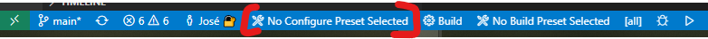

如何在Windows上使用Visual Studio Code构建、烧写和调试NXP nanoBooter和nanoCLR

⚠️ 关于构建.NET **nanoFramework**固件的说明 ⚠️

只有在您计划调试CLR、解释器、执行引擎、驱动程序、添加新目标或在本机级别添加新功能时，才需要构建它。
如果您的目标是使用C#进行编码，您只需使用[nanoff](https://github.com/nanoframework/nanoFirmwareFlasher)将您的MCU刷入适当的固件映像。
针对多个目标可提供准备好的可刷写固件映像，请查看[Home](https://github.com/nanoframework/Home#firmware-for-reference-boards)存储库。

## 关于本文档

本文档描述了如何为NXP目标构建所需的.NET **nanoFramework**固件映像。
构建系统基于CMake工具，以便在所有主要平台上进行开发。

## 使用Dev Container

如果您希望简单高效，我们建议您使用[Dev Container](using-dev-container.md)来构建映像。这也有一些要求，比如在VS Code中安装Docker Desktop和Remote Container扩展，但已经配置并准备就绪！

如果您更喜欢在Windows计算机上安装所有所需的工具，那么您应该继续本教程。

## 先决条件

您将需要：

- [Visual Studio Code](http://code.visualstudio.com/)
- Visual Studio Code扩展
  . [C/C++](https://marketplace.visualstudio.com/items?itemName=ms-vscode.cpptools) - C/C++ IntelliSense、调试和代码浏览（由Microsoft提供）
  . [CMake Tools](https://marketplace.visualstudio.com/items?itemName=ms-vscode.cmake-tools) - Visual Studio Code中的扩展CMake支持（由Microsoft提供）
  . [Cortex Debug](https://github.com/Marus/cortex-debug)) - 专为ARM Cortex-M核心而制作的调试工具（用于J-Link），如果您使用板载编程器，则不需要。
- [CMake](https://cmake.org/download/)（要求的最低版本为3.21）
- 一个用于生成构建文件的CMake构建系统。我们推荐使用[Ninja](https://github.com/ninja-build/ninja/releases)。
- [GNU ARM嵌入式工具链](https://developer.arm.com/open-source/gnu-toolchain/gnu-rm/downloads)
- OpenOCD。建议使用[xPack OpenOCD](https://github.com/xpack-dev-tools/openocd-xpack/releases)，他们提供了维护良好的Windows发行版。

上述所有内容都可以通过[`nf-interpreter`](https://github.com/nanoFramework/nf-interpreter)项目中的`install-scripts`文件夹中的PowerShell脚本`.\install-nf-tools.ps1 -TargetSeries NXP`来安装。如果您愿意，也可以手动进行安

装（鉴于明显的原因，这样做是不推荐的）。

## 概述

为了简化：本指南将把所有工具和源代码放在易于访问的文件夹中，而不是默认的安装路径（您不必采取相同的方式）。

1. 创建如下所示的目录结构：

   - `C:\nftools`
   - `C:\nanoFramework`

2. 下载并安装[Visual Studio Code](http://code.visualstudio.com)。

3. 将[`nf-interpreter`](https://github.com/nanoframework/nf-interpreter)存储库克隆到`C:\nanoFramework\nf-interpreter`。有关更多信息，请参阅下一节。

4. 运行位于`install-scripts`文件夹中的PowerShell脚本，该脚本将下载并安装所有所需的工具。
   `.\install-stm32-tools.ps1 -Path 'C:\nftools'`
   为了获得最佳效果，请在提升的命令提示符中运行，否则设置系统环境变量将失败。
5. 查看并调整几个JSON文件以符合您的环境（如下文所述进行文档记录）
6. 重新启动Visual Studio Code（由于更改了JSON文件）

设置过程比它看起来要简单得多。设置脚本几乎完成了所有工作。

## .NET **nanoFramework** GitHub存储库

如果您打算更改nanoBooter或nanoCLR并创建Pull请求，则需要将[nanoFramework/nf-interpreter](https://github.com/nanoFramework/nf-interpreter)分叉到您自己的GitHub存储库，并使用Git客户端（例如[GitHub桌面应用程序](https://desktop.github.com/)）在Windows系统上克隆分叉的GitHub存储库。

_main_分支是默认的工作分支。在修复错误或尝试新功能时，应在其自己的分支上进行操作。有关建议的贡献工作流程的具体说明，请参见[Contributing guide](../contributing/contributing-workflow.md#suggested-workflow)。

如果您不打算对nanoBooter和nanoCLR进行更改，可以直接从GitHub克隆[nanoFramework/nf-interpreter](https://github.com/nanoFramework/nf-interpreter)。

请确保将此文件夹放在驱动器上足够高的位置，以避免触发长文件名问题。CMake不支持超过250个字符的文件名。

## 在Windows中设置构建环境

为了简化，本指南将把所有工具和源代码放在易于访问的文件夹中，而不是默认的安装路径（您不必采取相同的方式）：

1. 创建如下所示的目录结构：

   - `C:\nftools`
   - `C:\nanoFramework`

2. [下载](http://code.visualstudio.com/)并安装Visual Studio Code。

3. [下载](https://cmake

.org/download/)并将CMake安装到`C:\nftools\CMake`。

4. [下载](https://github.com/ninja-build/ninja/releases)Ninja并将可执行文件放置在`C:\nftools\Ninja`中。

5. [下载](https://developer.arm.com/open-source/gnu-toolchain/gnu-rm/downloads)并安装GNU ARM嵌入式工具链到`C:\nftools\GNU_ARM_Toolchain`。

6. 最后，将`nf-interpreter`克隆到`C:\nanoFramework\nf-interpreter`。有关更多信息，请参阅下一节。

### 设置MCUXpresso IDE

要使用板载LPC-Link编程器对评估板进行编程，您需要设置MCUXpresso IDE，该IDE为我们提供了redlink软件。Redlink将Flash映像复制到核心RAM中，然后将其刷入外部HyperFlash或QSPI Flash。

1. 在nxp的[网站](https://www.google.com/url?sa=t&rct=j&q=&esrc=s&source=web&cd=1&cad=rja&uact=8&ved=2ahUKEwiPwZiTlMHmAhU5AxAIHQkrDNIQFjAAegQIBhAB&url=https%3A%2F%2Fwww.nxp.com%2Fdesign%2Fsoftware%2Fdevelopment-software%2Fmcuxpresso-software-and-tools%2Fmcuxpresso-integrated-development-environment-ide%3AMCUXpresso-IDE&usg=AOvVaw0Oh8kETGeCSOnWTlKyGj_I)上注册并下载MCUXpresso IDE。
2. 安装MCUXpresso IDE。
3. 在设置`launch.json`文件时，请记住设置正确的路径。

## 设置构建环境

克隆存储库后，您需要设置构建环境。您可以使用PowerShell脚本或按照逐步说明进行操作。

### 自动安装构建环境

**以管理员身份运行PowerShell并运行`set-executionpolicy RemoteSigned`以启用执行已签名脚本的功能。**

在Windows上，可以使用存储库`install-scripts`文件夹中的`.\install-nf-tools.ps1` PowerShell脚本下载/安装CMake、工具链、OpenOCD（用于JTAG调试）和Ninja。您可能需要使用**以管理员身份运行**的PowerShell来允许安装模块以解压缩下载的归档文件。
该脚本将下载zip和安装程序到存储库`zips`文件夹，并将它们提取到nanoFramework工具文件夹`C:\nftools`的子文件夹中，或者安装该工具。

1. 在存储库的`install-scripts`文件夹中打开PowerShell，并运行脚本。

示例PowerShell命令行：

```ps
.\install-nf-tools.ps1 -TargetSeries NXP
```

您可以通过在命令行中添加`-Force`来强制更新环境变量。

该脚本将创建以下子文件夹

（请参阅下面的手动安装）：

- `C:\nftools`
- `C:\nftools\GNU_Tools_ARM_Embedded\8-2019-q3-update`
- `C:\nftools\ninja`
- `C:\nftools\hex2dfu`
- `C:\nftools\openocd`

将为当前Windows用户创建以下环境变量。

- `NF_TOOLS_PATH = C:\nftools`
- `GNU_GCC_TOOLCHAIN_PATH = C:\nftools\GNU_Tools_ARM_Embedded\8-2019-q3-update`
- `NINJA_PATH = C:\nftools\ninja`

## 设置Visual Studio Code

- **步骤1**：安装以下扩展：

  - [C/C++](https://marketplace.visualstudio.com/items?itemName=ms-vscode.cpptools)
  - [CMake Tools](https://marketplace.visualstudio.com/items?itemName=ms-vscode.cmake-tools)

- **步骤2**：运行`install-scripts`文件夹中的PowerShell脚本`Initialize-VSCode.ps1`。这将调整所需的设置，为调试构建启动配置，并设置任务以简化开发工作。

```ps
.\Initialize-VSCode.ps1
```

您可以通过在命令行中添加`-Force`来强制更新环境变量。
PowerShell依赖于上述描述的环境变量，以正确设置各种VS Code工作文件。如果您未使用自动安装并且变量不可用，您将不得不手动编辑`tasks.json`、`launch.json`和`settings.json`，以替换相关路径。

- **步骤3**：将模板文件（位于`nf-interpreter\config`文件夹中）`user-tools-repos.TEMPLATE.json`复制到一个（新的）文件中，命名为`user-tools-repos.json`。将json部分`user-tools-repos-local`重命名为`user-tools-repos`，并根据`user-tools-repos`配置预设中的工具和存储库的路径进行调整。如果您不打算为特定平台构建，可以从中简单地删除相关选项。如果您不想使用各种存储库的本地克隆，可以将其设置为`null`。**!!请确保始终在路径中使用正斜杠!!**

- **步骤4**：如果要使用板载编程器，请编辑`.vscode`文件夹中的名为`settings.json`的文件，并粘贴以下内容（请记住更新路径以匹配您的设置）。

```json
{
    "cortex-debug.armToolchainPath": "c:/nftools/GNU_ARM_Toolchain/8 2019-q3-update/bin",
    "cortex-debug.JLinkGDBServerPath": "c:/Program Files (x86)/SEGGER/JLink/JLinkGDBServerCL.exe"
}
```

- **步骤5**：保存所有打开的文件并退出VS Code。

## 构建nanoCLR

- **步骤1**：从存储库文件夹中启动Visual Studio Code，或者从

**文件**菜单中选择**打开文件夹**并浏览到存储库文件夹。VS Code可能会提示您询问"是否要配置此项目？"忽略该提示，因为您需要先选择要构建的变体。

- **步骤2**：重新打开VS Code。它应该自动加载工作区。在左下角的状态栏上，单击`No Kit Selected`，然后选择`[Unspecified]`。

- **步骤3**：在左下角的状态栏上，单击`CMake:Debug NXP_MIMXRT1060_EVK: Ready`，然后选择`Debug`。等待配置项目完成（在右下角显示的进度条）。这可能需要一些时间，第一次比较长。

- **步骤4**：重新打开VS Code。它应该自动加载工作区。在左下角的状态栏上，单击`No Configure Preset Selected`，然后从打开的下拉列表中选择要构建的目标。可能是`NXP_MIMXRT1060_EVK`。VS Code将自动选择相应的构建预设。



- **步骤5**：在状态栏中点击`Build`或按下F7键。

- **步骤6**：等待构建完成，输出信息显示为`Build finished with exit code 0`。

- **步骤7**：在`build`文件夹中，您会找到以下文件：
  - `nanoBooter.bin`
  - `nanoBooter.elf`
  - `nanoBooter.hex`
  - `nanoCLR.bin`
  - `nanoCLR.elf`
  - `nanoCLR.hex`

>>注意：如果在构建过程中出现错误，可能会导致`build`文件夹中出现部分构建，而`CMake/Ninja`构建过程在`.bin`目标未创建时声明成功构建，并且`CMake clean`无法帮助解决问题。
在这种情况下，删除`build`文件夹中的内容应该允许构建完成，一旦解决了导致原始失败的问题。

### 常见的构建问题

如果存在以下情况，上述构建步骤可能会出现一些错误：

- CMake未正确安装，不在PATH中或由于某种原因无法找到。
- 无法识别Ninja：检查settings.json或PATH环境变量，并重新启动Visual Studio Code。
- 找不到COMPILATION对象文件：检查您的路径是否超过了140个字符。将解决方案文件夹放在足够高的位置。
- 如果您对`CMakePresets.json`或`CMakeUserPresets.json`进行了更改，请重新打开VS Code。

对于大多数构建问题，一个好的解决方法是手动清理构建文件夹，删除其内容，并重新启动VS Code。

## 烧写NXP目标

1.

 使用USB电缆将目标板连接到计算机。
2. 打开Visual Studio Code，转到`Debug and Run`（CTRL+SHIFT+D）。
3. 运行调试（绿色矩形或默认快捷键F5），先运行nanoBooter，然后运行nanoCLR。
   >>注意：您不需要每次都重新烧写nanoBooter，只需烧写nanoCLR即可。

## 使用Cortex Debug和J-Link进行调试（可选）

如果您想实时查看CPU寄存器的值并使用更高级的调试工具，则可以使用Cortex Debug扩展。请参考SEGGER的wiki上提供的指南。

## 下一步

参阅[入门指南](http://docs.nanoframework.net/content/getting-started-guides/getting-started-managed.html)，了解如何在nanoFramework板上创建和运行"Hello World"托管应用程序的说明。