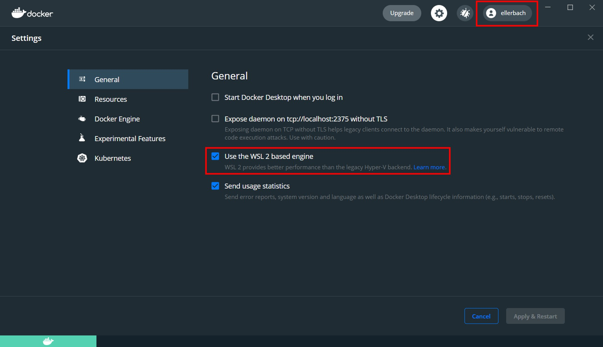
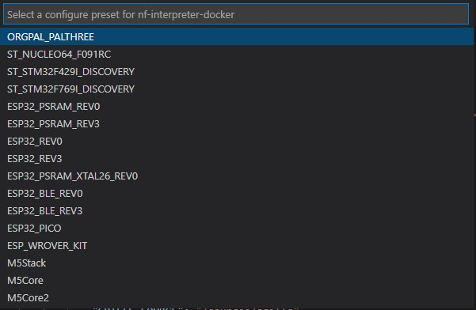
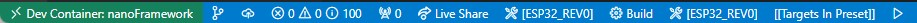
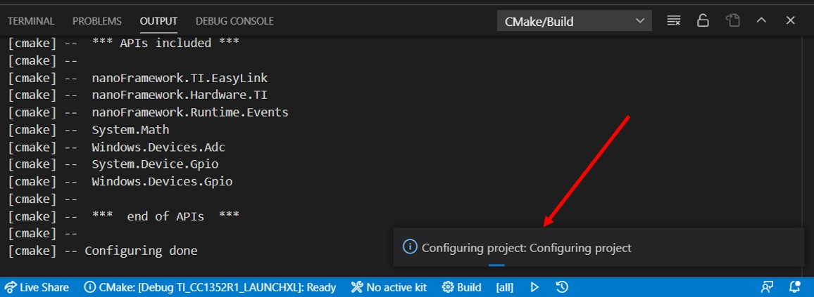

# 使用开发容器构建目标

[Dev Container](https://marketplace.visualstudio.com/items?itemName=ms-vscode-remote.remote-containers) 是使用 VS Code 的一个独立容器的方法。这样可以在与您正常的 Windows/Linux/Mac 环境分离的环境中工作。这样做的优点是与安装的应用程序隔离，因此您不必在自己的环境中"污染"可能不需要的工具。另一个优点是能够预先设置、在首次请求时构建，拉取您在开发中所需的所有工具、仓库、文档和设置。

我们提供了使用此类开发容器以非常简单和直接的方式构建任何受支持的目标的可能性。

## 需求

- **步骤0**：确保您已经克隆了 [nf-interpreter](https://github.com/nanoframework/nf-interpreter) nanoFramework 目录。工作分支为 `main`。
- **步骤1**：确保您已安装 [VS Code](https://code.visualstudio.com/Download)。
- **步骤2**：确保您已安装 [Docker Desktop](https://www.docker.com/products/docker-desktop)。
- **步骤3**：出于性能原因，可选但强烈推荐：在 Windows 主机机器上启用 [Windows 子系统用于 Linux 2](https://docs.microsoft.com/windows/wsl/install-win10)。

> 注意：这可能需要重新启动

- **步骤4**：检查 Docker 配置并确保您已登录。在下面的图片中，右上角应该显示您的 Docker 帐户。如果您未登录，将会收到一个错误。如果您正在使用 WSL2（推荐），WSL2 支持的复选框应该被选中。



- **步骤5**：确保您已安装 [Remote - Containers](https://marketplace.visualstudio.com/items?itemName=ms-vscode-remote.remote-containers) 扩展。
- **步骤6**：将两个模板文件（在 `nf-interpreter\config` 文件夹中）`user-tools-repos.TEMPLATE.json` 和 `user-prefs.TEMPLATE.json` 复制到（新的）文件，命名为 `user-tools-repos.json` 和 `user-prefs.json`。
  将您的 "新" `user-tools-repos.json` 文件的内容更改如下：
  - 将 JSON 部分的 `user-tools-repos-container` 重命名为 `user-tools-repos`。
- **步骤7**：使用 VS Code 打开完整的 `nf-interpreter` 目录。
- **步骤8**：选择您的容器。

转到文件 `.devcontainer/devcontainer.json` 并选择您想要的容器。文件本身中包含详细信息：

```json
 // 调整此文件以选择您希望使用预构建容器的平台
 // -

 Dockerfile.All = 您可以构建任何内容，但这是一个非常大的容器
 // - Dockerfile.AzureRTOS = 用于 AzureRTOS 目标
 // - Dockerfile.ChibiOS = 用于基于 ChibiOS 的目标（例如：STM32、Netduino、Orgpal）
 // - Dockerfile.ESP32 = 用于 ESP32 目标
 // - Dockerfile.TI = 用于 TI 目标
 // 如果您愿意，可以使用源文件并调整它们所在的位置，名称相同，在 ./sources 中。这将允许您自定义它们并添加您可能需要的任何其他内容。
 "dockerFile": "Dockerfile.ChibiOS",
```

> 注意：作为初学者，我们建议您使用预构建容器。如果您熟悉容器并且需要调整其中的资源，那么请使用可以自行构建的容器。使用 `./sources` 子目录中的容器。因此，文件名将是例如 `./source/Dockerfile.All`，以使用包含所有内容并从源代码构建的容器。
> 错误：如果您收到类似 "Bad CMake executable "". Is it installed or settings contain the correct path (cmake.cmakePath)? 解决方案：卸载 Visual Studio Code 中的 CMake 和 CMake 工具，然后重新启动 Visual Studio Code。

- **步骤9**：在提示时打开开发容器。

  这是演示如何进行此操作的示例：

  

  > 注意：在我们的情况下，开发容器被称为 `nanoFramework`。

  如果 VS Code 没有显示提示，您可以按 F1 键显示所有命令。在此列表中，您可以选择"Remote-Containers: Open Folder in Container..." 项手动打开开发容器。此选项将要求您通过文件夹选择对话框选择文件夹。

- **步骤10**：此时，如同前面的示例中所示，当单击日志时，您应该看到活动。请耐心等待。是的，非常耐心。
- **步骤11**：我们告诉过您要有耐心，去喝杯茶或咖啡吧。这部分资源密集型，会占用大部分内存和处理器。
- **步骤12**：再耐心点，是的，所有需要的工具和目录都被克隆，所有需要的设置也被克隆了。如果您的网络带宽较低，这可能需要很长时间。请参阅高级部分，了解如果您只对非常特定的板卡感兴趣，您如何跳过其中的一些元素。
- **步骤13**：当您的 VS Code 可以访问文件并且看起来像这样时，它将结束：


- **步骤14**：选择要构建的目标，如果之前的所有步骤都已经正确完成，列表将显示出来：



如果您选择了例如 ESP_REV0，您将在任务栏中看到它：



要选择新的目标，只需单击目标名称，菜单将再次弹出，然后您可以选择新的目标。确保您首先清理您的构建文件夹。

- **步骤15**：这实际上将在 `build` 文件夹中准备所需的一切。

> **重要提示**：这可能需要长达1小时或更长时间，具体取决于目标和您的计算机性能。所以请耐心等待！在准备项目时，您将在右侧看到一个小窗口：



- **步骤16**：我们之前告诉过您要有耐心吗？ :-) 如果您仍然有上一张图像中的小窗口，请耐心等待！完成后，继续下一步。
- **步骤17**：按下 `F7`，这将触发构建。构建也需要一些时间。如果一切顺利，构建将以代码0完成，并显示类似于 `[build] Build finished with exit code 0` 的内容。

## 小贴士和技巧

### 由于大小原因，某些构建可能失败

如果您的映像太大，构建可能会失败。这在某些设备上，如 ST Nucleo，选择 `debug` 时会发生。您将收到构建失败的消息，看起来像这样：

```text
[build] Memory region         Used Size  Region Size  %age Used
[build]           flash0:       18984 B        18 KB    102.99%
[build]           flash1:          0 GB         0 GB
[build]           flash2:          0 GB         0 GB
[build]           flash3:          0 GB         0 GB
[build]           flash4:          0 GB         0 GB
[build]           flash5:          0 GB         0 GB
[build]           flash6:          0 GB         0 GB
[build]           flash7:          0 GB         0 GB
[build]           config:          0 GB         0 GB
[build]       deployment:          0 GB         0 GB
[build]            ramvt:          0 GB         0 GB
[build]             ram0:        8528 B      32720 B     26.06%
[build]             ram1:          0 GB         0 GB
[build]             ram2:          0 GB         0 GB
[build]             ram3:          0 GB         0 GB
[build]             ram4:          0 GB         0 GB
[build]             ram5:         

 0 GB         0 GB
[build]             ram6:          0 GB         0 GB
[build]             ram7:          0 GB         0 GB
[build]       bootclpbrd:          48 B         48 B    100.00%
[build] collect2: error: ld returned 1 exit status
```

### 在 CMakePresets.json 或 CMakeUserPresets.json 文件中进行更改

每次您在 `CMakePresets.json` 或 `CMakeUserPresets.json` 文件中进行更改时，您可能需要离开容器，方法是单击左下角，然后选择 `Reopen locally`，然后再次选择 `Reopen in dev container`。

通常，您会执行此操作以调整您想要添加到目标中的内容。

更一般地说，任何更改 `.vscode` 文件夹中的任何文件都需要退出并重新启动开发容器。

## 高级方案

开发容器包括一个 Dockerfile 和一个 `devcontainer.json` 文件。您当然可以自定义两者并个性化您的环境。本节将为您提供一些提示。

### 自定义 devcontainer.json 文件

有很多元素可以自定义，其中之一是您要在容器中访问的挂载文件夹。例如，我们有一些常用的文件夹，您可以在其中存储您的 bash 历史记录或挂载更多文件夹：

```json
"mounts": [
    "source=/var/run/docker.sock,target=/var/run/docker.sock,type=bind",
    // Mount .azure folder for seamless az cli auth
    "source=${env:HOME}${env:USERPROFILE}/.azure,target=/home/vscode/.azure,type=bind",
    // Keep command history
    "source=nano-bashhistory,target=/home/vscode/commandhistory,type=volume",
]
```

您有很多可以自定义的元素，包括将安装的扩展：

```json
// 在创建容器时添加要安装的扩展的 ID。
"extensions": [
    "ms-vsliveshare.vsliveshare-pack",
    "streetsidesoftware.code-spell-checker",
    "twxs.cmake",
    "ms-vscode.cmake-tools"
]
```

### 限制您要下载的平台

`Dockerfile` 包含构建任何目标所需的所有元素。如果您的带宽有限或者您只对有限数量的目标感兴趣，您可以限制所克隆和安装的内容。

所有内容都被注释掉了，因此，例如，如果您确定您永远不会针对任何 TI 板卡，您可以注释与 TI 相关的内容。在此示例中，您将注释掉所有这些内容：

```dockerfile
#RUN git clone --branch 4.10.00.07 https://github.com/nanoframework/SimpleLink_CC32xx_SDK.git ./sources/SimpleLinkCC32 \
    # && git clone --branch 3.61.00.16 https://github.com/nanoframework/TI_XDCTools.git ./sources/TI_XDCTools \
#    && git clone

 --branch 4.20.01.04 https://github.com/nanoframework/SimpleLink_CC13x2_26x2_SDK.git ./sources/SimpleLinkCC13 \
#    && git clone --branch 1.5.0 https://github.com/nanoframework/TI_SysConfig.git ./sources/TI_SysConfig
```

您还会注意到有 2 个映像，一个用于下载和扩展工具，另一个则安装核心工具并复制从下载映像中下载的元素。您当然可以优化两个映像，将它们减少到您所需的最小限度。

这仅适用于具有对所需组件的最小了解的高级用户。

### 非根用户

默认的开发容器以 root 权限运行。在简单使用情况下，您只是偶尔使用它来执行此任务，这是可以的，但如果您开始更频繁地使用它，您可能希望降低权限并以标准用户运行。

为此，您将需要取消注释最后一行：

```json
// 取消注释以作为非根用户连接。请参阅 https: //aka.ms/vscode-remote/containers/non-root。
,"remoteUser": "vscode"
```

在主 Dockerfile 中，取消注释文件并添加脚本 `non-root-user.sh`：

```dockerfile
ARG USERNAME=vscode
ARG USER_UID=1000
ARG USER_GID=$USER_UID
```

### 刷新映像

使用 Windows 10 的 Docker Desktop，您无法直接将编译的映像刷新到您的设备中，因为容器无法直接公开串行端口。
这里其他文档页面中的关于 "终端" -> "运行任务" -> "Flash nanoCRL ..." 的说明在此无效。

您可以使用 [nanoff](../getting-started-guides/getting-started-managed.md#uploading-the-firmware-to-the-board-using-nanofirmwareflasher) 工具刷新已编译的 nanoCLR.bin 文件。

示例：

```console
nanoff --update --platform esp32 --serialport COM3 --clrfile nanoCLR.bin
```