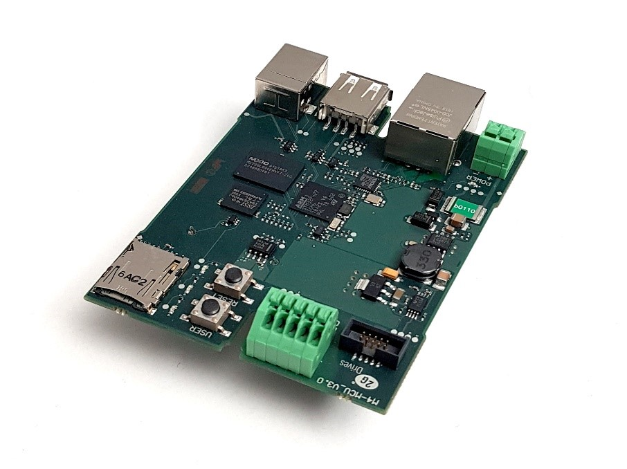
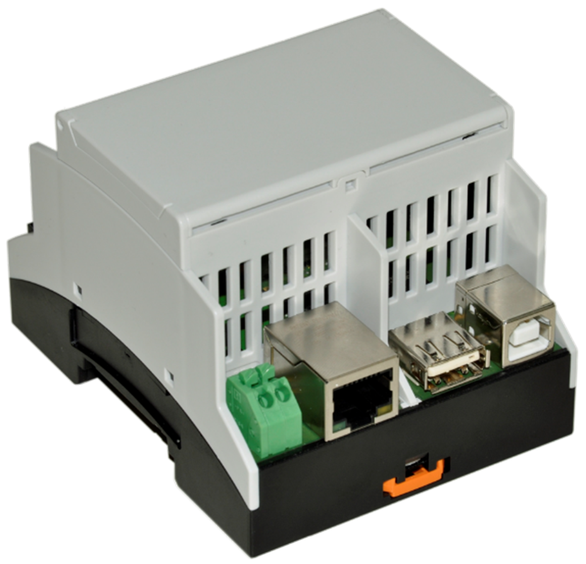
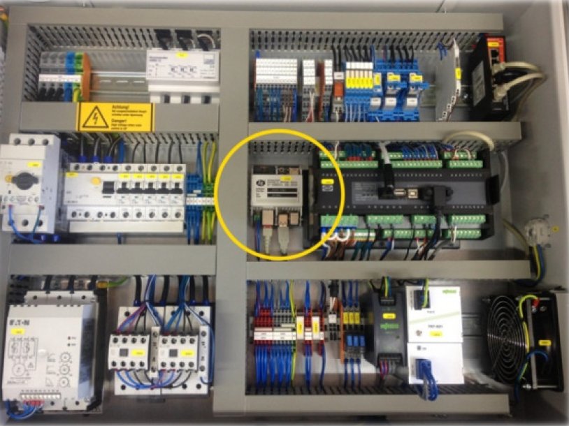
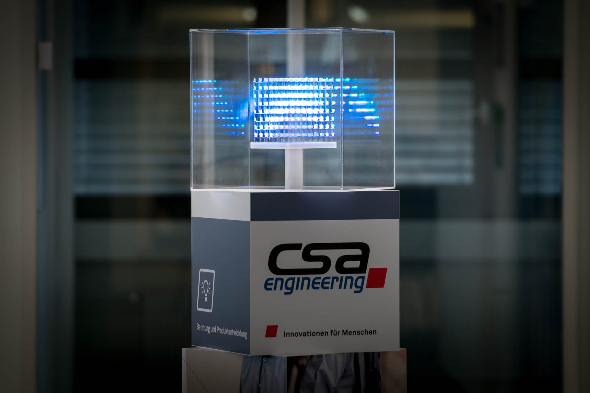
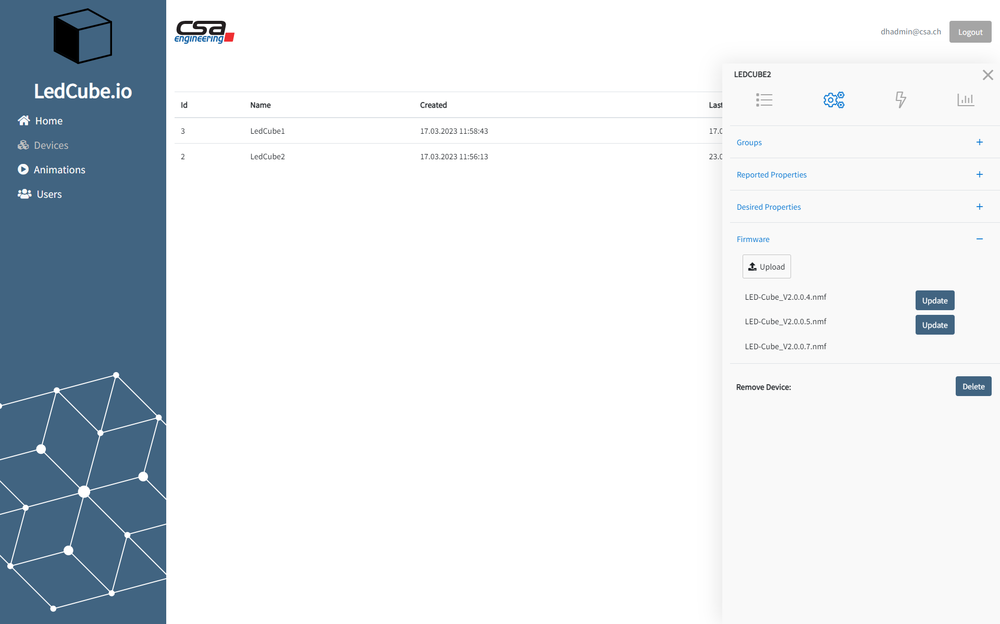

# CSA Engineering AG 在使用 .NET nanoFramework

**公司**：[CSA Engineering AG](https://www.csa.ch/)

作为一家工程服务提供商，CSA Engineering AG 为医疗技术、客运交通和工业领域开发客户定制的硬件和软件解决方案。最近，CSA 与其中一家客户共同开发了一种以 STM32F4 微控制器为主要硬件组件、以 .NET nanoFramework 作为软件基础的通用嵌入式平台。其结果是所谓的 M4MCU-Board。

## M4MCU-Board

对于这两个应用程序，以下关键需求非常重要：

- 广泛的通信功能，特别是远程访问的 TCP/IP，以及用于连接到 PLC 和工业传感器的 CAN 和 ModBus
- 可用的文件系统和处理较大数据文件的能力，以及实现现场配置的便利性，特别需要 USB 主机和 SD 卡功能
- 使用 C# 代码和所有公开可用的 .NET 类库，因为客户和 CSA 已经拥有大量现有代码。此外，为了提供高效的开发环境，嵌入式部分（M4MCU）和计算机应用程序可以使用相同的编程工具
- 实现安全可靠的远程软件更新功能

开发的 M4MCU-Board 通过以下组件满足了这些关键需求：

- 搭载 Cortex-M4 STM32F427 微控制器，具有 256kB 的 SRAM 和 1MB 的闪存
- 8MB SDRAM 和 8MB 闪存的外部存储
- SD 卡槽用于存储配置数据和大文件
- LED、按钮和一些通用输入输出（GPIO）用于一般交互
- 通信接口：
  - 1x USB 设备
  - 1x USB 主机
  - 1x 以太网 RJ45
  - 1x CAN
  - 1x RS485

此外，还实现了多个软件功能，例如使用 Visual Studio 进行开发、部署和调试，使用 NaCl 算法进行数据加密，远程软件更新，支持 SSL/TLS、CAN、ModBus 等多种通信协议，以及使用看门狗进行软件监视。

将 .NET nanoFramework 移植到我们自己的硬件平台花费了一些时间，并需要在嵌入式软件开发方面的深入知识。但最终，.NET nanoFramework 可以成功引入，并为产品应用提供了一种舒适的开发方式，结合了一套全面的功能。

M4MCU-Board 和 .NET nanoFramework 已

经在以下应用中使用。

## 应用程序 1：联合热电厂单元的智能网关

这些发电机同时产生热能和电能。为了优化目的，需要设置多个控制参数，例如点火时机或空燃比。这些参数必须可由维护工程师访问，无论是在发电机本身的本地访问，还是通过互联网，因为其中一些发电机安装在非常偏远的位置。此外，还记录和发送特征数据和错误信息供公司持续分析工厂效率。其中一个重要的特征数据是废气中的氮氧化物浓度。为了连续监测此值，之前的模型中也提供了一个独立单元作为改装套件。所有描述的任务都是通过使用 M4MCU-Board、.NET nanoFramework 作为基础和 C# 产品应用程序来实现的。

*M4MCU 安装在符合 DIN 轨标准的壳体内*

*应用程序 1：智能网关（用黄色圈标出）安装在联合热电厂控制柜中*

## 应用程序 2：展览吸引产品的控制和通信电子设备

该产品是一个 8x8x8 的 LED 立方体，用于显示文本和动画，从而吸引展览访客的注意力。LED 立方体可以进行配置，选择动画，并且操作员可以在前端进行状态监控。在后台，我们基于 Azure 产品的物联网后端正在运行。使用 M4MCU-Board、.NET nanoFramework 作为基础和 C# 产品应用程序，实现与物联网后端的通信（通过 MQTT）、动画/播放列表的转换和存储，以及通过 SPI 激活 LED。

*应用程序 2：由 M4MCU-Board 控制的 LED 立方体*

*应用程序 2：LED 立方体配置前端界面*