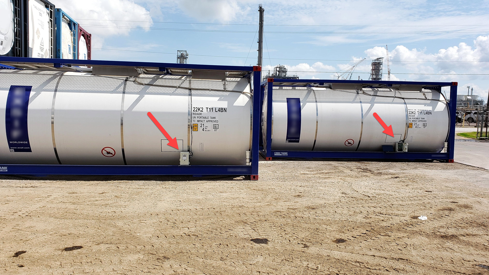
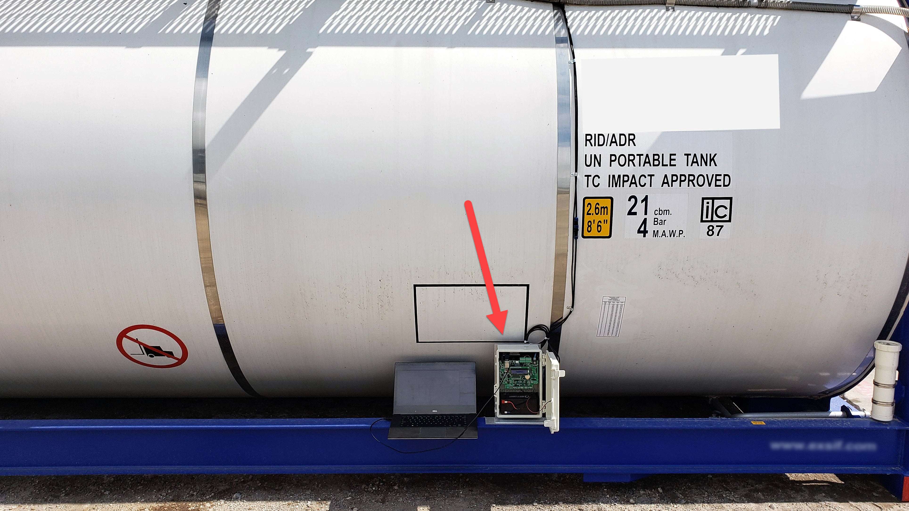
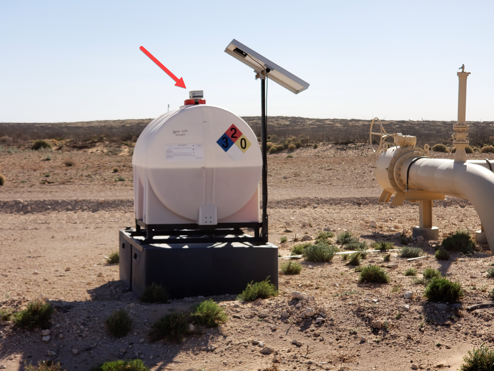
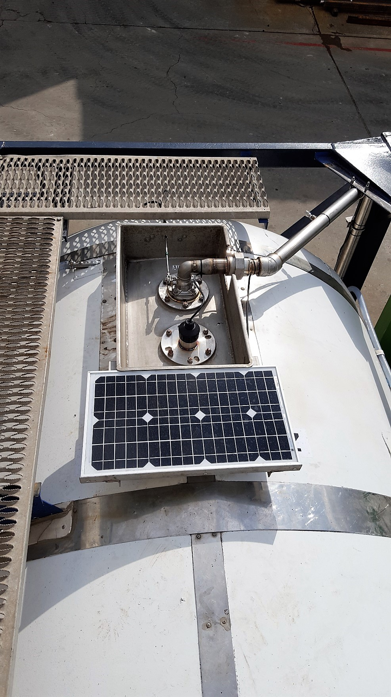
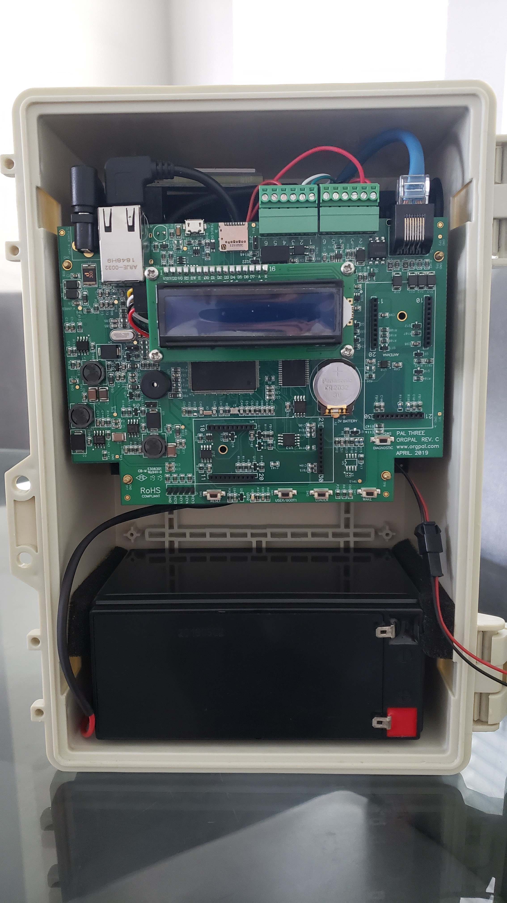

# 油田监测

**公司**: [OrgPal远程遥测](https://www.orgpal.com/)

**应用行业**: 油田

**[产品网站](https://www.orgpal.com/solutions-tank-level-monitoring)**

能源领域的服务和运营需要合规、准确和频繁的监测。对于石油和天然气公司来说，挑战在于找到一种经济实惠、可靠的系统，而并非所有的遥测系统都是相同的。

[扎恩·格利戈洛夫](https://www.linkedin.com/in/zan-gligorov-bb03a752)，[OrgPal远程遥测](https://www.orgpal.com/)的首席执行官，解释了他们的选择背后的原因。

我们的目标是创建一个现代化、简单易用的设备，可以轻松与北美各个油田中从最现代化到已有的数百个传感器进行集成。我们的硬件实现了这些目标，但我们需要一个优秀的固件来匹配它，而nanoFramework就使这成为可能。

许多解决方案使用来自许多制造商的不同组件来集成一个解决方案，导致成本高昂，维护选项更加昂贵。这种技术在设计上并不兼容，只是功能上相容，而且由于它们部署在偏远的恶劣环境中，几乎没有或者根本没有地面通信和电力供应，随着时间的推移，维护成本非常高昂。

由于nanoFramework功能丰富且易于使用，占用空间小（适用于微小的MCU），我们的解决方案在行业中具有最低的能源消耗。我们能够使用高功率的STM32 MCU，集成了完整的带天线的卫星、内置闪存/文件系统、USB、蜂窝网络支持、RTC等等，打造出一个功能强大的远程测量系统，并且能耗低。

基于PalThree的解决方案将是该行业的颠覆者。

请查看下面的照片。

*停放区的储罐*

*带有PalThree的储罐的近景*

*安装了PalThree的储

罐在沙漠中部署*

*为PalThree供电的太阳能电池板*

*产品外壳中的PalThree*