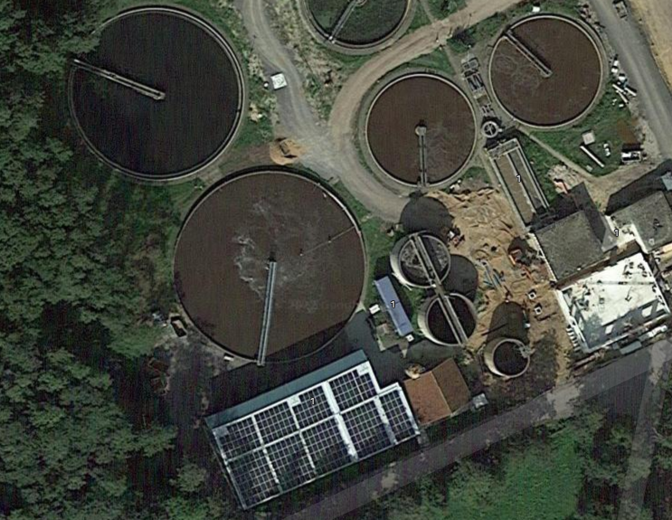
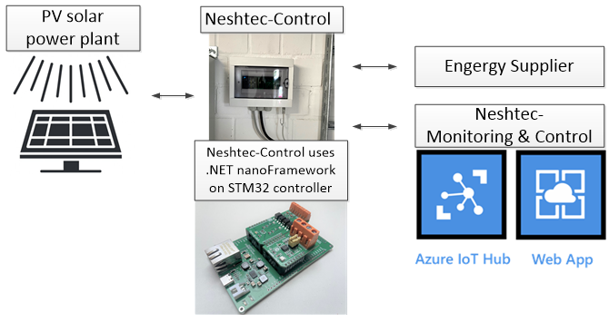

# 太阳能电厂远程监控与控制

**公司**: [Neshtec](https://neshtec.eu/)

**应用行业**: 太阳能电厂

Neshtec首次在一个项目中使用了他们自己新开发的硬件平台Neshtec-Control。该硬件平台基于STM32F7微控制器，并在.NET nanoFramework上运行。在该项目中，Neshtec-Control用于实现一个安装在污水处理厂的小于100千瓦峰值功率的光伏太阳能系统与能源供应商之间的接口。

借助Neshtec-Control，能源供应商可以远程监控系统，并进行控制，例如设置性能规范或进行紧急停机。这与Azure相连接，使得Neshtec能够执行自己的电厂监控和远程软件更新。

Neshtec-Control进行的接口转换在Modbus和IEC 60870-5-104这两种通信协议之间进行。Neshtec-Control具有模块化结构，因此可以通过.NET nanoFramework在应用层上抽象地使用不同的I/O模块，以满足项目的特定需求。结合框架的高可靠性和信息安全功能，这提高了Neshtec项目在成本和实施时间方面的效率。

请查看下面的照片。

*电厂的鸟瞰图*

*系统图示*