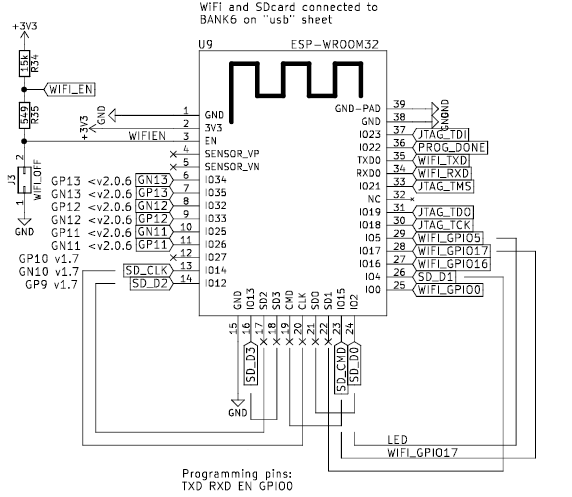

# ULX3S特定文章

请查看[Radiona ULX3S主页](https://radiona.org/ulx3s/)，以及[emard的源代码](https://github.com/emard/ulx3s)。

完整的ULX3S原理图可以在[这里](https://github.com/emard/ulx3s/blob/master/doc/schematics.pdf)找到。

特别注意ESP32的连接方式：

红色LED（D22）连接到GPIO5。