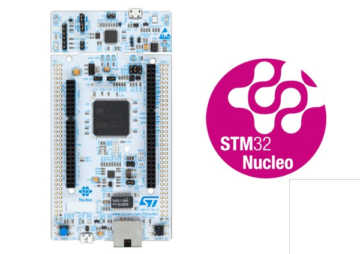

# STMicroelectronics NUCLEO144-F746ZG

[产品页面](http://www.st.com/en/evaluation-tools/nucleo-f746zg.html)

这个社区贡献中使用的开发板是来自STM的NUCLEO144 F746ZG开发板。该开发板可以从各个渠道购买，价格约为23欧元。有关该开发板的更多信息以及用户和编程手册的链接，请访问ST的[产品页面](http://www.st.com/en/evaluation-tools/nucleo-f746zg.html)。

以下是从ST提取的一些基本信息：

- LQFP144封装的STM32微控制器
- 外部开关电源用于产生Vcore逻辑电源（仅适用于带有“-P”后缀的板）
- 符合IEEE-802.3-2002以太网标准（取决于STM32的支持）
- USB OTG或全速设备（取决于STM32的支持）
- 3个用户LED指示灯
- 2个用户和复位按钮
- 32.768 kHz晶体振荡器
- 开发板连接器：
  - 带Micro-AB的USB接口
  - SWD接口
  - 以太网RJ45接口（取决于STM32的支持）
  - ST Zio连接器，包括Arduino™ Uno V3
  - ST morpho接口
- 灵活的电源供应选项：ST-LINK USB VBUS或外部电源
- 带有USB重新枚举功能的板载ST-LINK/V2-1调试器/编程器：支持大容量存储、虚拟COM端口和调试端口

## 烧写和调试

该开发板有两个Micro USB接口。一个是用于访问嵌入式ST-Link接口，用于烧写nanoFramework固件和对nanoCLR代码进行调试。第二个用于将设备连接到Visual Studio，以便部署和调试C#托管应用程序。

## 浮点数

当前构建设置为添加对单精度浮点数的支持。
这意味着`System.Math` API仅支持`float`重载，`double`重载会抛出`NotImplementedException`。

## 固件映像（可直接部署）

## 托管助手

请查看针对该开发板提供的[C#托管助手](https://github.com/nanoframework/nf-

Community-Targets/tree/main/ChibiOS/ST_NUCLEO144_F746ZG/managed_helpers)。