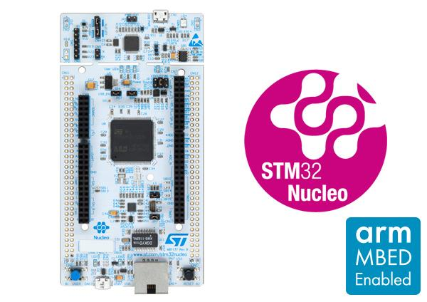

# STM NUCLEO144 F439ZI 开发板

这个社区贡献中使用的开发板是来自STM的 NUCLEO144 F439ZI 开发板。该开发板可以从各种渠道购买，价格约为23欧元。关于该开发板的更多信息以及用户和编程手册的链接可以在ST的产品页面中找到，[网址](http://www.st.com/en/evaluation-tools/nucleo-f439zi.html)。

以下是从ST摘录的一些基本信息：

- LQFP144 封装的 STM32 微控制器
- 外部开关电源以生成 Vcore 逻辑供电（仅适用于带有 '-P' 后缀的开发板）
- 符合 IEEE-802.3-2002 标准的以太网接口（取决于 STM32 支持）
- USB OTG 或全速设备（取决于 STM32 支持）
- 3个用户LED
- 用户和复位按钮
- 32.768 kHz 晶振
- 开发板连接器：
  - 带有 Micro-AB 的 USB 接口
  - SWD 接口
  - 以太网 RJ45 接口（取决于 STM32 支持）
  - 包括 Arduino™ Uno V3 的 ST Zio 连接器
  - ST morpho 接口
- 灵活的电源供应选项：ST-LINK USB VBUS 或外部电源
- 集成的 ST-LINK/V2-1 调试器/编程器，具备 USB 重新枚举功能：支持大容量存储、虚拟串口和调试端口

## 烧录和调试

该开发板具有两个 micro USB 接口。一个用于连接内置的 ST-Link 接口，用于烧录 nanoFramework 固件和对 nanoCLR 代码进行调试。第二个接口用于将设备与 Visual Studio 连接，以便部署和调试您的 C# 托管应用程序。

## 浮点数支持

当前构建设置为添加对单精度浮点数的支持。
这意味着 `System.Math` API 仅支持 `float` 重载，`double` 重载会抛出 `NotImplementedException` 异常。

## 托管帮助程序

请查看适用于该开发板的[C#托管帮助程序](https://github.com/nanoframework/nf-Community-Targets/tree/main/ChibiOS/ST_NUCLEO144_F439ZI/managed_helpers)。