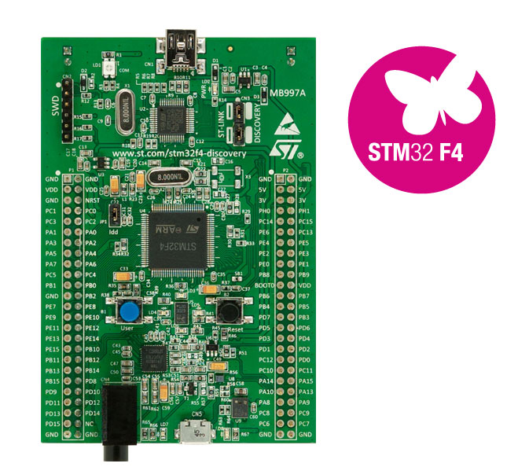

# STMicroelectronics STM32F4DISCOVERY

[产品页面](http://www.st.com/en/evaluation-tools/stm32f4discovery.html)

这个社区贡献所使用的开发板是来自ST的STM32F4DISCOVERY开发板。该开发板可以从各种渠道购买，价格约为20欧元。有关该开发板的更多信息以及用户和编程手册的链接可以在ST的[网站](https://www.st.com/en/evaluation-tools/stm32f4discovery.html)的产品页面中找到。

以下是从ST官方提取的一些基本信息：

- STM32F407VGT6微控制器，采用32位ARM® Cortex®-M4带FPU内核，1MB闪存，192KB RAM，采用LQFP100封装
- STM32F4DISCOVERY上搭载的是ST-LINK/V2（旧型号），STM32F407G-DISC1上搭载的是ST-LINK/V2-A（新型号）
- USB ST-LINK，具备重新枚举功能，提供三种不同的接口：
  - 调试端口
  - 虚拟串口（仅适用于新型号）
  - 大容量存储（仅适用于新型号）
- 板载电源：通过USB总线供电或外部5V电源电压供电
- 外部应用电源：3V和5V
- LIS302DL或LIS3DSH ST MEMS 3轴加速度计
- MP45DT02 ST-MEMS音频传感器全向数字麦克风
- CS43L22音频DAC，集成了类D扬声器驱动器
- 八个LED：
  - LD1（红/绿）用于USB通信
  - LD2（红色）表示3.3V电源开启
  - 四个用户LED，LD3（橙色），LD4（绿色），LD5（红色）和LD6（蓝色）
  - 2个USB OTG LED，LD7（绿色）表示VBUS，LD8（红色）表示过流
- 两个按键（用户和复位）
- 带有micro-AB连接器的USB OTG FS
- 扩展头，用于连接到原型板和便于探测的所有LQFP100 I/O引脚

## 烧录和调试

该开发板有一个迷你USB连接器，可暴露出用于烧录nanoFramework固件和对nanoCLR代码进行调试的嵌入式ST-Link接口。第二个USB连接器（micro USB）用于将设备与Visual Studio连接，以便部署和调试C#托管应用程序。

## ADC配置

以下ADC通道（及其相应的GPIO引脚）在托管API中可用，

对应的索引如下：

- PC1，ADC1 IN11
- PC2，ADC1 IN12
- PA6，ADC2 IN6
- PA7，ADC2 IN7
- PB0，ADC2 IN8
- 温度传感器 ADC1
- 内部参考电压 ADC1
- 电池电压 ADC1

## I2C配置

可用的I2C总线有：

- I2C1
  - SCL引脚：GPIOB_8
  - SDA引脚：GPIOB_9

## 浮点数

当前构建的设置支持单精度浮点数。
这意味着`System.Math` API仅支持`float`重载，`double`重载将抛出`NotImplementedException`异常。

## 固件镜像（准备部署）

## 托管帮助程序

查看为该开发板提供的[C#托管帮助程序](https://github.com/nanoframework/nf-Community-Targets/tree/main/ChibiOS/ST_STM32F4_DISCOVERY/managed_helpers)。