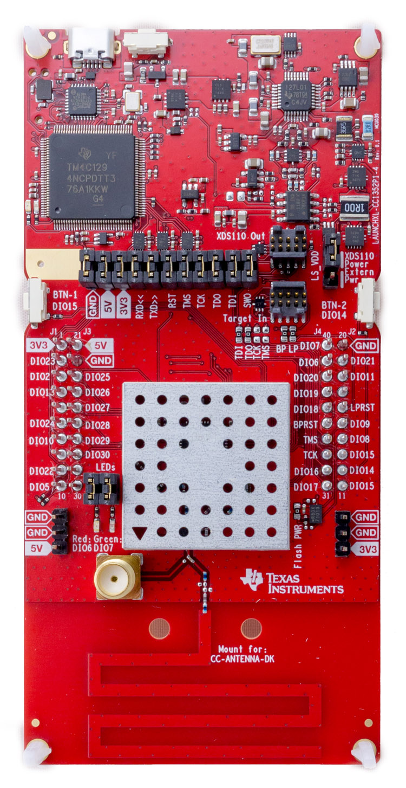

# TI CC1352P1-LAUNCHXL

[产品页面](http://www.ti.com/tool/LAUNCHXL-CC1352P)

## 特点

### CC1352R MCU

- CC3220SF 单芯片无线微控制器
- 双核架构：
  - 用户专用应用 MCU 子系统
  - 专用软件控制的无线电控制器
- 强大的 48 MHz Arm® Cortex®-M4F 处理器
- 嵌入式存储器：
  - 352KB 可编程闪存
  - 256KB 用于协议和库函数的只读存储器（ROM）
  - 8KB 缓存静态随机存储器（也可用作通用存储器）
  - 80KB 超低泄漏静态随机存储器
- 外设：
  - 数字外设可连接到任何通用输入/输出引脚（GPIO）
  - 4× 32位或 8× 16位通用定时器
  - 12位 ADC，200 kSamples/s，8个通道
  - 2× 带内部参考 DAC 的比较器（1× 连续时间，1× 超低功耗）
  - 可编程电流源
  - 2× 串口（UART）
  - 2× 同步串行接口（SSI，支持 SPI、MICROWIRE、TI）
  - I2C
  - I2S
  - 实时时钟（RTC）
  - AES 128位和 256位加密加速器
  - ECC 和 RSA 公钥硬件加速器
  - SHA2 加速器（完整的 SHA-512 套件）
  - 真随机数发生器（TRNG）
  - 最多8个通道的电容感应
  - 集成温度和电池监测
- 无线电部分
  - 多频段亚1 GHz 和 2.4 GHz RF 收发器，兼容蓝牙 5 低功耗和 IEEE 802.15.4 PHY 和 MAC
  - 优异的接收灵敏度：
  - SimpleLink 长距离模式下为 -121 dBm
  - 50 kbps 时为 -110 dBm，蓝牙 125 kbps 时为 -105 dBm（LE 编码 PHY）
  - 输出功率高达 +14 dBm（亚1 GHz）和 +5 dBm（2.4 GHz），具有温度补偿
  - 适用于符合全球无线电频率规定的系统
  - ETSI EN 300 220 接收机类别 1.5 和 2，EN 300 328，EN 303 131，EN 303 204（欧洲）
  - EN 300 440 类别 2
 

 - FCC CFR47 Part 15
  - ARIB STD-T108 和 STD-T66
  - 广泛的标准支持
  - 输出功率高达 +20 dBm，具有温度补偿
- 无线协议
  - Thread
  - Zigbee®
  - Bluetooth® 5 低功耗
  - IEEE 802.15.4g
  - 支持 IPv6 的智能对象（6LoWPAN）
  - 无线 M-Bus
  - Wi-SUN®
  - KNX RF
  - 专有系统
  - SimpleLink™ TI 15.4-Stack（亚1 GHz）
  - Dynamic Multiprotocol Manager（DMM）

### Launchpad 开发板

- 带有2.4 GHz 和亚1 GHz 无线电的 LaunchPad 开发板，适用于无线应用，带有集成的 PCB 跟踪天线
- 宽带天线支持欧洲的868 MHz ISM 频段和美国的915 MHz ISM 频段，单个板卡即可使用
- 内置仿真器，可在 CCS Cloud 中进行即时代码开发
- 可与 LaunchPad 套件和 SmartRF™ Studio 应用程序一起使用
- 通过 BoosterPack 插件模块连接器访问所有 I/O 信号
- 兼容 LCD BoosterPack

## 固件镜像（可直接部署）

提供的准备就绪的固件镜像包括下面标记的类库和功能的支持。

| Gpio | Spi | I2c | Pwm | Adc | Serial | Events | SWO | Networking | Large Heap |
|:---:|:---:|:---:|:---:|:---:|:---:|:---:|:---:|:---:|:---:|
| :heavy_check_mark: |  |  |  |  | |  | |  | |

