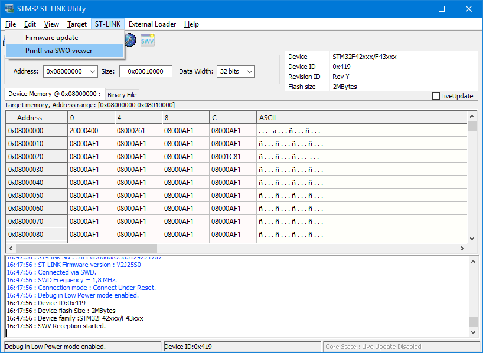
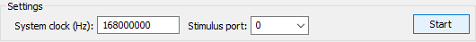
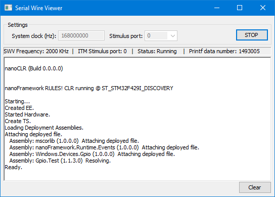

# 使用ARM Cortex-M Single Wire Output（SWO）

## 关于本文档

本文档描述了如何在.NET **nanoFramework**中使用Cortex-M SWO从设备输出数据。

## 先决条件

您将需要：

- 一块具有可用的SWO引脚并在复位状态下进行配置的目标板（即不由GPIO或任何其他外设使用，并且没有配置在任何备用模式下）。
- 如果使用原始开发板，检查原理图以确定是否需要进行任何硬件更改也是很方便的。
  - [STM F429I_DISCOVERY](../../../images/STM32F429I-DISCOVERY-solder-bridge-for-swo.jpg) 开发板需要焊接焊桥 SB9
  - [STM F769I-DISCO](../../../images/STM32F769I-DISCO-solder-bridge-for-swo.jpg) 开发板需要在 R92 上焊接一个0欧姆电阻（或将焊盘焊接在一起）
- 能够驱动和输出来自SWO源的数据的软件。[ST-Link](http://www.st.com/content/st_com/en/products/embedded-software/development-tool-software/stsw-link004.html) 是用于此目的的优秀工具。
- 将.NET **nanoFramework**构建选项设置为包括对SWO的支持（可以在 `CMakeUserPresets.json` 中设置 `"SWO_OUTPUT" : "ON"` 或使用 -DSWO_OUPUT=ON 启动CMake）。

## 输出SWO

- **步骤1**：使用带有SWO选项的.NET **nanoFramework**映像加载目标闪存
- **步骤2**：在ST-Link菜单中选择ST-Link -> Printf via SWO viewer

- **步骤3**：SWO viewer窗口加载后，将系统时钟设置为与目标匹配，并将Stimulus端口设置为`0`。

- **步骤4**：单击启动按钮，观察主窗口区域的输出。

