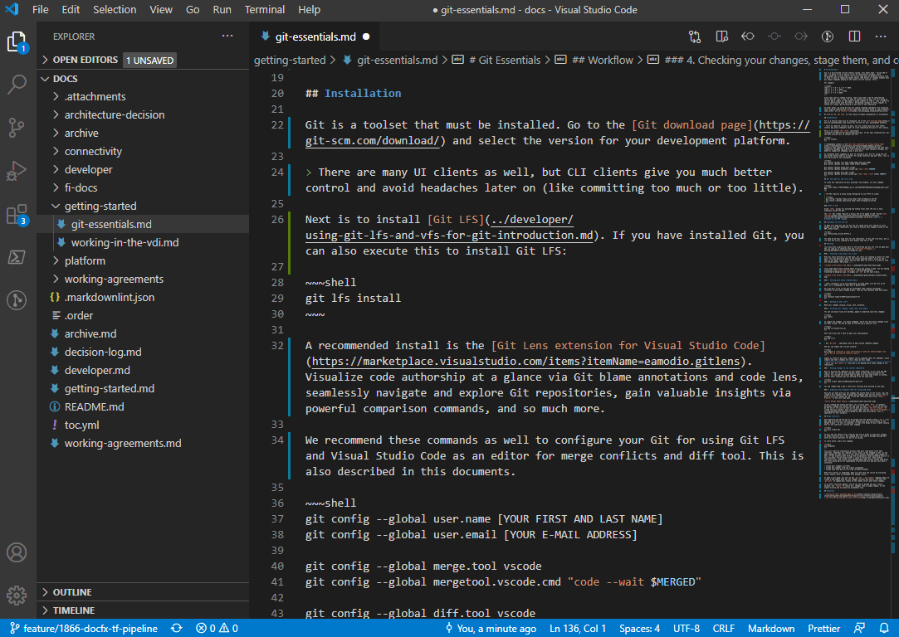

# 创建Markdown仓库的规则

本文档解释了在文档仓库中创建正确的Markdown文件的一些规则。

Markdown是一种轻量级的标记语言，您可以使用它来为纯文本文档添加格式化元素。由John Gruber于2004年创建，Markdown现在是世界上最流行的标记语言之一。

Markdown文件是基于文本的。如果您想了解Markdown的各种可能性（标题、列表、表格、代码等），此[Markdown速查表](https://github.com/adam-p/markdown-here/wiki/Markdown-Cheatsheet)将始终有所帮助。有很多这样的速查表。

使用Markdown与使用所见即所得编辑器不同。在像Microsoft Word这样的应用程序中，您点击按钮来格式化单词和短语，更改会立即可见。Markdown不是这样的。当您创建一个Markdown格式的文件时，您需要在文本中添加Markdown语法，以指示哪些单词和短语应该看起来不同。尽管如此，正如下面的部分所解释的那样，当您在VS Code中打开仓库时，可以获得一个很好的预览。

您可以在[此处](https://www.markdownguide.org/)找到更多信息，包括完整的文档。

## 图像和附件

**所有**图像都应存储在`/images`及其子目录中。

原因：我们使用[DocFX](https://dotnet.github.io/docfx/)来生成一个静态网站。我们只会移动`/images`中的附件和图片，其余内容将被忽略。

## 命名约定

请遵循以下简单的规则：

- 尽量只使用小写字母作为文件名
- 不要使用空格，使用“-”或“_”
- 仅使用来自字母和数字的ASCII 7字符

## 链接

可以使用外部链接。

对于文档内部链接，请使用相对链接到文件。例如，如果您在`/content/esp32`中，并且想要引用位于`/content/building`中的文档`build-esp32.md`，链接将是`../building/build-esp32.md`。

## 实用技巧与窍门

### 在VS Code中预览

在[VS Code](https://code.visualstudio.com)中编辑Markdown时，右上角有一个预览按钮，它会打开左侧的实时预览窗口。因此，您可以同时输入并查看结果。这通常是避免基本错误的好方法，例如确保您的图像正常显示。



### Typora作为备选工具

[Typora](https://typora.io/)是一个在线编辑器，可帮助您生成正确的Markdown。它可以帮助您创建您的第一个Markdown文档，并逐渐熟悉它。它还具有一些出色的功能，例如能够从网页复制/粘贴创建表格。请注意，这是一个在线工具，需要谨慎处理其中可能包含的信息的机密性。

### 在推送之前运行markdownlint

为确保在推送之前运行markdownlint工具检查您的md文件并解决所有消息。此工具将在流水线中运行以验证您的Markdown文件。请查看下面的[更多细节](#markdownlint)。

如果您使用VS Code，可以安装一个Markdown linter的扩展，例如[markdownlint](https://marketplace.visualstudio.com/items?itemName=DavidAnson.vscode-markdownlint)。使用它，您将立即获得有关任何格式问题的视觉反馈。

> **重要提示**：如果Markdown文件格式不正确，将无法合并。因此，在发起PR之前运行linter并修复所有问题非常重要。

### 使用拼写检查器

有很多拼写检查器扩展，它们将减少错误的数量。我们可以推荐您在VS Code中使用`Spell Right`或`Code Spell Checker`扩展程序。

### 枚举的模式

在Markdown中使用枚举时，可能会有点令人沮丧，特别是当您尝试使用枚举并在其中插入大段文本或代码块时。一点要记住的关键是，Markdown和一般情况下的枚举都是用来分组的。一旦您需要在两个枚举之间有大量文本或代码块，枚举就不是最佳选择了。因此，以下是一些模式。

```markdown
# 这是唯一的主标题

## 您可以拥有尽可能多的二级标题

1. 我的枚举从1开始
  - 我有子项目，它们也可以是枚举
  - 还有一个
1. 这个将是编号2
1. 您可以猜到，这个是3

1. 现在，由于两个枚举之间有空行，所以这个又是1
1. 然后又是2

```

如果您尝试获得包含段落和代码块的大块文本，请使用`Step #`模式，如下所示：

```markdown

- 步骤1：做某事

这里可能有很多废话，一些文本代码块、图像等。

- 步骤2：执行下一步

同样，在这里可能会有很多东西。

- 步骤3：您可以继续这种模式

```

### 在Markdown文件中添加表情符号

如果在Markdown内容中添加一些表情符号，可以很好地将重要内容简洁地呈现出来。要添加它们，请使用以下操作

系统的快捷键：

- 在Mac上：CTRL + CMD + Space
- 在Windows上：Win + ;（分号）或Win + .（句号）


## 移动文件

通常，尽量**不要**移动文件。文件中有很多相互指向的链接。

如果您想要更改文件，以下是检测破损链接的流程：

- 一旦您发起PR，构建流水线的一部分将运行[DockLinkChecker](https://github.com/nanoframework/nanoframework.github.io/blob/538b9fee8631ec30a11805da24c3bc23ef030e4f/azure-pipelines.yml#L236)。
- 打开DocFX任务结果并检查日志，其中将包含破损链接。
- 修正破损的文件。
- 推送更改。
- 如果仍然有一些问题，它们仍然会显示！

## 不需要添加任何TOC

文档将自动使用DocFX构建。DocFX的伴随工具将为您创建TOC。因此，请不要手动添加它。[TheToDocFxCreation](https://github.com/nanoframework/nanoframework.github.io/blob/538b9fee8631ec30a11805da24c3bc23ef030e4f/azure-pipelines.yml#L228)工具将为您创建TOC。

### 表格

请确保也遵守表格的规则。您需要在每列的开头和末尾都有一个`|`。第二行应至少包含3个破折号，因此每列应为`---`。您可以使用冒号模式来对齐列。[DockLinkChecker](https://github.com/nanoframework/nanoframework.github.io/blob/538b9fee8631ec30a11805da24c3bc23ef030e4f/azure-pipelines.yml#L236)将在PR期间检查您的表格是否正确形成。

## Markdownlint

为帮助开发人员和任何需要创建Markdown的人，我们建议使用[Markedownlint](https://github.com/DavidAnson/markdownlint)，它是Markdown文档的最常用的linter，也非常易用。[Markdownlint-cli](https://github.com/igorshubovych/markdownlint-cli)是一个易于使用的基于CLI的Markdownlint。

### 规则

可在[此处](https://github.com/DavidAnson/markdownlint/blob/main/doc/Rules.md)找到一份全面的规则列表。我们将采用相当严格的方法，除了我们不会应用行长度规则MD013以外，还有HTML标签。

请尽量避免使用HTML标签。由于我们集成了一些难以正确对齐的外部图像源，因此我们不会应用此规则。但是，我们将在PR中仔细检查以确保没有非关键的HTML标签被检入。

配置文件位于项目根目录中，方便您使用。该文件是`.markdownlint.json`，内容如下：

```json
{
    "MD013": false,
    "MD033": false
}
```

然后，只需从根文件夹运行以下命令：

```bash
markdownlint -f path_to_your_file.md
```

请注意，-f参数将修复所有基本错误，为您节省一些时间。

### 使用VS Code扩展

还有一些VS Code扩展可帮助您完成此任务。我们可以推荐[Prettier](https://marketplace.visualstudio.com/items?itemName=esbenp.prettier-vscode)，它将捕获其中的一些问题。

## Azure DevOps流水线

Markdownlint还包含在Azure DevOps代码质量流水线中，将自动在PR时运行。如果存在任何问题，它将失败并为您提供所有问题。您必须为合并修复这些问题。另请参阅技巧和窍门！