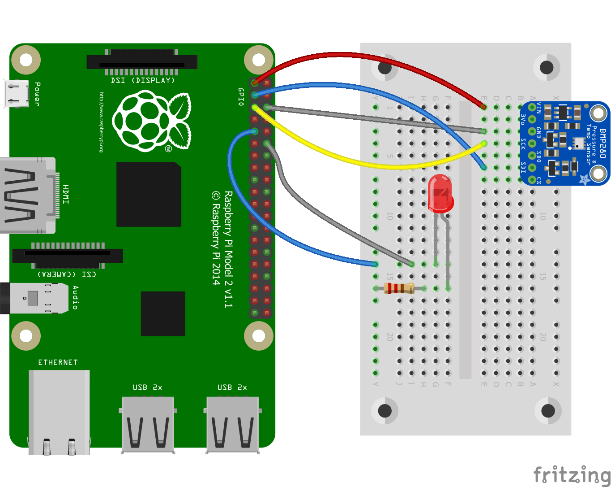
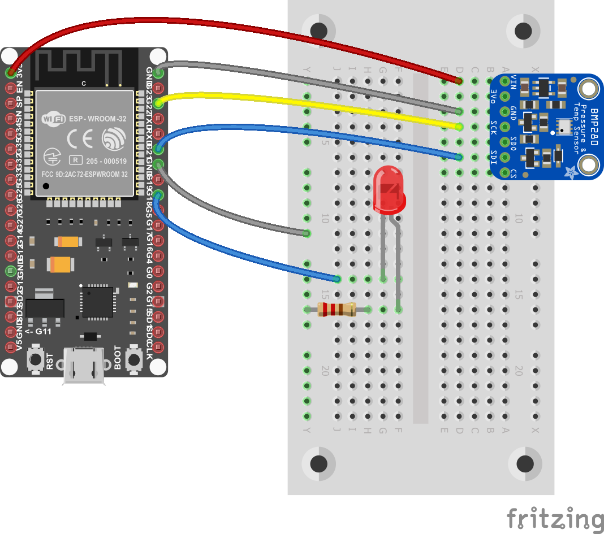

# .NET **nanoFramework** 与 .NET IoT 的比较

本文对比了.NET **nanoFramework** 和.NET IoT平台。为了进行此文档比较，在两个平台上创建了一个相同的样本应用程序，具有相同的场景。

示例应用程序在两个平台上都包括以下场景：每3秒钟，应用程序从BMP280传感器读取温度值，然后在读取值后打开LED。然后将此温度值与设备名称一起推送到IoT Hub，每次成功推送后，LED将闪烁并关闭。数据将由IoT Hub消息路由处理，并被推送到Blob存储中进行存储。

| .NET IoT               | .NET **nanoFramework** |
| :----------------------------------------------------------: | :----------------------------------------------------------: |
|  |  |
| [.NET IoT上的Raspberry Pi示例项目](https://github.com/dotnet/iot/tree/main/samples) | [.NET **nanoFramework**上的M5Stack示例项目](https://github.com/nanoframework/Samples/tree/main/samples/AzureSDK/AzureSDKSensorCertificate) |

## 证书

这些示例使用设备证书。证书提供了您的设备与Azure IoT Hub之间的握手，示例解释了如何在.NET IoT和.NET **nanoFramework**平台上使用证书。

如果您没有任何证书，可以按照[使用OpenSSL和Azure IoT Hub创建测试证书](https://github.com/nanoframework/Samples/blob/main/samples/AzureSDK/AzureSDKSensorCertificate/create-certificate.md)文档中的说明来创建证书。

您可以查看以下使用这些证书的区别。

## 快速提示和区别

| .NET IoT                                                | .NET **nanoFramework**                                           |
| ------------------------------------------------------------ | ------------------------------------------------------------ |
| 适用于具有内存和CPU的强大板 | 适用于具有低内存的低级微控制器设备   |
| 由于设备规格，可以从所有.NET核心库中受益 | 由于在低级设备上的性能问题，使用特定的.NET库  |
| 您可以通过NuGet管理器添加您的软件包 | 您可以通过NuGet管理器添加您的软件包 |
| 对于新的传感器，只需要添加`Iot.Device.Bindings`和`System.Device.Gpio`软件包 | 您需要分别为每个传感器添加.NET **nanoFramework**特定的软件包 |
| 您需要手动设置部署和远程调试 | 默认情况下内置部署和丰富的远程调试体验 |
| 通过SSH连接部署代码 | 直接通过有线连接部署代码 |
| 它可以使用Raspberry Pi OS的WiFi | 您需要通过您的代码将设备连接到WiFi |
| 您可以在您的代码中使用`pfx`证书 | 您可以在您的代码中使用`PEM`、`crt`和`der`证书 |

## 代码比较

通过这个比较，我们在.NET IoT和.NET **nanoFramework**平台上使用完全相同的场景。我们通过GPIO引脚控制BMP280温度和压力传感器以及LED，连接到Wi-Fi并通过客户端特定的Azure SDK访问Azure IoT Hub。我们使用证书来标识Azure IoT Hub上的设备，并基于证书授予访问权限。

由于访问某些特定于平台的资源和SDK，代码可能会发生变化，但在这些示例中，大部分代码行都是相同的。让我们比较一下这些平台的区别。

## 结论

.NET IoT和.NET **nanoFramework**都是非常强大的平台，可以在不同的板上使用C#编写托管代码应用程序。两个平台都提供了最大的代码可重用性，只有一些小差异，这些差异是由于平台/板特定的差异引起的。

它们都提供对GPIO引脚的访问，但根据设备制造商的不同，引脚编号可能会有所变化。