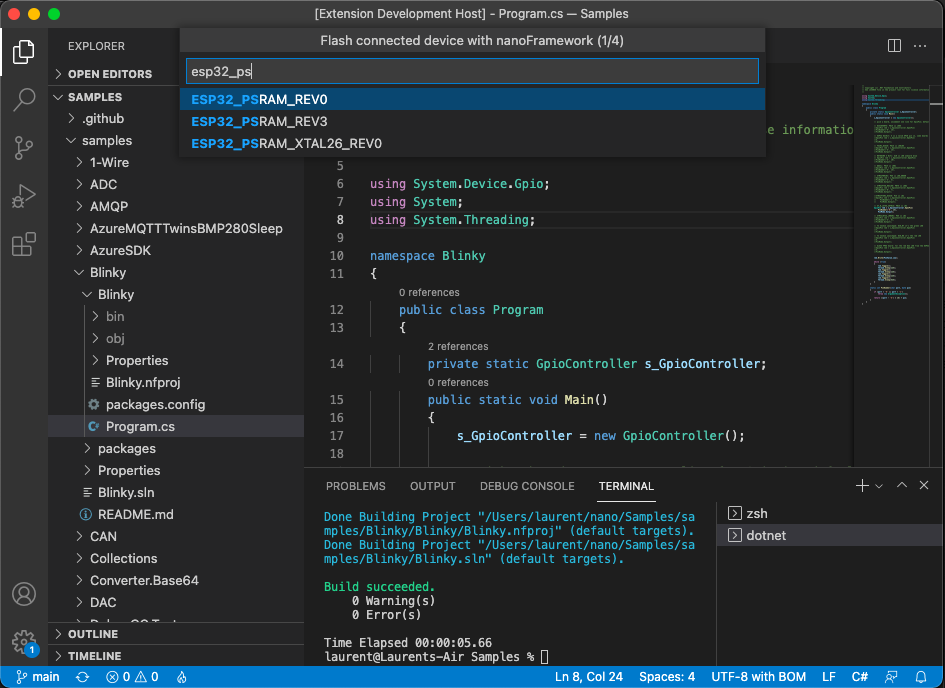
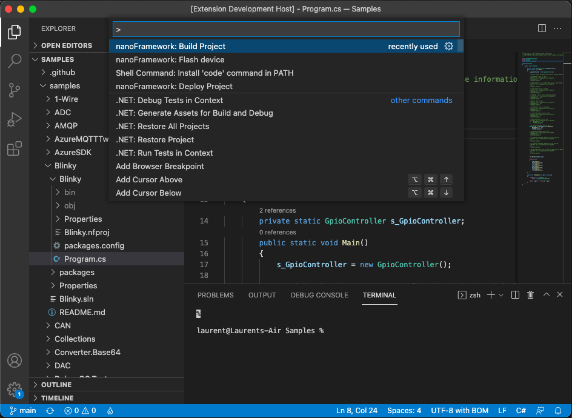

# .NET nanoFramework VS Code扩展入门指南

.NET nanoFramework允许编写嵌入式设备的托管代码应用程序，无论您是经验丰富的.NET开发人员还是刚刚开始尝试的新手。

[VS Code](https://code.visualstudio.com/)扩展允许您使用VS Code来为您的设备上的.NET nanoFramework闪存、构建和部署C#代码，无论您使用的是哪个平台。这已在Mac、Linux（64位）和Windows（64位）上进行了测试。

## 特性

这个.NET nanoFramework VS Code扩展允许您在ESP32或STM32 MCU上闪存、构建和部署您的C# .NET nanoFramework应用程序。

### 闪存设备

选择 `nanoFramework: Flash device` 并按照步骤操作。

根据您选择的目标，菜单将自动调整以帮助您找到正确的版本、DFU或串行端口。

一旦选择了所有选项，您将看到闪存正在进行中：

### 构建您的代码

选择 `nanoFramework: Build Project` 并按照步骤操作。

如果在打开的文件夹中有多个解决方案，您可以选择要构建的解决方案：

构建结果将显示在终端中：

### 部署到您的设备

选择 `nanoFramework: Deploy Project` 并按照步骤操作。

与构建项目类似，您必须选择要部署的项目。代码将被构建，部署将开始：

您还将在终端中获得部署状态。

一些ESP32设备在初始发现过程中存在问题，需要使用替代部署方法。
如果在部署过程中遇到问题，您可以选择 `nanoFramework: Deploy Project (alternative method)` 并按照提示操作，与其他步骤相同。

## 要求

您需要确保安装了以下元素：

- [.NET 6.0](https://dotnet.microsoft.com/download/dotnet)
- Windows上的[Visual Studio构建工具](https://visualstudio.microsoft.com/en/thank-you-downloading-visual-studio/?sku=BuildTools&rel=16)，[Linux/macOS上的`mono-complete`](https://www.mono-project.com/)

## 已知问题

此扩展不允许您调试设备。仅在Windows上（任何版本）并安装了.NET nanoFramework扩展的情况下才能进行调试。

此扩展在任何Mac版本（x64或M1）上都可用，仅在Linux x64和Windows x64上可用。不支持其他32位操作系统或ARM平台。

## 安装路径问题

:warning: 在用户路径包含变音字符时运行STM32设备命令存在已知问题。这会导致与`nanoff`扩展的依赖项之一，即STM32 Cube Programmer发生问题。
请注意，如果您不是在与STM32设备一起使用扩展，这个限制就不适用。