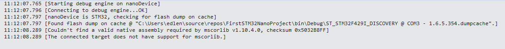

# 开始故障排除指南

以下是解决一些常见问题的方法，以便在开始时能够顺利进行。

## 在 Visual Studio 中的 **设备资源管理器** 中没有显示任何设备（查看/其他窗口/设备资源管理器）

- **Visual Studio nanoFramework 扩展** 通过串行/COM端口与设备通信。首先，扩展必须检测到COM端口处于活动状态，然后对该端口发出特定查询的响应进行PING。串行端口的设备驱动程序有各种不同的类型和版本，通常是检测和与设备通信的最大问题。安装您的开发板使用的USB芯片组的最新驱动程序。使用Windows设备管理器检查驱动程序的版本。
- 有时，拔出并重新插入USB端口会“唤醒”串行设备驱动程序。
- 尝试按下设备上的RESET按钮以重新启动它。
- 刷新您的设备以确保安装了nanoFramework。
- 在 **设备资源管理器** 中启用 **显示内部错误** 按钮 。在Visual Studio的输出窗口中检查消息，并在 `显示来自:` 下拉菜单中选择 **.Net nanoFramework 扩展**。
- 切换 **禁用设备监视器** 按钮  在 **设备资源管理器** 上，然后再次切换为OFF。这将导致扩展重新扫描所有COM端口。
- 尝试不同的USB电缆，或在已知正常设备上测试电缆。有时很难确定电缆是否仅用于充电而不携带信号线。长度超过2米/6英尺的电缆可能存在此问题，因为这些通常是仅用于供电的电缆。
- 一些STM32设备需要使用两根USB电缆 - 一根用于供电，另一根用于串行/COM通信。请参阅[托管代码（C#）入门指南](../getting-started-guides/getting-started-managed.md)。

## 尝试调试时出现部署错误，输出窗口/.NET nanoFramework 扩展中出现 "找不到 mscorlib 需要的有效程序集..." 的消息

- 当问题是版本号时，这是错误的示例。这是通过将CoreLibrary回退到1.10.4-preview.11来完成的，该版本是为以前的校验和准备的。在这种情况下，由于所需的本机程序集版本不匹配，未检查校验和而导致部署失败：

> 

- C#和本机C++程序集的版本不对齐。
- C#版本由NuGet和您选择的组件的版本确定。nanoFramework.CoreLibrary是最常见的问题，因为它倾向于早期加载。
- NuGet包的描述中包含所需本机程序集的版本和校验和信息。
- 请参阅[包和程序集版本以及校验和的指南](../architecture/guide-version-checksums.md)以获取更多信息。
- 使用 **设备能力** 按钮  在 **设备资源管理器** 中查看设备上作为固件的一部分安装的程序集版本和校验和。
- 如果要更改nanoFramework组件并更改C#代码或C++代码的接口/契约，则会出现校验和不匹配错误而不是版本不匹配错误。这是防止开发人员在不生成新版本和校验和的情况下破坏契约的机制。

## nanoff 未加载正确版本的固件

- 清除缓存位于 [用户名]\\.nanoFramework\\[设备名称] 的缓存，或者只需删除所有缓存文件夹。
- 使用 **设备能力** 按钮  在 **设备资源管理器** 中验证设备上安装的固件版本。

## nanoff 以 Ennnn 错误结束

- 使用以下命令更新您的 `nanoff` 工具副本：

    ```console
    dotnet tool update nanoff --global
    ```

- 再次运行 `nanoff`，这次在末尾添加 `-v diag` 以输出工具执行进度的详细消息，希望详细说明可能出现的问题。
- 确保连接的串行设备具有最新的驱动程序。检查驱动程序制造商的网站，因为并非所有驱动程序都通过Windows Update提供最新版本。
- 检查位于 [用户名]\\.nanoFramework 的缓存文件夹的权限。有时，删除缓存文件可以修复问题。
- 与 **设备资源管理器** 一样，闪存实用程序依赖于大多数设备的串行/COM驱动程序。检查USB电缆不是仅用于供电的电缆（即不带信号线），并确保您使用的是最新的USB驱动程序。