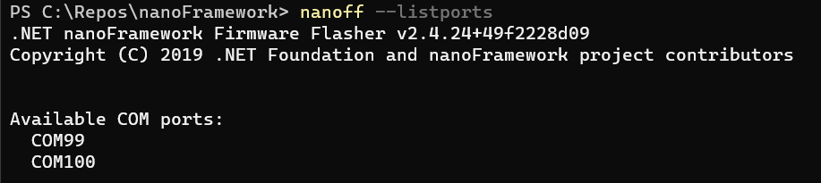
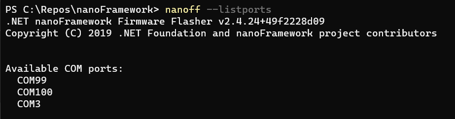
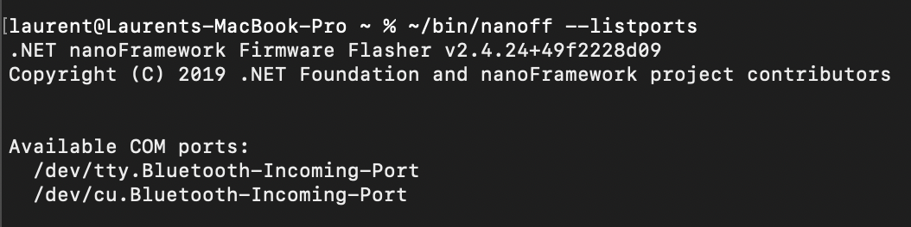
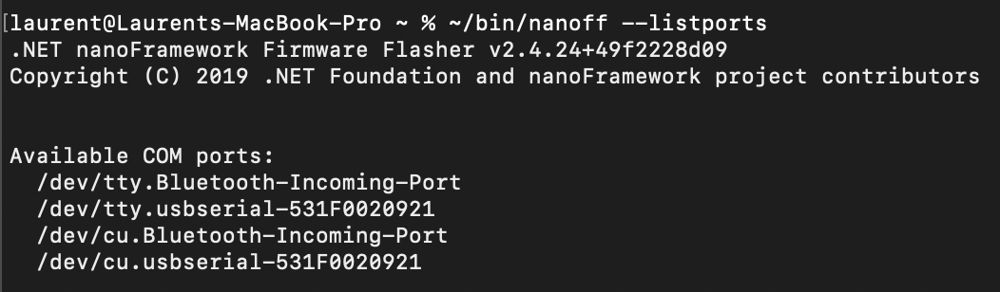
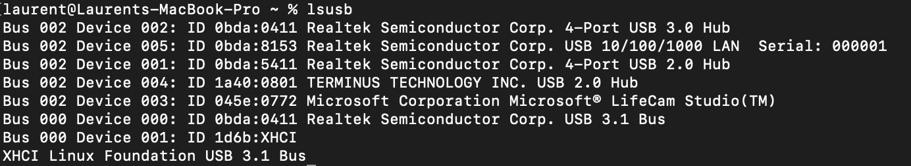
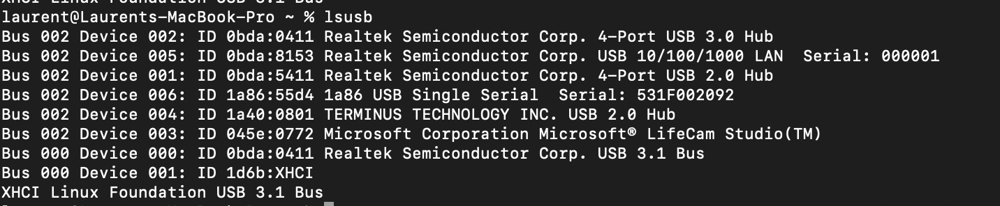
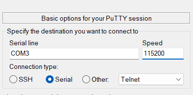
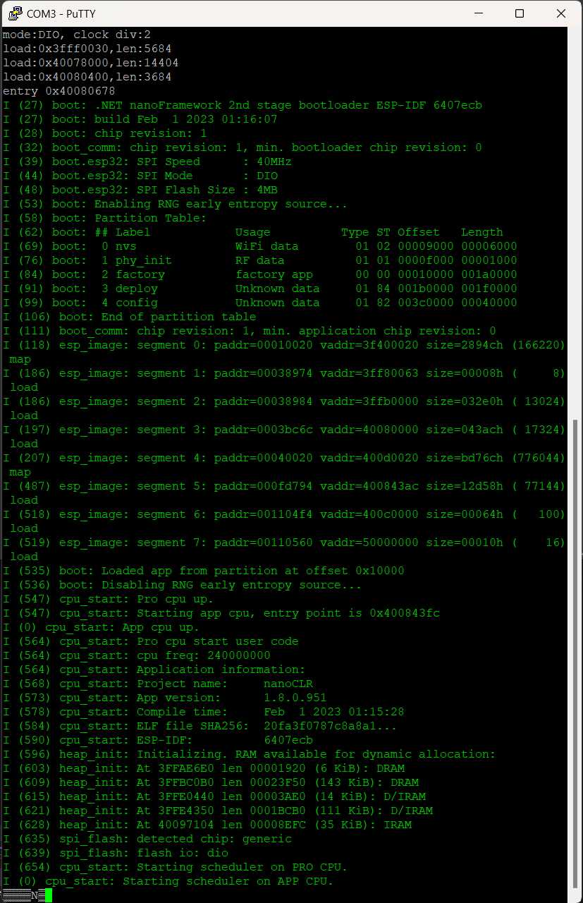
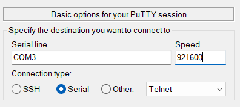
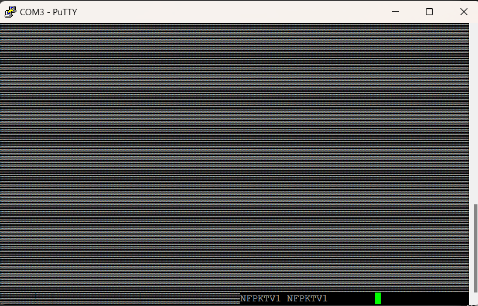

# 设备连接故障排除

有时，您可能会遇到与设备相关的问题。您可能难以找到设备，难以将其刷写，并且刷写后可能无法在Visual Studio扩展中找到它。因此，本文为您提供了查找根本原因的要素。

本示例将使用ESP32设备，但对于其他设备，操作方式类似。

## 假设

我们假设您已经正确安装了.NET nanoFramework刷写工具，称为 `nanoff`。如果尚未安装，请转到[这里](https://github.com/nanoframework/nanoFirmwareFlasher)。

我们还假设您已经正确安装了Visual Studio扩展。如果不是这种情况，请转到[这里](./getting-started-managed.md)。

最后，我们假设您具有观看串行端口流量的工具，比如 `putty`。如果您没有，请访问[这里](https://www.chiark.greenend.org.uk/~sgtatham/putty/latest.html)。

## 查找设备的串行端口

这里的主要技巧是运行以下命令两次：`nanoff --listports`

### 在Windows上查找端口

第一次在Windows上运行时，它会像这样：

然后，当您插入设备并重新运行该命令时，您将看到您的端口：

在这种情况下，Windows上的串口是 `COM3`。太棒了！

如果您根本看不到任何内容，请确保已安装了正确的驱动程序。如果未安装正确的驱动程序，您将在设备资源管理器中看到错误。如果一切都正确安装，您也将能够找到端口：

### 在Linux/MacOS上查找端口

在MacOS/Linux上，没有连接设备时会像这样：

一旦插入设备，您将获得端口详细信息：

我们将使用 tty 端口，因此是 `/dev/tty.usbserial-531F00209021`。根据您使用的设备，命名可能会有很大不同。在所有情况下，确保安装了最新的驱动程序。

如果找不到您的设备，建议安装 `lsusb`。对于Linux，根据版本，只需使用 `apt-get install lsusb`，对于MacOS，使用 `brew install lsusb`（您可能需要使用 `sudo` 获取更高的权限）。

然后，与使用 nanoff 命令类似，拔掉设备并运行 `lsusb` 以列出已连接的设备。再次运行该命令，连接设备以确定是什么设备以及需要哪些驱动程序。结果将如下所示：

加上设备后：

您可以参考找到的硬件，然后查找供应商以确定所需的驱动程序。

## 我的设备已刷写但在Visual Studio扩展中找不到

您已成功使用 `nanoff` 刷写设备，但在Visual Studio扩展中看不到它。

首先，检查[此故障排除指南](./trouble-shooting-guide.md)！

还是没有找到？好的，让我们调试设备本身。

### 特殊的ESP32

ESP32设备在启动时会输出很多信息。为此，您需要使用适当的串行端口连接您的ESP32设备（在先前的示例中为Windows上的 `COM3`，在Linux/Mac上为 `/dev/tty.usbserial-531F00209021`），并使用波特率115200。

当您连接设备并按下ESP32上的EN或BOOT或等效按钮以重置设备时，您将得到以下结果：

如果您的设备正常，您应该看到所有绿色，没有红线。如果有红线，可能与设备上的问题有关，这可能指示您的设备存在故障。如果设备一直重新启动，您将一次又一次看到这个屏幕，这意味着设备可能已经损坏或者您的镜像有问题。

如果在这一点上您的设备一切正常，请继续下一步。

### 查找nanoFramework是否已启动

要知道您的设备是否正确启动，请使用putty或类似的工具，打开您的设备连接的串行端口，波特率为 `921600`，这是由 `Console.WriteLine` 或 `Debug.WriteLine` 使用的波特率，用于CLR引发的任何异常或等效事件。

无论您的设备如何，一旦连接，您将看到消息 `NFPKTV1` 出现。这意味着.NET nanoFramework已正确加载并正常工作。要看到它，您可能需要按下EN、RST、BOOT或等效按钮重新启动设备。

不要担心之前可能出现的混乱字符，它们是设备本身启动时的字符。有些设备，如ESP32，

会非常多嘴（参见前一节），而有些设备，如STM32，会非常安静！

从这一点出发，看到这条消息意味着设备正常工作，因此再次查看[此故障排除指南](./trouble-shooting-guide.md)。