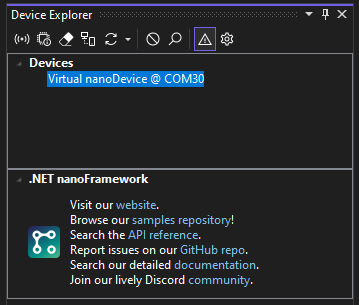
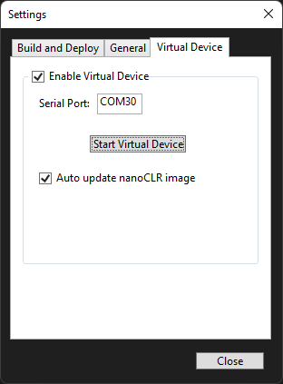

# .NET nanoFramework 虚拟设备

.NET nanoFramework 虚拟设备作为一个 [.NET 工具](https://docs.microsoft.com/en-us/dotnet/core/tools/global-tools) 可供使用。它允许在Windows机器上运行nanoCLR。这对于开发目的、在流水线上执行自动化测试和其他需要虚拟设备而不是真实物理硬件的用途非常有用。虚拟设备可以通过虚拟串行端口或TCP/IP端口像真实设备一样访问。

Visual Studio扩展可以与.NET nanoFramework虚拟设备进行交互，就像与真实设备一样。它将在设备资源管理器窗口中列出，并提供与真实设备相同的选项。



> 注意：.NET nanoFramework虚拟设备与Visual Studio扩展不是互斥的。它是一个全局工具，可以独立使用。请阅读下面的说明以了解如何使用它。

暴露nanoFramework虚拟设备的串行端口由 [HHD Software](https://www.hhdsoftware.com/) 提供，他们慷慨地赞助了运行其工具在.NET nanoFramework工具中的免费许可证。

## 配置虚拟设备

要启用和配置.NET nanoFramework虚拟设备，请在设备资源管理器中打开“设置”配置对话框（点击工具栏中的齿轮图标）。导航到“虚拟设备”选项卡。



要启用虚拟设备，只需选中“启用虚拟设备”复选框。这将在Visual Studio中启动nanoFramework虚拟设备。如果工具未安装，Visual Studio将在后台安装它。如果不需要虚拟设备，请取消选中该选项，虚拟设备将不会启动。

可以配置一个特定的串行端口来暴露虚拟设备。在“串行端口”文本框中输入有效的COM端口名称，它将被使用。如果虚拟串行端口尚不存在，它将被创建。

虚拟设备可以通过单击相应的按钮来启动和停止。

最后一个配置涉及虚拟设备将运行的nanoCLR图像的自动更新。要使工具自动更新并使用最新可用版本，只需启用复选框。

> 注意：如果已安装了特定的nanoCLR版本，虚拟设备将使用该版本。这对于测试特定版本的库或固件版本非常有用，例如。

## 虚拟设备的输出

虚拟设备的输出在Visual Studio的输出窗格中提供，只需选择“.NET nanoFramework虚拟设备”。


## 已知限制

虚拟设备已实现了大多数不需要硬件交互的库和API。对于那些需要硬件交互的API，提供了一个“存根”版本，这意味着对这些API的调用将导致“Not Implemented Exception”。目前不支持网络。这将在未来版本中添加。

## 用法

安装了该工具后，可以通过其命令`nanoclr`来调用它，这是名称的一个缩写，以便于输入。

```console
nanoclr [命令] [参数]
```

该工具包括所有可用命令的帮助。可以通过输入以下命令查看所有可用命令的列表：

```console
nanoclr --help
```

## 虚拟串行端口

这个动词允许管理暴露虚拟设备的虚拟串行端口。
虚拟串行端口仅在Windows机器上可用。它是由 [HHD Software](https://www.hhdsoftware.com/) 赞助的，他们慷慨地提供了免费许可证来运行他们的工具。

### 列出虚拟串行端口

此命令列出系统中安装的虚拟串行端口桥接器。

```console
nanoclr virtualserial --list
```

### 创建虚拟串行端口

此命令创建一个虚拟串行端口，该端口将用于暴露运行的nanoCLR实例。将创建一个随机的COM端口。还可以选择指定COM端口作为选项。在这种情况下，如果该COM端口未被使用，它将被创建。

```console
nanoclr virtualserial --create [COM99]
```

### 删除虚拟串行端口

此命令删除现有的虚拟串行端口。

```console
nanoclr virtualserial --remove [COM99]
```

### 安装虚拟串行端口工具

此命令安装[HHD Software](https://www.hhdsoftware.com/)的虚拟串行端口工具软件。安装程序将从他们的网站下载并执行。执行安装程序需要“安装驱动程序”权限，必须提升权限。如果运行它的进程没有所需的权限，将显示UAC提示。

```console
nanoclr virtualserial --install
```

## 运行虚拟nanoCLR

这些选项运行nanoCLR实例，加载指定的程序集并在指定的接口上暴露设备。请注意，为了成功运行nanoCLR实例，需要加载一组程序集并指定一个接口来暴露它，否则它没有用处。

### 加载一组程序

集

这将加载一组.NET nanoFramework程序集并运行nanoCLR。这些程序集必须以.NET nanoFramework PE（可移植可执行文件）格式存在。它们通常位于Visual Studio项目的输出文件夹中（通常是`bin\Debug`或`bin\Release`）。需要提供PE文件的完整路径。

```console
nanoclr run --assemblies "C:\nano\my_nice_project\bin\Debug\mscorlib.pe" "C:\nano\my_nice_project\bin\Debug\my_nice_project.pe"
```

### 指定串行端口

此选项指定将用于暴露运行的虚拟nanoCLR的COM端口。需要先设置虚拟串行端口（参见[创建虚拟串行端口](#create-virtual-serial-port)）。

```console
nanoclr run --serialport COM99 (--assemblies ...)
```

### 指定命名管道

此选项指定将用于暴露运行的虚拟nanoCLR的[命名管道](https://learn.microsoft.com/en-us/windows/win32/ipc/named-pipes)。

```console
nanoclr run --namedpipe MyNanoDevice (--assemblies ...)
```

### 解析引用

此选项尝试解析加载的程序集之间的交叉引用。

```console
nanoclr run --resolve (--assemblies ...)
```

## 使用nanoCLR执行维护操作

nanoCLR实际上是分发为DLL的nanoCLR实例的包装，以便于轻松更新。以下操作可用于管理此功能。

### nanoCLR版本

获取当前nanoCLR实例的版本。

```console
nanoclr instance --getversion
```

### 更新nanoCLR实例

检查稳定版本的nanoCLR是否可用，并更新它，如果有的话。可以指定版本。要检查预览版本，请添加`--preview`选项。

```console
nanoclr instance --update [--preview] [--clrversion 1.22.333.4444]
```