以下是建议用于.NET nanoFramework的推荐设备列表，以及可以找到它们的链接。尽管此列表远非详尽无遗，但我们非常欢迎您提供关于这些设备以及购买选项的调整和贡献。

> 重要提示：这些列表仅供参考，购买链接也是如此。我们与这些供应商或经销商无关。

| 微控制器 | 规格 | 制造商 SKU | 固件目标 | 购买选项 |
| --- | --- | --- | --- | --- |
| 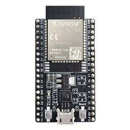 ESP-WROOM-32E | 4MB 闪存 | ESP32-DevKitC-32E | ESP32_REV3, ESP32_REV0, ESP32_BLE_REV0 |  |
| 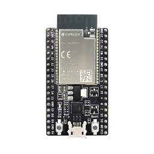 ESP_WROVER-E | 4MB 闪存和 8MB PSRAM | ESP32-DevKitC-VE | ESP32_REV3, ESP32_PSRAM_REV3, ESP32_BLE_REV3, ESP32_REV0 |  |
| 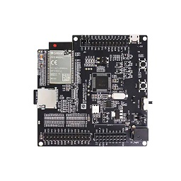 ESP_WROVER-E | 4MB 闪存和 8MB PSRAM | ESP-WROVER-KIT-VE | ESP32_REV3, ESP32_PSRAM_REV3, ESP32_BLE_REV3, ESP32_REV0, ESP_WROVER_KIT |  |
| 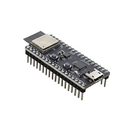 ESP32-PICO-MINI-02 | 4MB 闪存和 2MB PSRAM | ESP32-PICO-DEVKITM-2 | ESP_PICO |  |
| 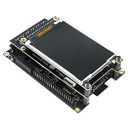 ESP32_S2-WROVER | 4MB 闪存和 2MB PSRAM | ESP32-S2-KALUGA-1 | KALUGA_1 |  |
| 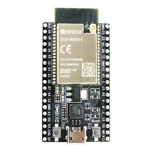 ESP32-DEVKITC-VIE | 4MB 闪存和 8MB PSRAM | ESP32-DEVKITC-VIE | ESP32_REV3, ESP32_PSRAM_REV3, ESP32_BLE_REV3, ESP32_REV0 |  |
| 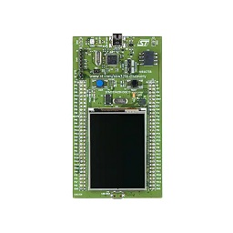 STM32F429 Discovery | 2MB 闪存，256KB RAM 和 64Mb SDRAM | 32F429IDISCOVERY | ST_STM32F429I_DISCOVERY |  |
| 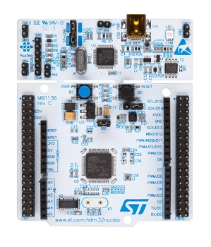 NUCLEO-F091RC | | NUCLEO-F091RC | NUCLEO-F091RC |  |
| 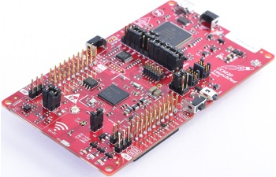 CC3220SF-LAUNCHXL | 256KB RAM，可选的 1MB 可执行闪存 | CC3220SF-LAUNCHXL | CC3220SF-LAUNCHXL |  |
| 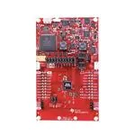 TI_CC1352R1_LAUNCHXL | 352KB 闪存，256KB ROM | CC3220SF-LAUNCHXL | TI_CC1352R1_LAUNCHXL_915 或 TI_CC1352R1_LAUNCHXL_868 |  |

集成了额外传感器如加速度计、屏幕、LED等的设备：

| 微控制器 | 规格 | 制造商 SKU | 固件目标 | 购买选项 |
| --- | --- | --- | --- | --- |
|  M5Core | 16MB 闪存，520KB SRAM | ESP32-D0WDQ6-V3 | M5Core | [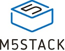](https://shop.m5stack.com/collections/m5-controllers/CORE) |
| 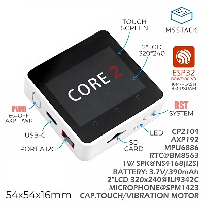 M5Core2 | 16MB 闪存，520KB SRAM，9MB PSRAM | ESP32-D0WDQ6-V3 | M5Core2 |  |
| 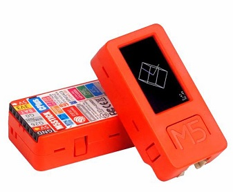 M5StickC、M5StickC Plus | 4MB 闪存和 2MB PSRAM | ESP32-PICO-DEVKITM-2 | M5StickC 或 M5StickC Plus |  |
| 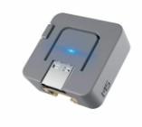 M5Atom、M5Atom Lite、M5Atom Matrix | 4MB 闪存和 2MB PSRAM | ESP32-PICO-DEVKITM-2 | ESP32_PICO |  |
| 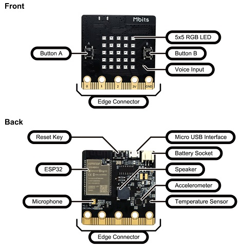 Mbits ESP32 Dev Board | 16MB 闪存和 8MB RAM，包含额外传感器 | Mbits ESP32 | ESP32_REV0, ESP32_BLE_REV0 |  |

请注意，您也可以在亚马逊和各种本地网站上找到大多数这些开发板。再次强调，欢迎提交更多购买链接，以找到您喜欢的设备！

> 重要提示：这些列表仅供参考，购买链接也是如此。我们与这些供应商或经销商无关。