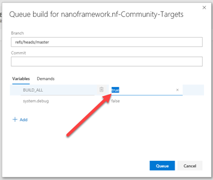

# 社区目标的构建和发布

## 关于本文档

本文档描述了设置新的社区目标构建和发布的步骤。

## 简介

每个社区目标的构建都是在 Azure Pipelines 的 YAML 文件中进行的。

通过在 PR 描述中勾选相应的复选框（来自 PR 模板）或勾选“[] ALL”来触发每个目标的构建。请注意，可以勾选多个要构建的目标。

## 设置新目标的构建

按照以下步骤更新[社区存储库](https://github.com/nanoframework/nf-Community-Targets/blob/master/azure-pipelines.yml)中的 `azure-pipelines.yml` 文件：

1. 首先，添加一个新的作业到集合中。最好从类似的目标中进行复制/粘贴。

2. 确保在显示目标名称的各个位置使用目标名称，包括作业名称、条件表达式和变量。

3. 通过在检查清单中添加新的目标名称，更新 PR 模板。

## 设置图像发布

社区目标图像通过我们的 Cloudsmith [存储库](https://cloudsmith.io/~net-nanoframework/repos/nanoframework-images-community-targets/packages/)进行分发。

1. 第一次生成软件包的构建必须发生，以便实际在存储库中创建该软件包。

2. 转到最近创建的软件包的软件包页面，并从“徽章”选项卡中获取 markdown（确保获取的是**最新**版本的徽章），然后将其粘贴到自述文件中的目标列表中。

## PR 和手动构建

在合并 PR 时，请确保在提交消息中添加要构建的目标的令牌，否则合并到主分支将不会触发任何板卡的构建。

可以手动启动一个构建并指定应该构建所有目标。例如，在 nf-interpreter 存储库中进行了一些更改以构建社区目标的新图像后，这是非常方便的。另一种情况是当忘记在 PR 合并中添加构建令牌并且需要随后触发构建时。

要执行此操作，请转到项目 Azure Pipelines 中的“构建”页面，并点击“排队”按钮。在弹出窗口中，将 BUILD_ALL 变量更改为“true”。如下所示：

