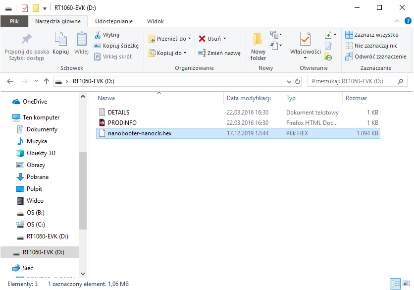
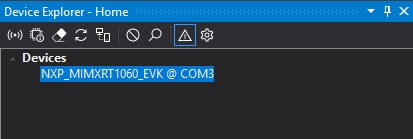

# 在NXP MIMXRT1060_EVAL开发板上刷写nanoCLR镜像/nanoBooter

## 操作指南

将nanoBooter和nanoCLR镜像刷写到i.MX RT1060开发板上的最简单方法是通过mbed，连接开发板到计算机后，它会提供一个虚拟磁盘。

> 注意：如果您覆盖了DAPLink固件，您将需要适合于eval板内置的OpenSDA串行和调试适配器的正确DAPLink固件，它提供了USB主机（IDE、文件系统和串行终端）。您可以从这里下载：[OpenSDA](https://www.nxp.com/design/microcontrollers-developer-resources/ides-for-kinetis-mcus/opensda-serial-and-debug-adapter:OPENSDA?&tid=vanOpenSDA#MIMXRT1060-EVK)。然后按照链接中描述的步骤进行操作。

1. 从.NET **nanoFramework**仓库下载镜像。
2. 检查**J1**是否处于中间位置（从Micro-USB端口供电），并将USB电缆连接到**J41** USB端口。
3. 文件管理器中应该出现可移动磁盘"rt1060-evk"。
4. 解压下载的镜像，并将nanoFramework镜像"nanobooter-nanoclr.hex"复制到可移动磁盘中。

5. 设备应自动编程闪存，并在短时间后重置自身。
6. 按住**SW8**按钮重置开发板，检查编程是否成功。如果绿色LED开始闪烁，表示nanoBooter正常工作。
7. 最后重置开发板并打开Visual Studio。设备应被设备资源管理器（Device Explorer）nanoFramework插件识别。

## 常见问题解答

- 设备在设备资源管理器中无法被识别。

> 尝试重新启动Visual Studio
> 检查固件是否正确刷写，尝试启动至nanoBooter，设备应在设备资源管理器中列出。

- 在可移动磁盘上的FAIL.txt文件中出现错误："The interface firmware FAILED to reset/halt the target MCU"（接口固件无法重置/停止目标MCU）

> 检查跳线J47、J48、J49是否存在，而J44是否不存在
> 如果您没有使用外部电源，跳线J1必须处于中间位置

- 设备能够正确启动至nanoBooter，但无法被检测到

> 如果您刷写了nanoBooter.hex，然后刷写了nanoCLR.hex，编程过程中会擦除存储器。