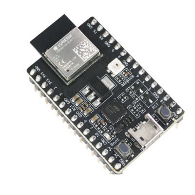
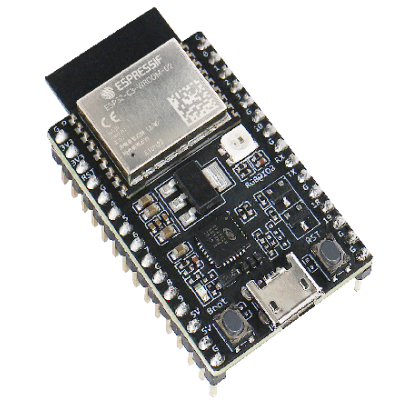
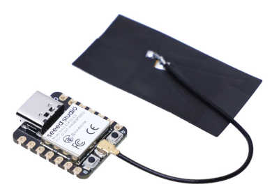

# Espressif ESP32-C3 系列

以下是固件映像：

- ESP32_C3_REVx 适用于所有 ESP32-C3 开发板。这些开发板可以是 ESP32-C3 DevKits、ESP32-C3 模块等，可以带有或不带有 PSRAM。修订后缀取决于设备。有两个版本可用，REV2 和 REV3。后者适用于修订版本为 3 和 4 的设备。

您可以查看 Espressif [产品选择器](https://products.espressif.com/#/product-selector?names=&filter={%22Series%22:[%22ESP32-C3%22]}) 获取有关所有现有变种、芯片、模块及其开发套件的详细信息。

## ESP32-C3-DevKitM-1

[ESP32-C3-DevKitM-1 产品页面](https://docs.espressif.com/projects/esp-idf/en/latest/esp32c3/hw-reference/esp32c3/user-guide-devkitm-1.html)

## ESP32-C3-DevKitC-02

[ESP32-C3-DevKitC-02 产品页面](https://docs.espressif.com/projects/esp-idf/en/latest/esp32c3/hw-reference/esp32c3/user-guide-devkitc-02.html)

## Seeed Studio XIAO ESP32C3

[Seeed Studio XIAO ESP32C3 产品页面](https://www.seeedstudio.com/Seeed-XIAO-ESP32C3-p-5431.html)

## 固件映像（可直接部署）

| 目标 | 固件 |
|:---|---|
| ESP32_C3_REV2 |  |
| ESP32_C3_REV3 |  |
| XIAO_ESP32C3 |  |