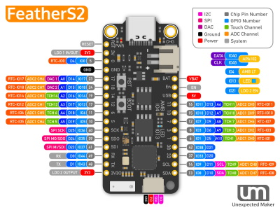
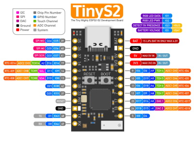
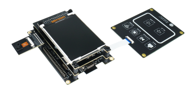

# Espressif ESP32-S2 系列

以下是固件镜像：

- FEATHER_S2 适用于所有使用 GPIO19 和 GPIO20 将内置 USB CDC 作为接口的 ESP32-S2 开发板。这些板子可以是 FeatherS2、TinyS2 或任何其他具有或不具有 PSRAM 的类似硬件。
- KALUGA_1 专为 ESP32-S2-Kaluga-1 Kit 设计的固件镜像。其中包含了 UI 功能和 ILI9341 驱动程序。

您可以查看 Espressif 的[产品选择器](https://products.espressif.com/#/product-selector?names=&filter={%22Series%22:[%22ESP32-S2%22]})以获取有关所有现有变种、芯片、模块和相应开发套件的详细信息。

## FeatherS2

[FeatherS2 产品页面](https://feathers2.io/)

## TinyS2

[TinyS2 产品页面](https://unexpectedmaker.com/tinys2/)

## ESP32-S2-Kaluga-1 Kit

[ESP32-S2-Kaluga-1 Kit 产品页面](https://docs.espressif.com/projects/esp-idf/en/latest/esp32s2/hw-reference/esp32s2/user-guide-esp32-s2-kaluga-1-kit.html)

## 固件镜像（可直接部署）

| 目标 | 固件 |
|:---|---|
| FEATHER_S2 |  |
| KALUGA_1 |  |

:warning: 要使用 [nanoff](https://github.com/nanoframework/nanoFirmwareFlasher) 更新 FeatherS2 和 TinyS2 的固件，需将开发板置于 **下载模式**，方法是按住 [BOOT] 键，然后点击 [RESET] 键，最后释放 [BOOT] 键。