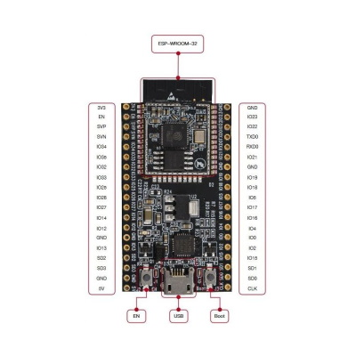
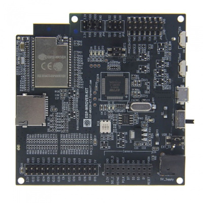
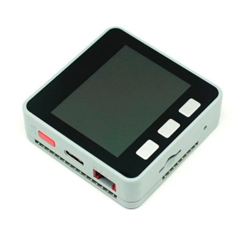
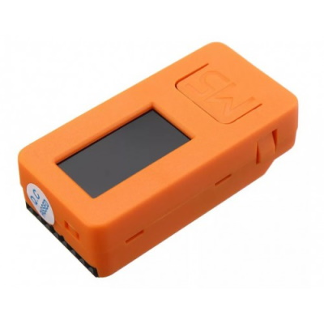
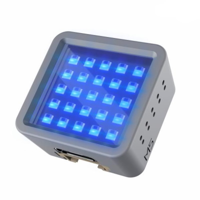

# Espressif ESP32系列

以下是固件映像：

- ESP32_PSRAM_REV0 适用于携带带有PSRAM支持的ESP32芯片的所有ESP32开发板。这些可以是带有PSRAM的ESP32-DevKitC、ESP32-WROOM和ESP32-WROVER变体。
- ESP32_REV0 适用于携带不支持PSRAM的ESP32芯片的所有ESP32开发板。这些可以是不带PSRAM的ESP32-DevKitC、ESP32-WROOM和ESP32-WROVER变体。
- ESP_WROVER_KIT 专为ESP WROVER KIT设计。该映像包含UI功能、PSRAM支持和ILI9341驱动程序。
- ESP32_PICO 适用于携带不支持PSRAM的ESP32 PICO芯片的所有ESP32开发板，例如ESP32-PICO-KIT和M5Stack ATOM。
- ESP32_PSRAM_REV3 适用于携带ESP32芯片 **第3版** 的所有ESP32开发板，带有PSRAM支持。
- ESP32_LILYGO 专为LilyGO ESP32开发板设计，包括对以太网PHY的支持。

您可以查看Espressif的[产品选择器](https://products.espressif.com/#/product-selector?names=&filter={%22Series%22:[%22ESP32%22]})，了解所有现有变体、芯片、模块和相应的开发套件的详细信息。

> 注意：第3版芯片是最新的版本（nanoff在连接到设备后会报告芯片的版本）。为第0版构建的映像可以在第3版芯片上完美运行，但反之则不行。

所有其他映像都是基于这些映像的变体构建的。存在带有BLE或无BLE、带有或无屏幕驱动程序等变体。

[ESP32-DevKitC 产品页面](https://www.espressif.com/en/products/hardware/esp32-devkitc/overview)

[ESP32-WROVER-KIT 产品页面](https://www.espressif.com/en/products/hardware/esp-wrover-kit/overview)

所有M5Stack开发板均搭载ESP32芯片。其中一些是第1版，其他的是第3版或PICO版。请查阅[官方文档](https://docs.m5stack.com/en/products?id=core)，了解哪个开发板基于哪个芯片。

## 固件映像（可部署）

| 目标 | 固件 |
|:---|---|
| ESP32_PSRAM_REV0

 |  |
| ESP32_REV0 |  |
| ESP32_BLE_REV0 |  |
| ESP32_PSRAM_REV3 |  |
| ESP_WROVER_KIT |  |
| ESP32_PICO |  |
| ESP32_LILYGO |  |

> 注意：您还会找到基于ESP32的其他目标，包括屏幕驱动程序的名称，例如：

- ESP32_REV0_ILI9342（适用于M5Stack的驱动程序）
- ESP32_WROVER_KIT（包含ILI9341驱动程序的映像）
- ESP32_PICO_ST7735S（适用于M5Stick的驱动程序）
- ESP32_PICO_ST7789V（适用于M5Stick C Plus的驱动程序）
- ESP32_PSRAM_REV3_ILI9342
- ESP32_PSRAM_REV3_ILI9341

有关nanoFramework中ESP32引脚布局的详细信息，请查看[此处](../esp32/esp32_pin_out.md).
