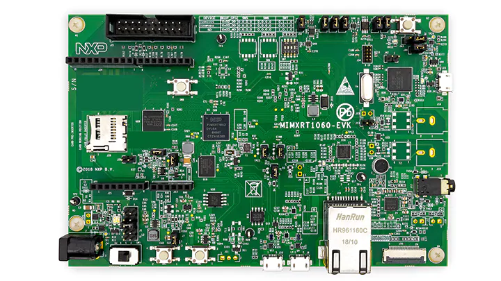

# NXP i.MXRT1060评估板

该板搭载了600 MHz的ARM Cortex-M7内核，没有内部闪存，但支持QSPI和HyperFlash。可以通过USB供电。板载LPC-Link程序员。

技术和功能规格：

- 存储器
  - 256 Mb SDRAM内存
  - 512 Mb Hyper Flash
  - 64 Mb QSPI Flash
  - 用于SD卡的TF插槽
- 显示和音频
  - 并行LCD连接器
  - 摄像头连接器
  - 音频编解码器
  - 4极音频耳机插孔
  - 外部扬声器连接
  - 麦克风
  - S/PDIF连接器
- 连接性
  - 微型USB主机和OTG连接器
  - 以太网（10/100M）连接器
  - CAN收发器
  - Arduino®接口

> 规格来自NXP的[产品页面](https://www.nxp.com/design/development-boards/i.mx-evaluation-and-development-boards/mimxrt1060-evk-i.mx-rt1060-evaluation-kit:MIMXRT1060-EVK)

## 固件映像（可直接部署）

提供的现成固件映像包括下面标记的类库和功能的支持。

| Gpio | Spi | I2c | Pwm | Adc | 串口 | 事件 | SWO | 网络 | 大堆 |
|:---:|:---:|:---:|:---:|:---:|:---:|:---:|:---:|:---:|:---:|
| :heavy_check_mark: | | |  | |  | :heavy_check_mark: | :heavy_check_mark: | :heavy_check_mark: | :heavy_check_mark: |

## J-Link

如果您想使用专用的J-Link程序员而不是板载的程序员，请参考SEGGER的[wiki](https://wiki.segger.com/i.MXRT1060)。其中描述了如何配置J-Link以与i.MXRT1060微控制器配合使用。

要在Visual Studio Code中设置J-Link，请参考[此](https://wiki.segger.com/J-Link:Visual_Studio_Code)指南。