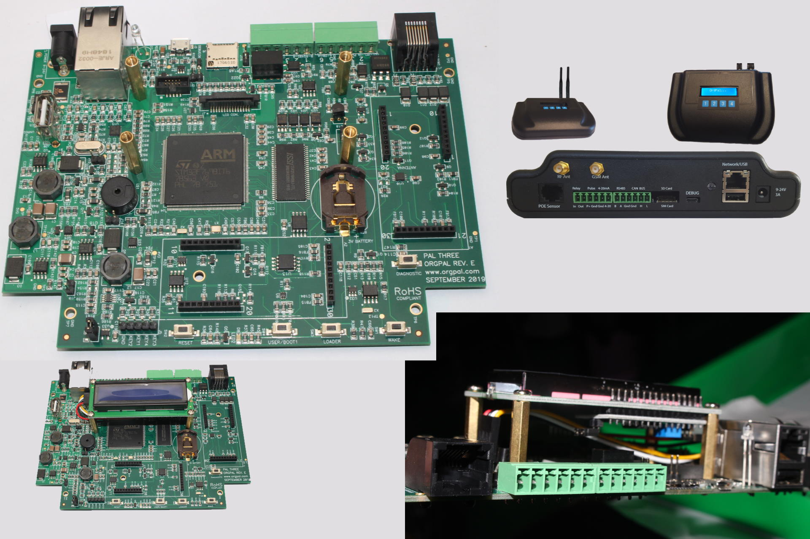

# OrgPal PalThree

[产品页面](https://www.orgpal.com/palthree-iot-azure)

## 特点

### STM32F769BIT 微控制器

- 强大的 216-MHz Arm® Cortex®-M7
- 2 MB Flash 和 1 MB 外部 SDRAM

### PalThree 开发板

- 多功能开发板，适用于许多应用，具有集成的传感器协议支持
- 通过 RS 485/Modbus、4-20mA、UART、I2C、模拟/数字 GPIO 在单个板上支持广泛的传感器协议
- 内置的微型 USB 可以使用 Visual Studio 2017 或更高版本进行快速代码开发
- 可以通过两个 30 引脚端口扩展多个插件板
- 16 MB QSPI Flash 和 8 MB SPI Flash 用于板上存储
- SD 卡
- USB 多路复用，带有 2 个连接器
- 用于调试和编程的 microUSB 接口
- 带有 SSL 支持的以太网 (LAN8742A)
- 16x2 LCD I2C，可扩展为使用任何 I2C LCD
- DSI LCD 连接器，带有 I2C (Raspberry Pi LCD 连接器)
- 外设和传感器协议:
  - RS 485
  - 4-20mA
  - 1 继电器（光电隔离）
  - 1 流量/脉冲计数
  - 数字和模拟 GPIO
  - UART、I2C 和 SPI
  - 3 个用户 LED
  - 2 个用户按钮
  - 4 按键矩阵键盘连接器
  - 实时时钟（RTC）
  - 扬声器（蜂鸣器）
  - 集成温度和电池监测器
- 2 个 30 引脚扩展端口
- JTAG 10 引脚 ARM 微连接器
- 低功耗设计，在自动关闭模式下功耗低至 0.4mA
- 9-24V 电源输入范围，具有反极性保护

## 固件镜像（可直接部署）

提供的可直接使用的固件镜像包括下面标记的类库和功能的支持。

| Gpio | Spi | I2c | Pwm | Adc | Serial | 事件 | SWO | 网络 | 大堆栈 |
|:---:|:---:|:---:|:---:|:---:|:---:|:---:|:---:|:---:|:---:|
| :heavy_check_mark: | :heavy_check_mark: | :heavy_check_mark: | :heavy_check_mark: | :heavy_check_mark: | :heavy_check_mark: | :heavy_check_mark: |

 :heavy_check_mark: | :heavy_check_mark: | :heavy_check_mark: |

