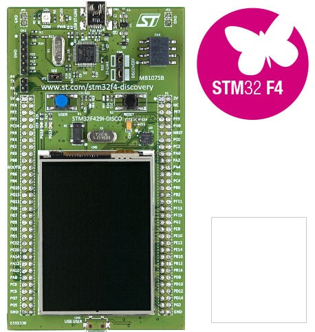

# STMicroelectronics 32F429IDISCOVERY

[产品页面](http://www.st.com/en/evaluation-tools/32f429idiscovery.html)

## 特点

- STM32F429ZIT6 微控制器
- 2MB 内部闪存
- 256KB 内部RAM
- 64兆位SDRAM（作为8MB受管堆提供）
- 2.4英寸 QVGA TFT LCD 屏幕
- 两个用户LED：LD3（绿色）、LD4（红色）
- 两个按钮（用户和复位）
- 带有 micro-AB 连接器的 USB OTG
- 简单扩展头，暴露大多数微控制器引脚
- 内置 ST-LINK/V2

## 固件镜像（可直接使用）

提供的可直接使用的固件镜像包括以下标记的类库和功能支持。

| Gpio | Spi | I2c | Pwm | Adc | Serial | Events | SWO | 网络 | 大堆 |
|:---:|:---:|:---:|:---:|:---:|:---:|:---:|:---:|:---:|:---:|
| :heavy_check_mark: | :heavy_check_mark: | :heavy_check_mark: | :heavy_check_mark: | | :heavy_check_mark: | :heavy_check_mark: | :heavy_check_mark: | | :heavy_check_mark: |

