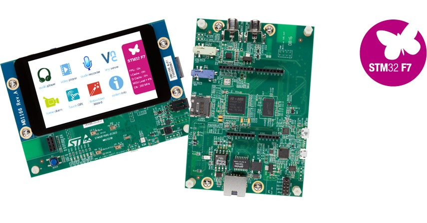

# STMicroelectronics 32F769IDISCOVERY

[产品页面](http://www.st.com/en/evaluation-tools/32f769idiscovery.html)

## 连接和供电板子

板子上有两个USB端口。用于固件烧录和调试，请使用名为"USB ST_LINK"的端口：

> 注意：这个USB连接也将为板子供电。另外，它支持PoE，所以在现场部署时可能会很方便（尽管无法通过此方式上传新的程序）。要启用PoE，请在CN3头上安装适当的跳线。

## 安装驱动程序和STM32 Cube Programmer

从ST网站上下载适当的[STM32 Cube Programmer](https://www.st.com/en/development-tools/stm32cubeprog.html)版本，并将其安装到您的开发机上（它还将安装USB驱动程序）。

## 烧录初始的nanoFramework固件

在您可以使用C#编写代码之前，需要烧录nanoFramework运行时。这可以通过您在入门指南中安装的`nanoff`实用程序来完成。在命令提示符中运行以下命令：

`nanoff --target ST_STM32F769I_DISCOVERY --update`

该命令将下载最新的稳定固件版本，检测板子并进行烧录。

如果出现类似于以下的警告，请忽略它：

现在您已经可以上传C#程序了。

## 用户LED和按钮

用户可以使用四个LED，标记为LD1-LD4，并且还有一个按钮USER。它们的引脚如下：

|标记|MCU端口和引脚|nF引脚编号|
|---|---|---|
|LD1|PJ13|157|
|LD2|PJ5|149|
|LD3|PA12|12|
|LD4|PD4|52|
|USER|PA0|0|

**注意**：与LD1-LD3相比，LD4的电平是反向的。

**注意**：LD3还与Arduino头针D13相连接。

如果您想知道如何将MCU引脚名称转换为nF引脚编号，请参阅[这里的常见问题解答](https://docs.nanoframework.net/content/faq/working-with-stm32-targets.html)。

## Arduino头针定义

CN11（电源传递）：

|标记|MCU端口和引脚|nF引脚编号|
|---|---|---|
|NC|-|-|
|IOREF|-|-|
|RESET|NRST|-|
|+3

V3|-|-|
|5V|-|-|
|GND|-|-|
|GND|-|-|
|VIN|-|-|

CN14（模拟功能）：

|标记|MCU端口和引脚|nF引脚编号|备用功能|
|---|---|---|---|
|A0|PA6|6|模拟通道0|
|A1|PA4|4|模拟通道1|
|A2|PC2|34|模拟通道2|
|A3|PF10|90|-|
|A4|PF8|88|模拟通道4|
|A5|PF9|89|-|

CN9（数字功能）：

|标记|MCU端口和引脚|nF引脚编号|备用功能|
|---|---|---|---|
|D15|PB8|24|I2C1_SCL|
|D14|PB9|25|I2C1_SDA|
|AVDD|-|-|-|
|GND|-|-|-|
|D13|PA12|12|SPI2_SCK|
|D12|PB14|30|SPI2_MISO|
|D11|PB15|31|SPI2_MOSI|
|D10|PA11|11|SPI2_CS|
|D9|PH6|118|-|
|D8|PJ4|148|-|

CN13（数字功能）：

|标记|MCU端口和引脚|nF引脚编号|备用功能|
|---|---|---|---|
|D7|PJ3|147|-|
|D6|PF7|87|-|
|D5|PC8|40|-|
|D4|PJ0|144|-|
|D3|PF6|86|-|
|D2|PJ1|145|-|
|D1|PC6|38|USART6_TX|
|D0|PC7|39|USART6_RX|

## 固件映像（准备部署）

