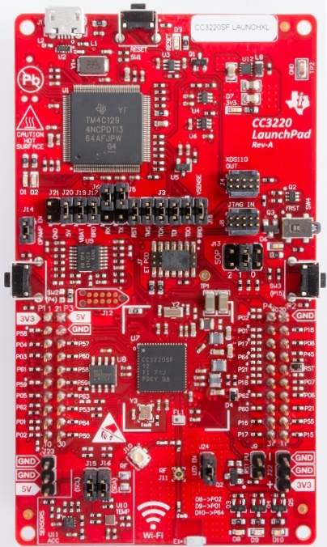

# TI CC3220SF-LAUNCHXL

[产品页面](http://www.ti.com/tool/CC3220SF-LAUNCHXL)

## 特点

### CC3220SF MCU

- CC3220SF 单芯片无线微控制器
- 双核架构：
  - 用户专用应用 MCU 子系统
  - 高度集成的 Wi-Fi 网络处理器
- Arm® Cortex®-M4 核心，主频 80 MHz
- 嵌入式内存：
  - 256KB RAM
  - 可选的 1MB 可执行 Flash
  - 外部串行 Flash
- 外设：
  - McASP 支持两个 I2S 通道
  - SD、SPI、I2C、UART
  - 8 位同步图像接口
  - 4 通道 12 位 ADC
  - 4 个带 16 位 PWM 模式的通用定时器 (GPT)
  - 看门狗定时器
  - 最多 27 个 GPIO 引脚
  - 调试接口：JTAG、cJTAG、SWD
- Wi-Fi 网络处理器 (NWP) 子系统：
  - Wi-Fi 模式：
    - 802.11b/g/n 站点
    - 802.11b/g 访问点 (AP)，支持最多四个站点
    - Wi-Fi Direct® 客户端和组所有者
- WPA2 个人和企业级安全性：WEP、WPA™/WPA2™ PSK、WPA2 企业级 (802.1x)
- IPv4 和 IPv6 TCP/IP 栈
- SimpleLink 连接管理器，实现自主和快速的 Wi-Fi 连接
- 灵活的 Wi-Fi 配置，支持 SmartConfig™ 技术、AP 模式和 WPS2 选项
- 硬件加密引擎，支持高级快速安全性，包括：AES、DES、3DES、SHA2、MD5、CRC 和校验和
- 安全套接字 (SSLv3、TLS1.0、TLS1.1、TLS1.2)
- 安全引导：在启动期间验证运行时二进制的完整性和真实性

### Launchpad 开发板

- 独立开发平台，配备传感器、LED 和按钮
- 带有选项的板载芯片天线，可进行基于 U.FL 的测试
- 2x20 引脚可堆叠连接器 (BoosterPack 头部) ，可连接到 TI LaunchPad 和其他 BoosterPacks
- 通过 USB 到 PC 的双向通用异步收发器/解调器 (UART)
- 基于 XDS110 的 JTAG 仿真，带有用于闪存编程的串行端口

## 固件映像 (可直接部署)

提供的即用固件映像包括以下标记的类库和特性支持。

| Gpio | Spi | I2c | Pwm | Adc | Serial | Events | SWO | 网络连接 | 大堆 |
|:---:|:---:|:---:|:---:|:---:|:---:|:---:|:---:|:---:|:---:|
| :heavy_check_mark: | :heavy_check_mark: | :heavy_check_mark: | :heavy_check_mark: | :heavy_check_mark: | | :heavy_check_mark: | | :heavy_check_mark: | |

