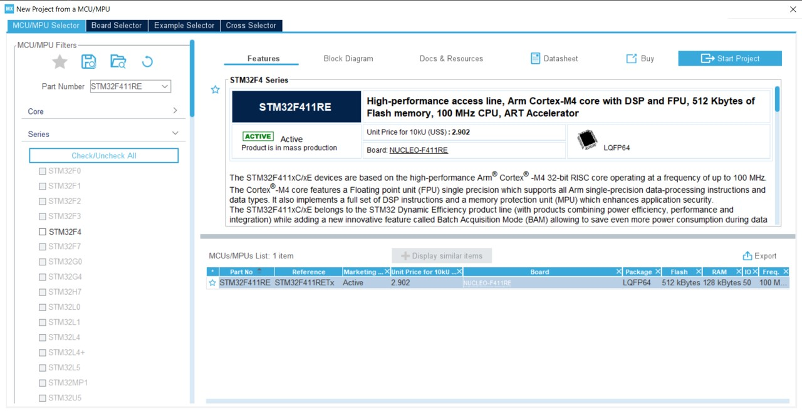
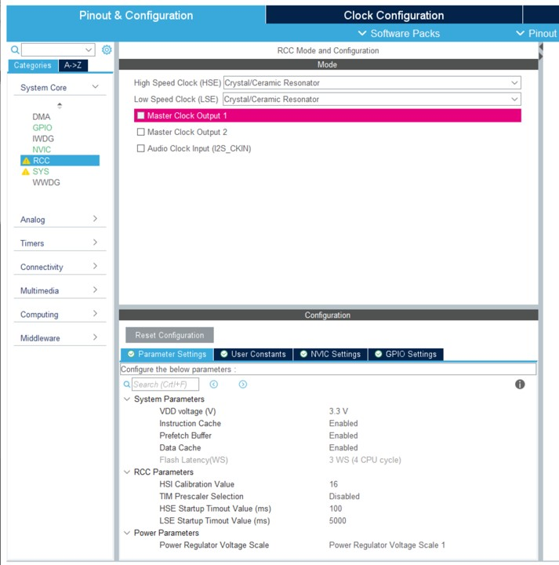
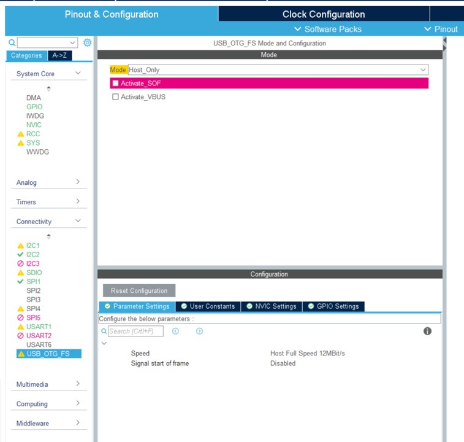
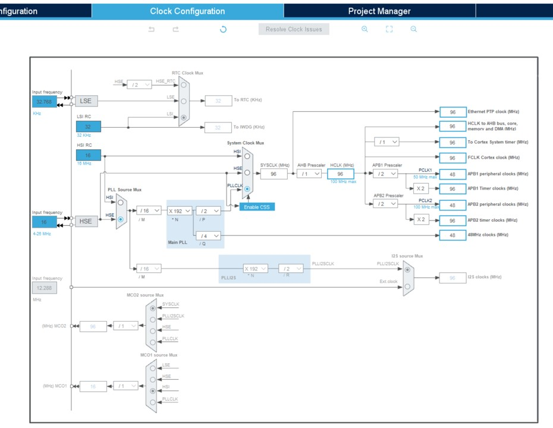
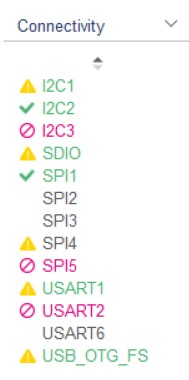
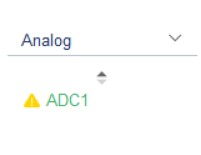
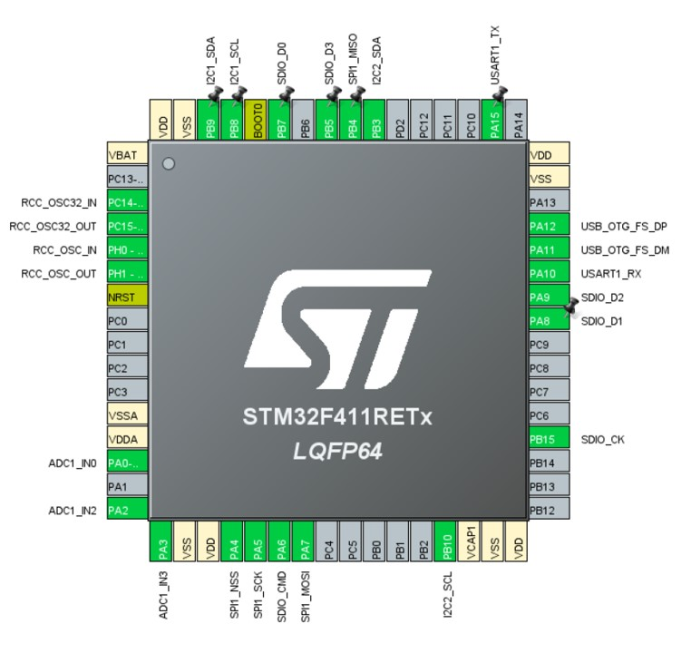

# 如何创建基于STM32的社区开发板

本文将解释如何调整设置以创建基于STM32处理器的社区开发板。

## 以相似的板子为起点

找到一个与您的开发板相似的板子。可以检查官方开发板和社区开发板。

重要的是找到相同的MCU或相近的MCU。完成后，在您克隆的[nf-interpreter](https://github.com/nanoframework/nf-interpreter)存储库中复制/粘贴文件夹，并将文件夹重命名。请注意，建议创建一个新的分支，这样您就不会与其他内容混淆。您也可以将存储库克隆到临时位置，只供此次活动使用。在所有情况下，请确保您拥有最新的`main`分支。

> 提示：在开发期间，将文件夹保留在nf-interpreter目标文件夹中。稍后您可以将其移动到`nf-Community-Targets`目录并进行适当的PR。

## 在CMakeUserPresets.json中创建项目

在您的`CMakePresets.json`和`CMakeUserPresets.json`中创建一个合适的部分。重用您要开始的板子中的设置。使用与推荐设置完全相同的设置来构建它，以确保一切正常。只需为确保一切正常，使用与克隆的开发板相同的设置进行构建。这将确保您从干净的状态开始。

> 提示：您可以使用[dev containers](../building/using-dev-container.md)来避免克隆所有源代码库并在安全的、始终正常工作的环境中构建。

## 调整时钟设置

这是第一步，也是最重要的一步。这也是可能有些棘手的地方。您需要了解时钟源以及它如何连接到MCU。为此，您需要确保找到开发板的原理图。

> 为了进行计算，请安装并使用[STM32CubeMX](https://www.st.com/en/development-tools/stm32cubemx.html)。您以后还将需要此软件进行引脚设置。

这是使用STM32F411RET MCU的示例：



在大多数情况下，您将需要使用外部时钟。在这种情况下，您需要激活RCC元素：



然后是通过启用USB OTG来解决外部时钟：



> 注意：这些屏幕截图已经包含了一些为此项目设置的更多元素。您设置的元素越多，您在菜单中就会看到更多的绿色条目、警告和红色元素

。这将帮助您了解您的配置和引脚设置是否正确。您不应该遇到任何不可能的情况。

时钟调整是最困难的部分。您需要了解从您的开发板文档中选择哪些时钟设置。这是一个示例：



> 提示：该工具提供了一个解算器，但可能不适合您的设置。首次尝试后，您可能需要返回并调整更多这些元素。如果文档或模式不是最好的，您可能需要进行一些试错。

## 构建和部署

一旦您到达这个阶段，最好是调整时钟的核心元素，构建、部署并检查这些核心部分是否工作正常。

### board.h

`board\board.h`文件是最重要的文件之一。您需要调整其中的一些元素。

首先，调整开发板的名称，以及时钟设置中的频率和其他设置元素。按照示例进行调整：

```cpp
/*
 * Board identifier.
 */
#define BOARD_PYBSTICK2X
#define BOARD_NAME                  "PYBStick standard 26"

/*
 * USB OTG Force
 */
#define BOARD_OTG_NOVBUSSENS

/*
 * Completely wacko definition of a flash sector here
 */
#define FLASH_SECTOR_11    ((uint32_t)11U)

/*
 * Board oscillators-related settings.
 * NOTE: LSE is fitted and is of course 32768.
 * NOTE: HSE is fitted and set to a 16 MHz one.
 */
#if !defined(STM32_LSECLK)
#define STM32_LSECLK                32768U
#endif

#if !defined(STM32_HSECLK)
#define STM32_HSECLK                16000000U
#endif
```

### nanoCLR和nanoBooter中的mcuconf.h

然后，您需要调整两个文件，即`nanoCLR/mcuconf.h`和`nanoBooter/mcuconf.h`，并使用第二组常量进行调整。这些常量是您在时钟设置中确定的设置。以下是示例项目的示例：

```cpp
#define STM32_NO_INIT                       FALSE
#define STM32_HSI_ENABLED                   TRUE
#define STM32_LSI_ENABLED                   TRUE
#define STM32_HSE_ENABLED                   TRUE
#define STM32_LSE_ENABLED                   TRUE
#define STM32_CLOCK48_REQUIRED              TRUE
#define STM32_SW                            STM32_SW_PLL
#define STM32_PLLSRC                        STM32_PLLSRC_HSE
#define STM32_PLLM_VALUE                    16
#define STM32_PLLN_VALUE                    192
#define STM32_PLLP_VALUE                    2
#define STM32_PLLQ_VALUE                    4

#define STM32_HPRE                          STM32_HPRE_DIV1
#define STM32_PPRE1                         STM32_PPRE1_DIV2
#define STM32_PPRE2                         STM32_PPRE2_DIV2
#define STM32_RTCSEL                        STM32_RTCSEL_LSE
#define STM32_RTCPRE_VALUE                  8
#define STM32_MCO1SEL                       STM32_MCO1SEL_HSE
#define STM32_MCO1PRE                       STM32_MCO1PRE_DIV1
#define STM32_MCO2SEL                       STM32_MCO2SEL_SYSCLK
#define

 STM32_MCO2PRE                       STM32_MCO2PRE_DIV1
#define STM32_I2SSRC                        STM32_I2SSRC_CKIN
#define STM32_PLLI2SN_VALUE                 192
#define STM32_PLLI2SR_VALUE                 2
#define STM32_PVD_ENABLE                    FALSE
#define STM32_PLS                           STM32_PLS_LEV0
#define STM32_BKPRAM_ENABLE                 FALSE
```

构建目标并部署它。参见[如何使用STM32 Cube Programmer刷写目标](./flash-cube-programmer.md)（您需要安装该工具）。

> 注意：即使您收到关于无法启动程序的错误消息，断开并重新连接开发板，如果它在Visual Studio的设备资源管理器nanoFramework扩展中显示出来，表示一切顺利。与原始板相比，一些DFU可能已被重新刷写，可能会出现奇怪的行为。

如果遇到部署错误，请尝试再次部署。

如果设备显示出来，这意味着您成功了，最复杂的部分已经完成！

> 注意：在以后的开发中，从这两个文件中最重要的要调整的是`nanoCLR/mcuconf.h`。如果向nanoBooter添加了任何内容，可以添加更多文件。

## 调整默认引脚行为并设置所有引脚行为

现在，您需要调整开发板启动时引脚的默认行为。但是还需要创建所有SPI、I2C、UART配置。

我们将使用之前安装的STM32 Cube程序。这将帮助设置您的引脚，确保一切一致，并减少潜在的错误。所有的设置都通过`Connectivity`和`Analog`子菜单完成：





检查您的开发板原理图，并开始使用该工具进行设置。这是您的MCU在进行了真实配置后的样子：



> 提示：如果您开始进行不可能的配置，您会很快知道，因为您会收到红色元素或无法设置更多元素的错误。上面的屏幕截图显示了IC3和SPI5无法进行设置的例子。这是此开发板示例中的情况。如果您遇到了一个错误，而您不应该遇到错误，请仔细检查，可能有问题发生了！

现在，是时候要求工具构建源代码了，请单击`Generate Code`，您不需要SDK，所以可以回答“否”来回答各种问题。我们只需要生成的项目来检查交替引脚配置。

然后，您需要调整`board\board.h`文件。找到引脚名称并重命名以反映您的开发板。以下是一个真实示例：

```cpp
/*
 *

 Board pins assignments.
 */

#define GPIOA_USART1_TX                 9
#define GPIOA_USART1_RX                 10

#define GPIOB_PIN_0                     0
#define GPIOB_PIN_1                     1
#define GPIOB_PIN_2                     2
#define GPIOB_PIN_3                     3
#define GPIOB_PIN_4                     4
#define GPIOB_PIN_5                     5
#define GPIOB_PIN_6                     6
#define GPIOB_PIN_7                     7
#define GPIOB_I2C1_SCL                  8
#define GPIOB_I2C1_SDA                  9
#define GPIOB_PIN_10                    10
#define GPIOB_PIN_11                    11
#define GPIOB_PIN_12                    12
#define GPIOB_PIN_13                    13
#define GPIOB_SPI2_CLK                  13
#define GPIOB_PIN_14                    14
#define GPIOB_SPI2_MISO                 14
#define GPIOB_PIN_15                    15
#define GPIOB_SPI2_MOSI                 15
```
> 提示：对使用的所有引脚进行重命名，这有助于查找和减少错误。要进行重命名，请在文件中使用全局替换，引脚的名称出现多次。

一旦重命名完成，您将需要调整引脚的初始值。这是在各种定义 `MODER, OTYPER, OSPEEDR, PUPDR, ODR, AFRL, AFRH` 中完成的。如果您有任何疑问，请确保参考文档或生成的代码。下面的解释仅供参考。

### MODER

以下是要使用的值：

- 对于任何 ADC 引脚，请使用 PIN_MODE_ANALOG。
- 对于 LED 和其他已知输出引脚，请使用 PIN_MODE_OUTPUT。
- 对于任何 SPI、I2C、UART 元素，请使用 PIN_MODE_ALTERNATE。
- 对于其他任何情况，请使用 PIN_MODE_INPUT。

### OTYPER

以下是要使用的值：

- 对于 I2C，请使用 PIN_OTYPE_OPENDRAIN。
- 对于其他情况，请使用 PIN_OTYPE_PUSHPULL。

### OSPEEDR

- 对于 LED，请使用 PIN_OSPEED_MEDIUM。
- 对于其他情况，请使用 PIN_OSPEED_HIGH。

### PUPDR

- 对于输出或 I2C、SPI、UART 或类似时钟的任何内容，请使用 PIN_PUPDR_FLOATING。
- 对于其余的引脚，请使用 PIN_PUPDR_PULLUP，这应该只用于普通 GPIO、尚未定义的 PWM 或等效引脚。

### ODR

这是引脚的初始状态：

- 对于 LED、ADC 和类似元素，请使用 PIN_ODR_LOW。
- 对于其余的情况，请使用 PIN_ODR_HIGH。

> 提示：任何未使用的引脚应为输入上拉高电平。

### AFRL 和 AFRH

这是您可以定义要使用的替代配置的位置。这必须正确地针对所有 SPI、I2C、UART、SD 卡配置进行设置。

引脚的配置如下所示：

```cpp
PIN_AFIO_AF(GPIOA_SPI1_MOSI, 5U)
```

在这种情况下，`5U` 表示替代 5。

> 提示：在 STM32 Cube 生成的文件中，您将在 AFx 中找到替代项，其中 x 是数字。
下面是您需要调整的示例：

> 提示：从工具中，您可以访问处理器数据手册配置文件。该文件包含所有可能的配置和替代项。

现在您已经调整了引脚，您将需要添加与各种 API 相关的正确 CPP 文件。
至于您所克隆的原始设备，复制/粘贴另一个设备的文件并进行调整。

### LINE 部分

LINE 部分将为内部本机级别使用创建 GPIO。例如，如果您有一个带有插入检测的 SD 卡读卡器，您将需要设置一行用于该目的。以下是一个

包含 OTG 引脚和 LED 的设置示例：

```cpp
/*
 * IO lines assignments.
 */
#define LINE_LED_GREEN              PAL_LINE(GPIOA, 14U)
#define LINE_LED_BLUE               PAL_LINE(GPIOB, 1U)
#define LINE_LED_YELLOW             PAL_LINE(GPIOB, 0U)
#define LINE_LED_RED                PAL_LINE(GPIOA, 13U)
#define LINE_OTG_FS_DM              PAL_LINE(GPIOA, 11U)
#define LINE_OTG_FS_DP              PAL_LINE(GPIOA, 12U)
#define LINE_SD_DETECT              PAL_LINE(GPIOB, 14U)
```

## ADC

要添加或调整的文件是 `target_windows_devices_adc_config.cpp`。

对于 ADC，这些是基于索引的。您可以添加尽可能多的通道，只需确保正确记录它们，因为它们将与通道编号不匹配。如下面的示例所示，顺序与可用的 ADC 通道无关，这是您自己的选择。

对于 STM32 设备的 ADC，您还可以添加 3 个额外的通道，这些通道分别是板上温度（在绝对温度方面不太准确，但在进行相对测量时可以使用）、1.21V 的参考电压和电池电压。对于这些通道的测量，与任何其他通道一样，您将获得原始值。按照约定，这 3 个额外的传感器始终位于第一个 ADC 的末尾。

文件如下所示：

```cpp
const NF_PAL_ADC_PORT_PIN_CHANNEL AdcPortPinConfig[] = {

    // ADC1
    {1, GPIOA, 2, ADC_CHANNEL_IN2},
    {1, GPIOA, 3, ADC_CHANNEL_IN3},
    {1, GPIOA, 0, ADC_CHANNEL_IN0},
    {1, GPIOA, 4, ADC_CHANNEL_IN4},
    {1, GPIOA, 5, ADC_CHANNEL_IN5},
    {1, GPIOA, 7, ADC_CHANNEL_IN7},

    // 这些是内部源，仅在 ADC1 可用
    {1, NULL, 0, ADC_CHANNEL_SENSOR},
    {1, NULL, 0, ADC_CHANNEL_VREFINT},
    {1, NULL, 0, ADC_CHANNEL_VBAT},
};

const int AdcChannelCount = ARRAYSIZE(AdcPortPinConfig);
```

## SPI

请确保在文件 `target_windows_devices_spi_config.cpp` 中添加 SPI 通道。

以下是如何添加 SPI1 的示例：

```cpp
// SPI1 的引脚配置
// SCK 引脚的端口是：5 SPI1_SCLK
// MISO 引脚的端口是：4 SPI1_MISO
// MOSI 引脚的端口是：7 SPI1_MOSI

// GPIO 替代引脚功能为 5（请参阅设备数据手册中的替代功能映射表）
SPI_CONFIG_PINS(1, GPIOA, 5, GPIOB, 4, GPIOA, 7, 5)
```

您还需要相应地调整 `mcuconf.h` 文件。找到 SPI 部分，并将

要公开的任何通道设置为 TRUE：

```cpp
/*
 * SPI driver system settings.
 */
#define STM32_SPI_USE_SPI1                  TRUE
#define STM32_SPI_USE_SPI2                  FALSE
#define STM32_SPI_USE_SPI3                  FALSE
```

如果您使用的 MCU 与现有板上的 MCU 相同，则其余的 SPI 配置应该正确。否则，请根据文档进行调整。

## I2C

与 SPI 类似，I2C 的过程也是一样的。要添加或调整的文件是 `target_windows_devices_i2c_config.cpp`。以下是一个具有 2 个 I2C 通道的示例：

```cpp
//////////
// I2C1 //
//////////

// I2C1 的引脚配置
// SCL 引脚的端口是：GPIOB
// SDA 引脚的端口是：GPIOB
// SCL 引脚是：GPIOB_8
// SDA 引脚是：GPIOB_9
// GPIO 替代引脚功能为 4（请参阅设备数据手册中的替代功能映射表）
I2C_CONFIG_PINS(1, GPIOB, GPIOB, 8, 9, 4)

//////////
// I2C1 //
//////////

// I2C1 的引脚配置
// SCL 引脚的端口是：GPIOB
// SDA 引脚的端口是：GPIOB
// SCL 引脚是：GPIOB_10
// SDA 引脚是：GPIOB_3
// GPIO 替代引脚功能为 9（请参阅设备数据手册中的替代功能映射表）
I2C_CONFIG_PINS(2, GPIOB, GPIOB, 10, 3, 9)
```

请确保在 `mcuconf.h` 文件中设置相应的通道为 TRUE。以下是一个具有 2 个 I2C 的示例：

```cpp
/*
 * I2C driver system settings.
 */
#define STM32_I2C_USE_I2C1                  TRUE
#define STM32_I2C_USE_I2C2                  TRUE
#define STM32_I2C_USE_I2C3                  FALSE
```

## UART

UART 也是同样的原理。需要调整 `target_windows_devices_serialcommunication_config.h` 和 `target_windows_devices_serialcommunication_config.cpp` 两个文件。

以下是在头文件中添加 UART2 的示例：

```cpp
// 启用 USART2
#define NF_SERIAL_COMM_STM32_UART_USE_USART2   TRUE
```

在 CPP 文件中：

```cpp
///////////
// UART2 //
///////////

// UART2 的引脚配置
// 端口：GPIOA
// TX 引脚：GPIOA 15
// RX 引脚：GPIOA 10
// GPIO 替代引脚功能为 7（请参阅 STM32F411xC 和 STM32F411xE 数据手册中的 "Table 9. Alternate function mapping"）
UART_CONFIG_PINS(2, GPIOA, GPIOA, 2, 3, 7)

// 缓冲区
// 建议使用 DMA 读写的缓

冲区应与 32 字节缓存页面大小边界对齐
// 由于缓存和 DMA 的问题（这在 Cortex-M7 上尤为重要，因为缓存问题），因此缓冲区应该对齐。
#if defined(__GNUC__)
__attribute__((aligned (32)))
#endif
uint8_t Uart2_TxBuffer[UART2_TX_SIZE];
#if defined(__GNUC__)
__attribute__((aligned (32)))
#endif
uint8_t Uart2_RxBuffer[UART2_RX_SIZE];

// UART2 的初始化
UART_INIT(2, UART2_TX_SIZE, UART2_RX_SIZE)

// UART2 的反初始化
UART_UNINIT(2)
```

特别的是，您不能使用 UART1。其他所有 UART 都可以使用。请确保为您的用户正确地记录此信息。

> 提示：您可以添加多个额外的 UART，对于大多数 STM32 来说，通常使用 UART2 或 6。它们将显示为托管端上的 COM2、COM6。

## SD Card

添加或调整现有文件 `target_windows_storage_config.h`。您将需要添加检测线路：

```cpp
// 映射 SD Card 驱动程序
#define SD_CARD_DRIVER      SDCD1

// 映射 SD Card 检测 GPIO 定义（在 Target_Windows_Storage.c 中）到板上 GPIO 线路（在 board.h 中）
#define SDCARD_LINE_DETECT  LINE_SD_DETECT

// 在存储中包含 SPIFFS
#define USE_SPIFFS_FOR_STORAGE  FALSE
```

LINE **必须**存在，并在 board.h 文件中正确设置。

添加一个名为 `ff.conf` 的文件，从其他 STM32 板上复制/粘贴。该文件中的所有设置应该正确。

如果该部分不存在，请在文件 `nanoCLR\mcuconf.h` 中添加：

```cpp
/*
 * SDC driver system settings.
 */
#define STM32_SDC_SDIO_DMA_PRIORITY         3
#define STM32_SDC_SDIO_IRQ_PRIORITY         9
#define STM32_SDC_WRITE_TIMEOUT_MS          250
#define STM32_SDC_READ_TIMEOUT_MS           25
#define STM32_SDC_CLOCK_ACTIVATION_DELAY    10
#define STM32_SDC_SDIO_UNALIGNED_SUPPORT    TRUE
#define STM32_SDC_SDIO_DMA_STREAM           STM32_DMA_STREAM_ID(2, 3)
```

## 根据您的变体进行调整

对于各种 API，请确保使用适当的 API。对于卡片，您需要一些特殊的 API。在删除 `Windows.Devices` 命名空间之前，您需要同时使用 `Windows.Devices` 和 `System.Device` 命名空间。

> 提示：不要尝试一次调整所有内容，如果这是您第一次使用板子，请小步前进。先添加 SPI，然后添加 I2C，再添加 UART，最后添加 SD 卡。在每次构建后测试镜像，在每个阶段调整任何错误。

## 为您的板子创建一个扩展

使您的用户能够轻松创建 SPI 设备、I2C 设备或其他任何设备。还为板子上的引脚和

名称创建映射。为 ADC 使用枚举（如果需要的话）。将您的代码放在 `managed_helpers` 文件夹中。添加一个 nuspec 文件。您可以在[此处](https://github.com/nanoframework/nf-interpreter/blob/develop/targets/ChibiOS/ST_STM32F769I_DISCOVERY/managed_helpers/package.nuspec)找到一个很好的示例。

以下是用于板子扩展类的函数定义摘录示例：

```csharp
namespace nanoFramework.Targets.Community.PybStick2x
{
    /// <summary>
    /// This extension class will help opening the right pins
    /// </summary>
    public static class Board
    {
        /// <summary>
        /// Creates a default SPI Device on SPI1 with Chip Select A4.
        /// </summary>
        /// <returns></returns>
        public static SpiDevice Create() => Create(PinNumber('A', 4));

        /// <summary>
        /// Creates a default SPI Device on SPI1 with a custom Chip Select
        /// </summary>
        /// <param name="chipSelect"></param>
        /// <returns></returns>

        public static SpiDevice Create(int chipSelect) => SpiDevice.Create(new SpiConnectionSettings(1, chipSelect));

        /// <summary>
        /// Gets the pin number based on port and pin. Example A5
        /// </summary>
        /// <param name="port">The port</param>
        /// <param name="pin">The port pin</param>
        /// <returns>The pin number</returns>
        public static int PinNumber(char port, byte pin)
        {
            if (port < 'A' || port > 'J')
                throw new ArgumentException();

            return ((port - 'A') * 16) + pin;
        }

        /// <summary>
        /// Get the pin number for the board pin. Example: S5 will be 5
        /// </summary>
        /// <param name="num">The board pin number</param>
        /// <returns>The pin number</returns>
        public static int PinFromBoardNumber(int num)
        {
            switch (num)
            {
                case 3:
                    return PinNumber('B', 9);
                case 5:
                    return PinNumber('B', 8);
                case 7:
                    return PinNumber('B', 6);
                case 8:
                    return PinNumber('A', 2);
                case 10:
                    return PinNumber('A', 3);
                // 更多代码和更多 cases
            }
        }

        // 更多类似这样的函数，以帮助您
    }
}
```