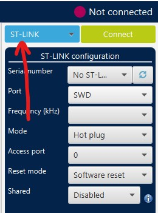
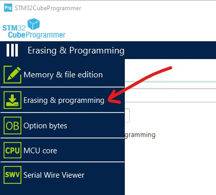
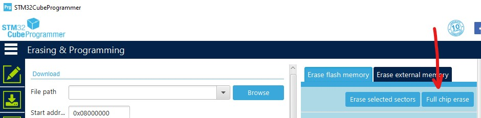
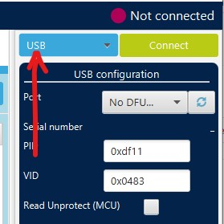

# 如何使用STM32 Cube Programmer烧写目标设备固件

这是一份关于如何使用STM32CubeProgrammer工具手动烧写固件的指南。该工具取代了ST-Link工具，对于某些Windows 10机器可能是必需的。

您需要使用该工具替换STM32芯片上的引导加载程序。一旦替换完成，您可以使用nanoFramework固件刷新工具（nanoff.exe）进行所有后续的固件维护。

## 安装工具

1. 从ST网站下载适用的[STM32 Cube Programmer](https://www.st.com/en/development-tools/stm32cubeprog.html)并将其安装在您的开发机上。

## 烧写连接了JTAG的开发板

目标设备需要烧写两个镜像，一个是用于nanoBooter的镜像，另一个是用于nanoCLR的镜像。

1. 通过单击此处，从我们的网站上下载包含开发板固件的ZIP文件[链接](https://github.com/nanoframework/nf-interpreter#firmware-for-reference-boards)。这将带您访问我们的Cloudsmith软件库，其中存储了几个目标开发板的预构建镜像包。下载后，解压缩包内容。

1. 使用USB电缆将目标板连接到您的计算机。请注意，大多数ST开发板上有两个Micro USB连接器。根据本指南，您应使用通过ST-Link调试器提供JTAG连接的那个连接器。如有疑问，请查看PCB以确定正确的连接器或查看开发板原理图。

1. 启动刚刚安装的STM32 Cube Programmer，并连接到ST开发板。

1. 在界面选项中选择“USB”。
    >

1. 导航至“擦除和编程”视图。
    >

1. 执行“全片擦除”以清除闪存。
    >

1. 通过单击“浏览”按钮加载包中的`nanoBooter.hex`文件。确保选中“编程后运行”和“编程前跳过闪存擦除”复选框，然后点击“开始编程...”按钮。上传完成后，MCU将被重置，nanoBooter镜像将运行。您可以通过观察LED上的缓慢闪烁模式来检查操作是否成功。恭喜，您现在拥有一块运行nanoFramework引导加载程序的开发板！
    >

1. 接下来，通过单击“浏览”按钮，从解压缩的包文件夹中加载`nanoCLR.hex`文件。确保选中“编程后运行”和“编程前跳过闪存擦除”复选框，然后点击“开始编程...”按钮。上传完成后，MCU将被重置，nanoCLR镜像将运行。这次，如果一切按预期进行，LED将不会闪烁。您可以通过查看Visual Studio中的设备资源管理器窗口来检查开发板是否正确运行.NET **nanoFramework**。您可能需要点击“重新扫描nanoDevices”按钮（放大镜图标）。

## 烧写连接了DFU的开发板

1. 将设备置于启动加载程序模式。这可以通过按下特定的按钮组合来完成。具体取决于您使用的特定硬件。

1. 启动刚刚安装的STM32 Cube Programmer，并连接到ST开发板。

1. 在界面选项中选择“USB”。
    >

1. 通过单击“浏览”按钮加载`nnnn.dfu`文件。确保选中“编程后运行”复选框，然后点击“开始编程...”按钮。上传完成后，MCU将被重置，nanoCLR镜像将运行。您可以通过查看Visual Studio中的设备资源管理器窗口来检查开发板是否正确运行.NET **nanoFramework**。您可能需要点击“重新扫描nanoDevices”按钮（放大镜图标）。