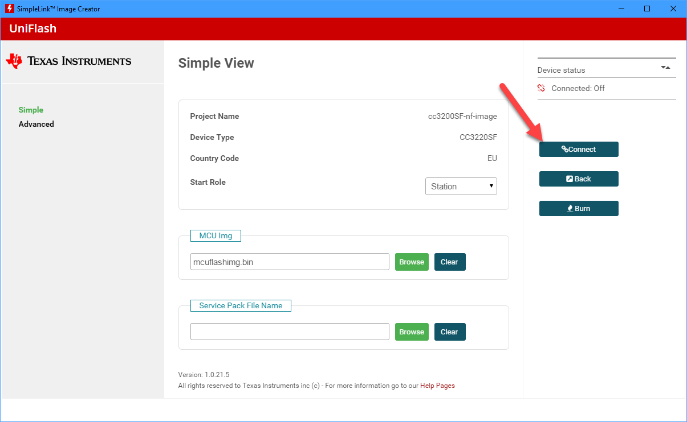

# 在TI CC13x2/CC6x2开发板上刷入nanoCLR镜像

## 操作指南

要在TI CC13x2/CC6x2开发板上刷入nanoCLR镜像，需要使用TI的[Uniflash](http://www.ti.com/tool/uniflash)工具。

假设Uniflash工具和USB驱动程序已经正确安装，按照以下步骤操作适用于CC1352R1 LaunchPad开发板的推荐过程。

1. 从.NET **nanoFramework**仓库下载镜像。
1. 使用USB电缆连接开发板。
1. 启动Uniflash。除非配置为手动检测，否则应该能够检测到并列出开发板。

1. 点击那里的**Start**按钮。
1. 通过点击**Browse**并导航到包含`nanoCLR.bin`文件的文件夹/文件位置，选择nanoCLR镜像文件。（确保选择的文件扩展名为_bin_）。

1. nanoCLR镜像将显示在闪存列表中。通过点击**Load Image**按钮，刷写过程开始。

1. 成功烧写了带有nanoCLR镜像的闪存后，您可以断开并重新连接USB电缆。预期情况下，nanoDevice目标将显示在Visual Studio Device Explorer窗口中。
