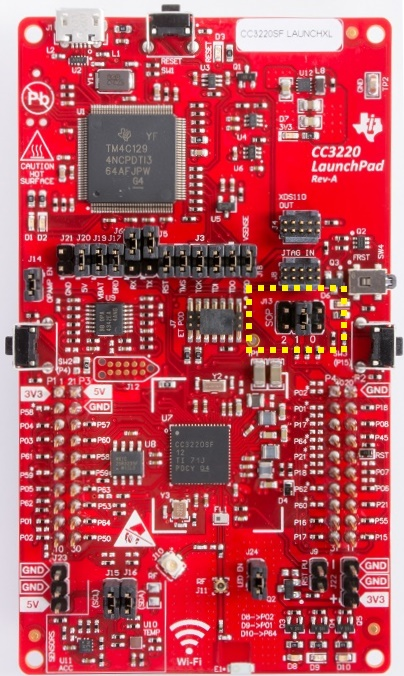
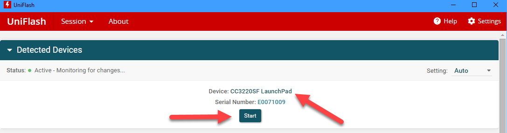
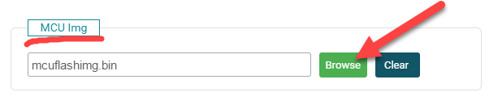
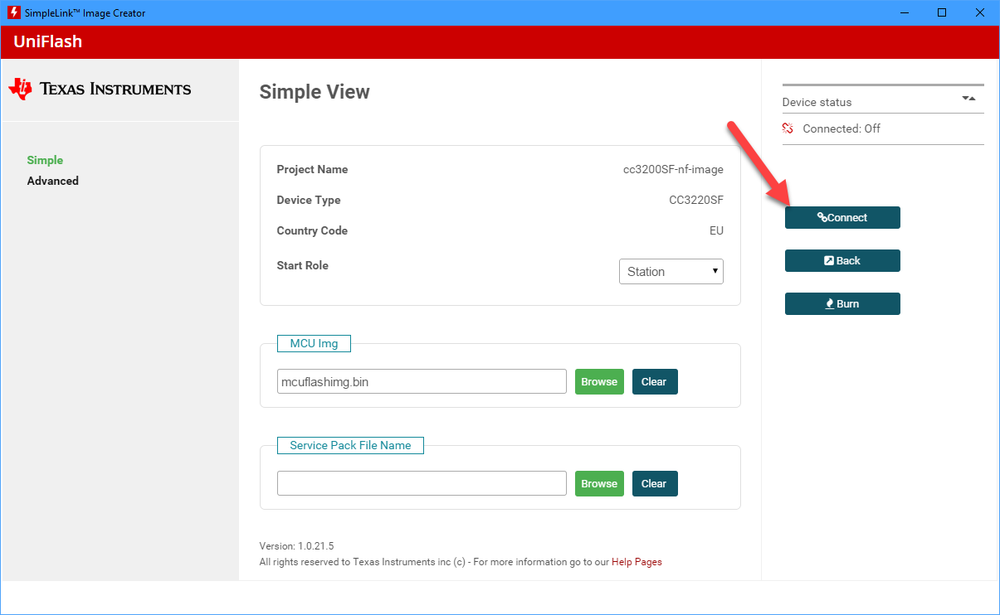
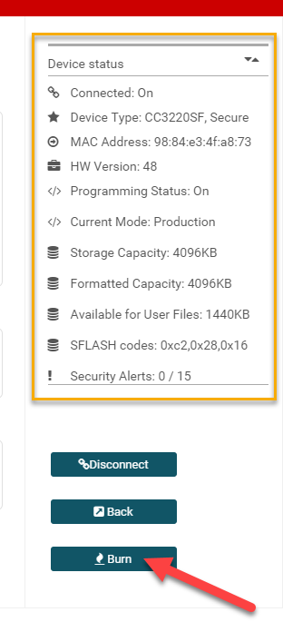

# 在TI CC32xx开发板上刷写nanoCLR固件镜像

## 使用指南

要在TI开发板上刷写nanoCLR固件镜像，需要使用TI的[Uniflash](http://www.ti.com/tool/uniflash)工具。

假设已经正确安装了Uniflash工具和USB驱动程序，请按照以下步骤为CC3220SF-LAUNCHXL开发板执行操作：

1. 从.NET **nanoFramework**代码库中下载固件镜像。
1. 将J13 SPO跳线放置在位置1。

1. 使用USB电缆连接开发板。
1. 启动Uniflash。开发板应该被检测到并列出。

1. 点击右上角的**Start**按钮，然后选择与您的开发板相对应的项目。这里假设您事先已经创建了该项目。如果没有，请按照这里的步骤进行操作：[准备CC32xx开发板的Uniflash项目](#prepare-a-uniflash-project-for-a-cc32xx-board)。
1. 通过点击**Browse**按钮，选择nanoCLR固件镜像文件所在的文件夹/文件，确保选择具有_bin扩展名的文件。

1. 点击**Connect**按钮。

1. 成功建立与目标设备的连接后，设备状态和功能将在右上角列出。
1. 点击**Burn**按钮，刷写过程将开始。

1. 成功将flash刷写为nanoCLR固件镜像后，您可以断开并重新连接USB电缆。预期情况下，nanoDevice目标将在Visual Studio的设备资源管理器窗口中显示。

## 为CC32xx开发板准备Uniflash项目

（待定）