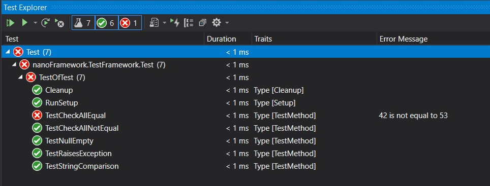
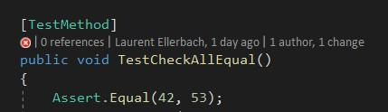
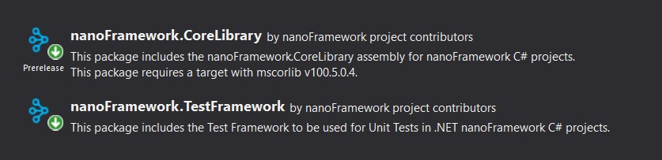
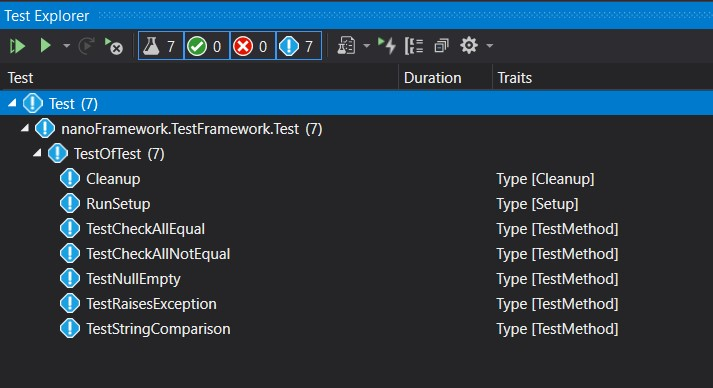
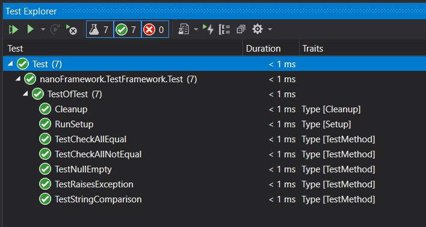
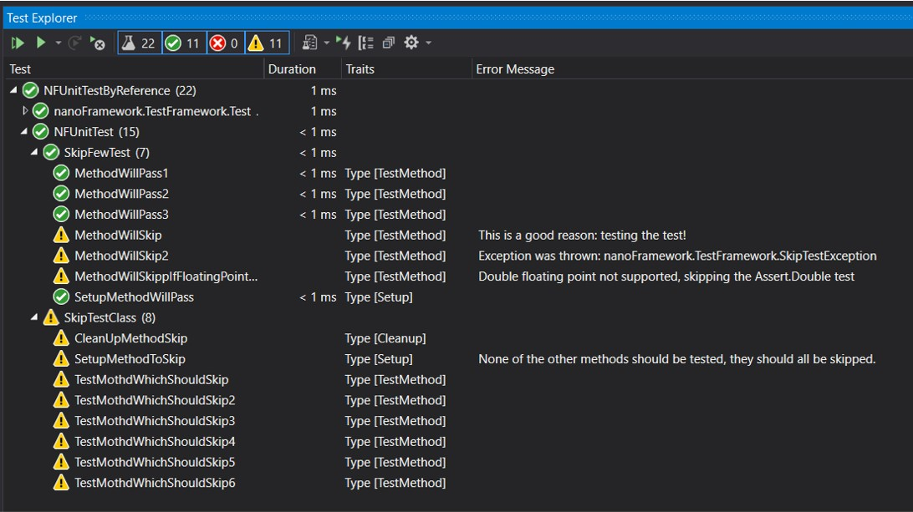
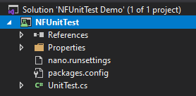

.NET nanoFramework的完整单元测试平台称为`nanoFramework.TestPlatform`。

nanoFramework.TestPlatform是专门针对.NET nanoFramework的单元测试平台！它具有使用Microsoft Test平台进行.NET或XUnit或任何其他测试时所习惯的所有好处！

该框架包括多个元素，这些元素包含在单个NuGet中！

- `nanoFramework.TestPlatform`包含用于装饰代码的属性和用于检查代码是否按预期执行的`Assert`类。
- `nanoFramework.UnitTestLauncher`是启动和管理单元测试的引擎。
- `nanoFramework.TestAdapter`是Visual Studio测试平台适配器，允许在Visual Studio中进行测试集成。

集成如下所示：

集成将指向您的代码以获取成功或失败的测试：

## 使用nanoFramework.TestPlatform

只需将`nanoFramework.TestPlatform` NuGet添加到您的项目中，您就可以开始使用了！

一旦构建项目，测试将自动发现：

然后，您可以运行所有测试，并获得结果：

某些测试可能会被跳过，它们将显示如下：

## 创建新的Visual Studio NFUnitTest项目

您也可以简单地创建一个新的Visual Studio NFUnitTest项目，该项目已经包含了所有所需的元素。

## 详细使用

您将在其他文档中找到平台的[详细使用](using-test-platform.md)、[如何运行测试](running-tests.md)和[约束/限制](constraints-limitations.md)。

如果您对架构感兴趣，请查看[此详细页面](../architecture/unit-test.md)。