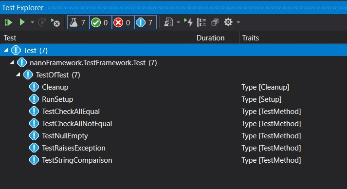
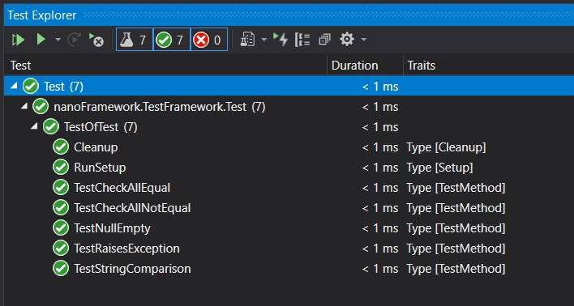
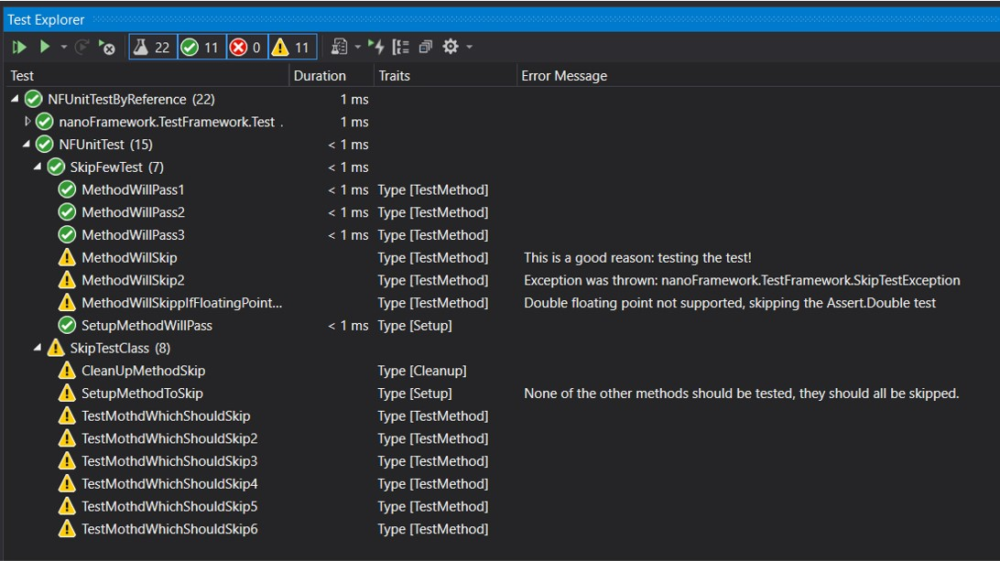

# 在.NET nanoFramework上运行单元测试

首先，您需要设置您的.NET nanoFramework单元测试项目。您有两个选项，可以从Visual Studio创建一个`NFUnitTest`项目，或者将nanoFramework.TestFramework NuGet添加到您的类库项目中。

## 通过Visual Studio项目模板进行设置

您也可以简单地创建一个新的Visual Studio NFUnitTest项目，该项目已经包含了所有所需的元素。


### 通过NuGet设置单元测试

.NET nanoFramework单元测试平台可通过NuGet获得，并且已经包含了所有所需的元素。您只需将其添加到您的.NET nanoFramework项目中：


请确保在sln文件的主目录或与nfproj文件相同的目录中有一个`.runsettings`文件，您需要的最小元素如下：

```xml
<?xml version="1.0" encoding="utf-8"?>
<RunSettings>
   <!-- Configurations that affect the Test Framework -->
   <RunConfiguration>
       <MaxCpuCount>1</MaxCpuCount>
       <ResultsDirectory>.\TestResults</ResultsDirectory><!-- Path relative to solution directory -->
       <TestSessionTimeout>120000</TestSessionTimeout><!-- Milliseconds -->
       <TargetFrameworkVersion>Framework40</TargetFrameworkVersion>
   </RunConfiguration>
   <nanoFrameworkAdapter>
    <Logging>None</Logging>
    <IsRealHardware>False</IsRealHardware>
   </nanoFrameworkAdapter>
</RunSettings>
```

最重要的部分是`<TargetFrameworkVersion>Framework40</TargetFrameworkVersion>`，因为这将触发对测试的发现。

## 发现测试

一旦构建项目，测试将自动被发现：



这是自动完成的，您只需要构建即可。如果出现任何问题，您可以尝试`重新生成`选项，它将强制重新发现测试。

## 在真实硬件上运行测试

您需要将`.runsettings`文件中的`IsRealHardware`条目调整为true：

```xml
<IsRealHardware>True</IsRealHardware>
```

一旦运行测试，它们将被部署到连接到您机器的设备上。

## 运行测试

只需按下播放按钮即可运行所有测试或者只运行您想要的测试。如果成功，您将看到类似于以下内容：



如果其中一个测试失败，您将看到类似于以下内容：


有些测试可能被跳过，它们将显示如下：



## 测试覆盖率和代码高亮

您可以期望在测试方法和已调用的方法中获得覆盖的测试结果：


如果失败，将获得相同的结果：


## 在流水线中运行测试

可以使用`vstest

.Console.exe`在流水线中运行测试。要使用的适配器是`nanoFramework.TestAdapter.dll`。您可以在NuGet包中找到所有这些内容。

## 更新NuGet

当您更新NuGet时，如果对`.runsettings`文件进行了更改，您将被提示替换文件，根据您的选择，您可能希望保存您的选择并将其合并到新文件中。我们建议使用新文件并进行调整。

